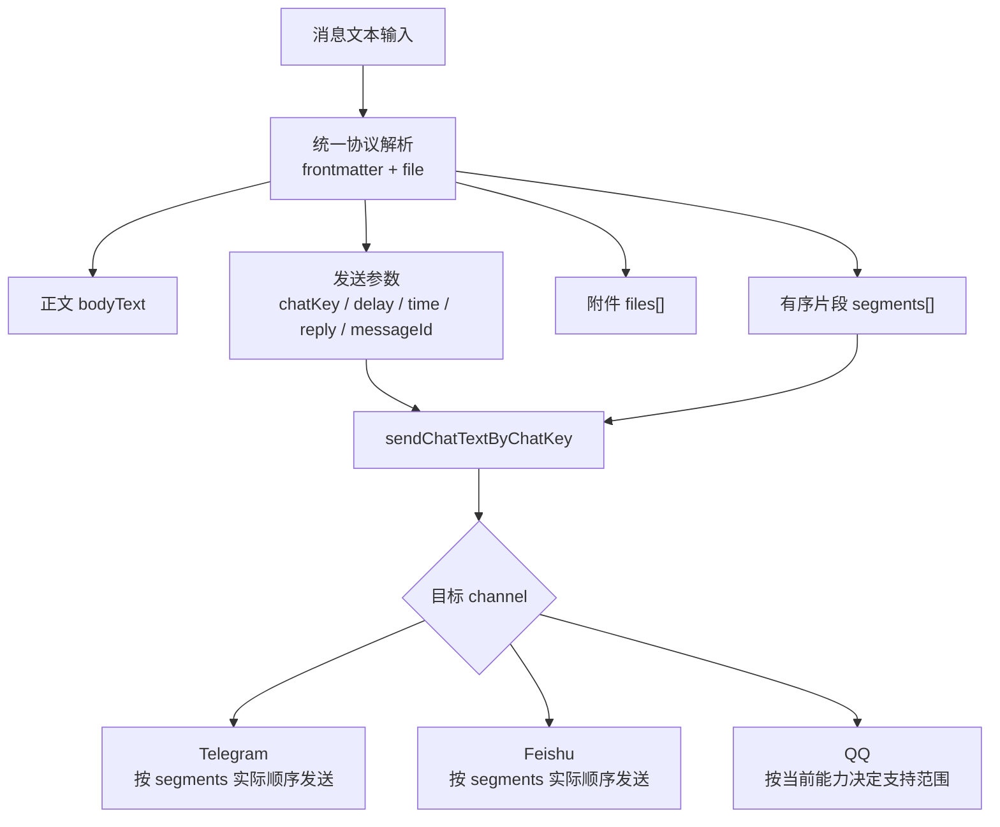
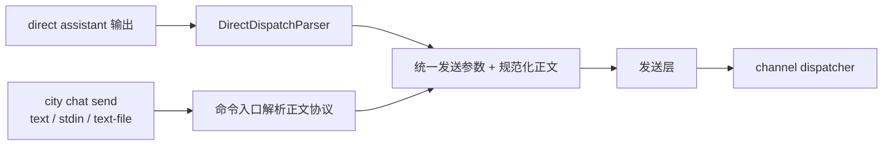
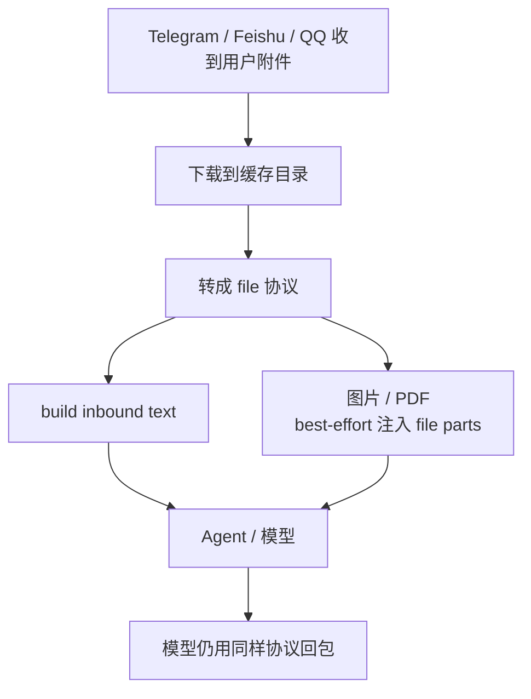

# Chat 消息协议

当前聊天链路已经收敛成一套统一协议。

## 核心结论

现在只有一套消息协议：

- frontmatter metadata：表示 `chat send` 参数
- `<file ...>...</file>`：表示附件
- `react`：只在 direct 模式额外支持

也就是说，附件协议统一为 `<file>`。

## 当前行为补充

有两个现在很重要的行为：

1. 出站消息会先被解析成有序 `segments[]`
2. 正文和附件会按它们在原消息中的真实出现顺序发送

所以现在不再是“正文固定先发、附件固定后发”。

## 发送协议图

## 两条入口

## 入站到模型

入站附件也统一注入成 `<file>`，这样模型看到的协议和它输出时使用的协议保持一致。

## 这套协议解决了什么

- 正文、参数、附件不再分裂成多套入口
- 入站和出站可以共用同一套语义
- 多模态附件既有文本协议兜底，也能尽量走更强的 file parts
