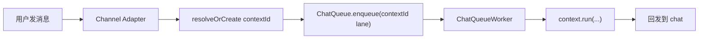
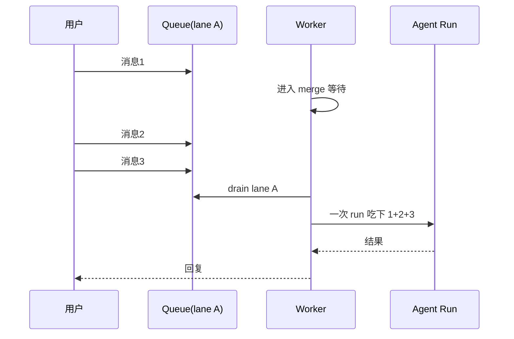

# Chat 排队与消息合并

当前 chat 排队逻辑，先记成四句话：

1. 队列是进程内内存队列，不是数据库队列
2. 排队按 `contextId` 分 lane
3. 同一个 lane 串行，不同 lane 可以并行
4. 同一个 chat 的连续消息会尽量合并，而不是每条都立刻单独开跑

## 先说结论

不论私聊还是群聊，排队规则本质一样：

- 先把平台 chat 目标映射成一个 `contextId`
- 再按这个 `contextId` 串行执行

差别只在 lane 粒度：

- Telegram 私聊：一个私聊一个 lane
- Telegram 普通群：一个群一个 lane
- Telegram topic：同一群里不同 topic 是不同 lane
- 其他平台也是按各自 chat 目标映射到稳定 lane

## 单个 chat 的基本模型

最关键的点：

- `laneKey` 本质上就是 `contextId`
- 同一个 `contextId` 同时只会有一个 worker 在跑
- 不同 `contextId` 可以并发跑，但总并发有上限

## 为什么会合并消息

默认不会在第一条消息到达的 0ms 就立刻执行。

系统会短暂等待，看看同一个 lane 里是否还有后续消息，从而把：

- 多条密集消息
- 连续补充说明
- 很快到达的上下文补充

合成一次执行。

## 同 lane 快速连发

这种场景里：

- history 仍然会保留每条消息
- 但真正执行时可能只开一次 run

## 第一条已经在跑，第二条才到

如果当前 lane 已经开始跑，后续消息不会再平行开第二个 run，而是进入同 lane 队列，等待当前 run 结束或在合适边界被吸收。

## 这套设计的价值

- 避免同一个 chat 并发乱跑
- 减少连续补充导致的重复执行
- 让平台消息节奏和 session 执行节奏更稳定
