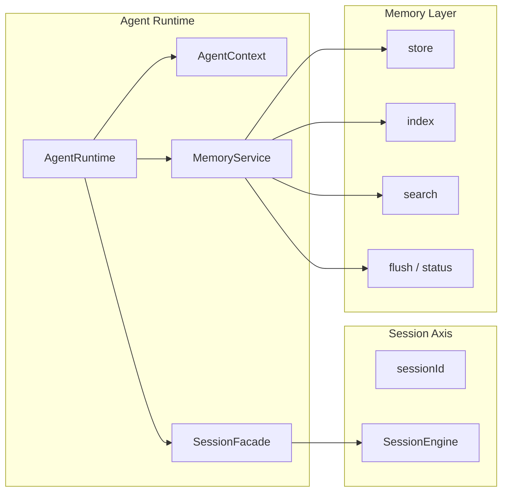
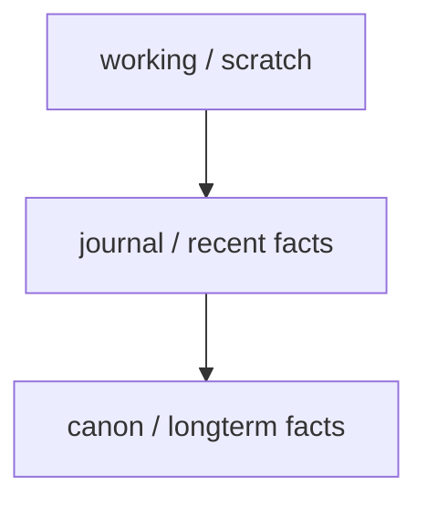

# Memory 设计原理

这页说明两件事：

1. 当前 `memory service` 在系统里的真实位置
2. 长期来看 memory 应该继续往什么方向收敛

先给结论：

- `memory` 是标准 service
- `memory` 不是 session
- `memory` 不是 history
- `memory` 也不是第二个主 agent

一句话：

```text
memory service 负责长期记忆的读写、索引、检索与维护，并为当前 agent 提供稳定的长期状态层。
```

## 先把边界说清楚

### Memory 不是 History

`History` 更接近原始发生记录。

`Memory` 更接近：

- 被系统保留下来、以后还要继续使用的长期状态

### Memory 不是 Session

`Session` 是以 `sessionId` 为主键的一段长期会话执行状态。

`Memory` 是跨 session 的长期状态层。

### Memory 不是第二个主 Agent

当前系统真正的执行主轴仍然是：

- `SessionFacade -> SessionEngine`

所以 memory 不应该被理解成另一个平级执行主体。

## Memory 在系统里的位置



这张图里最重要的意思是：

- memory 的宿主是 `MemoryService`
- Session 是 memory 的消费者之一
- memory 不拥有 session 执行主轴

## 当前 MemoryService 的职责

当前实现里，`memory service` 主要负责：

- `status`
- `index`
- `search`
- `get`
- `store`
- `flush`

这说明它当前已经是一个明确的长期状态 service，而不是单纯工具函数集合。

## 为什么 memory 应该先被理解成状态系统

如果直接把 memory 理解成：

- 文件仓库
- 索引器
- 搜索接口

就很容易出问题。

更稳定的理解方式是：

- memory 的核心是长期状态
- 文件、索引、搜索只是状态系统的实现形式

## 一个更清晰的三层理解



### working

更接近当前工作台：

- 当前问题
- 当前计划
- 当前约束

### journal

更接近按时间沉淀的事实：

- 某次决策
- 某次结果
- 某次反馈

### canon

更接近长期有效版本：

- 稳定偏好
- 长期规则
- 已确认结论

## 当前实现和目标设计之间的关系

当前实现已经落地的是：

- memory 有独立 service
- memory 有自身 runtime state
- memory 有明确 actions
- memory 可以做显式索引和检索

长期更适合继续增强的是：

- recall 与 session 的衔接方式
- 写入候选记忆的抽取策略
- working / journal / canon 的投影结构

## Memory 和 Session 的关系

更准确的关系不是：

- Session 属于 memory

而是：

- Session 在执行时可能消费 memory
- memory 在冷路径中整理长期状态

也就是说：

- Session 负责当前执行
- memory 负责长期保留和后续召回

## 一句话总结

```text
memory service 的正确位置，是作为 agent 里的长期状态 service，为 session 和其他业务流程提供跨会话的长期记忆层，而不是替代 session 主轴。
```
