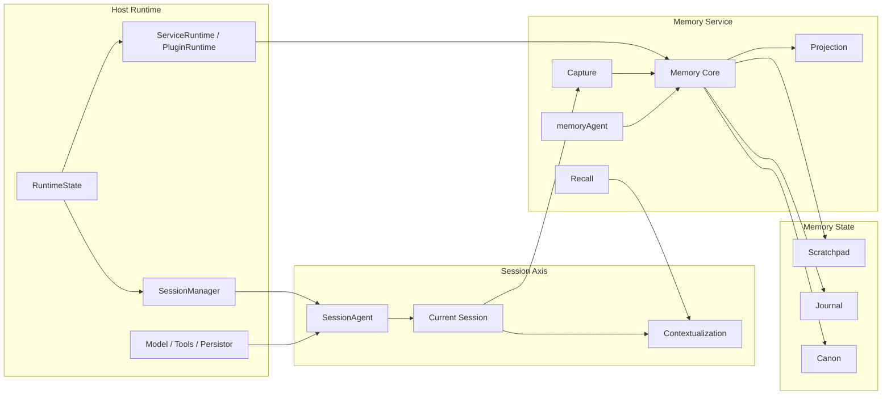
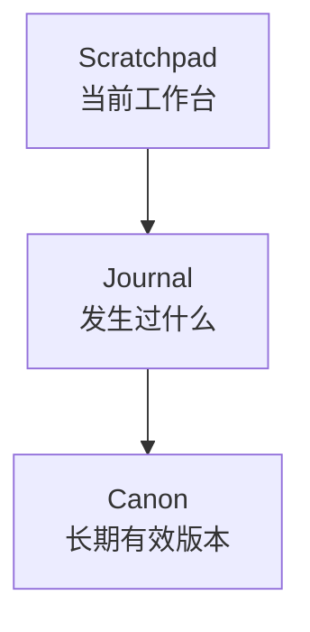
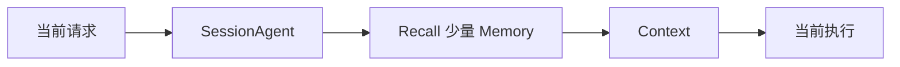
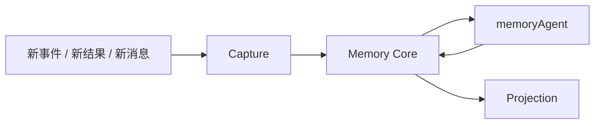
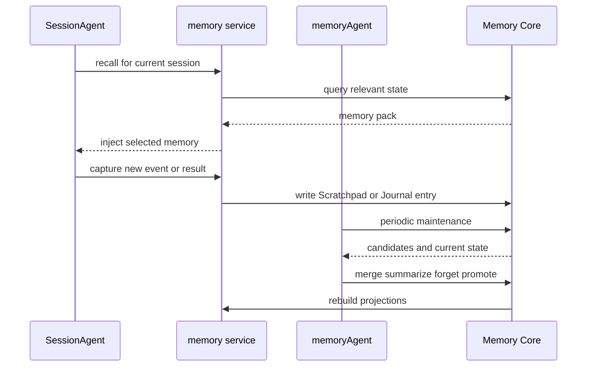

# Memory 设计原理

这页刻意不按当前代码实现复盘。

这页回答的是：

- 按我们现在已经形成的文档逻辑，`memory service` 正确应该怎么设计

也就是说，这是一份：

- 目标设计说明

不是：

- 当前实现忠实说明

先给结论：

- `memory` 应该是一个标准 service
- `memory` 的宿主应该是 `memory service`
- `memoryAgent` 应该只是 `memory service` 内部的后台整理角色
- `Memory` 不是 `History`
- `Memory` 不是 `Session`
- `Memory` 也不是第二个主 Agent

一句话概括：

```text
memory service 应该承载长期状态系统：在线时为 Session 提供 recall，离线时把历史整理成稳定记忆，并投影成不同层级的可用视图。
```

## 先把边界说死

### Memory 不是 History

`History` 是原始发生记录。  
`Memory` 是系统决定要留下来继续使用的长期状态。

### Memory 不是 Session

`Session` 是某个 `sessionId` 对应的持续执行会话。  
`Memory` 是跨 session、跨时间保留下来的长期状态层。

### Memory 不是第二个主 Agent

主执行体仍然是：

- `SessionAgent`

`memoryAgent` 只能是：

- `memory service` 内部的维护角色

而不是另一个平级主角。

## Memory 在整个系统里的正确位置

按目标设计，`memory` 应该这样挂在系统里：



这张图里最重要的意思是：

- `memory service` 是 Memory 的宿主
- `SessionAgent` 是 Memory 的使用者
- `memoryAgent` 是 `memory service` 内部的后台维护角色
- `Memory Core` 才是长期状态中心

## Memory service 的主职责

按目标设计，`memory service` 应该负责四类工作：

### 1. Recall

在热路径中，为当前 Session 提供少量、相关、可控的 memory pack。

它解决的是：

- 这次执行该看见哪些长期状态

### 2. Capture

从 Session、任务结果、关键事件中提取候选记忆。

它解决的是：

- 新发生的事情如何进入 Memory 维护链

### 3. Maintenance

由 `memoryAgent` 在冷路径里整理、合并、归纳、淘汰长期状态。

它解决的是：

- Memory 如何越用越稳，而不是越堆越乱

### 4. Projection

把核心状态投影成不同用途的视图，例如：

- `working`
- `daily`
- `longterm`
- `MEMORY.md`

它解决的是：

- 不同场景应该怎么看见 Memory

## Memory 的真正核心不是文件，而是状态

按目标设计，Memory 的核心不应该是：

- 文件目录
- SQLite 索引
- 某个 action

而应该是下面三层状态：



### Scratchpad

这是短期工作态。

它主要承载：

- 当前目标
- 当前约束
- 当前开放问题
- 当前行动计划

它不是长期真理，只是当前工作台。

### Journal

这是事件层。

它主要承载：

- 某次决策
- 某次任务结果
- 某次失败
- 某次用户反馈

它保留时间线和事实感。

### Canon

这是长期稳定版本。

它主要承载：

- 稳定偏好
- 已确认规则
- 当前有效结论
- 默认可依赖的事实

它不是所有历史的复制，而是被保留下来的长期状态。

## 为什么 Memory 必须先做成状态系统

因为如果直接把 Memory 理解成：

- 文件仓库
- 向量库
- 搜索接口

就会出问题。

会出现这些坏味道：

- 历史和记忆混在一起
- 写入越来越多，但质量越来越差
- recall 越来越重
- 没有 forget 机制
- 没有稳定的“默认版本”

所以更好的设计顺序应该是：

1. 先定义状态层
2. 再定义维护动作
3. 最后决定文件、索引和 projection 怎么实现

## Memory 的两条主路径

Memory 不是只有一条链，而应该明确分成两条：

### 热路径：Recall

面向当前执行，要求轻、快、低延迟。



这里的原则是：

- 只拿少量相关内容
- 不做重整理
- 不把 Memory 全量塞回模型

### 冷路径：Maintenance

面向长期整理，允许慢、允许归纳。



这里的原则是：

- 可以慢
- 可以做归纳
- 可以做冲突处理
- 可以做 forget

## memoryAgent 的正确定位

这点非常关键。

`memoryAgent` 应该被理解成：

- `memory service` 内部的后台整理角色

而不是：

- 平级主执行体
- 第二套主对话 Agent
- 另一个长期 runtime

它最适合做的事是：

- 合并 Journal
- 归纳 Canon 候选
- 处理冲突和过期
- 重写投影视图

它不应该做的事是：

- 每次热路径都强制介入
- 每条消息都同步做大总结
- 抢走 `SessionAgent` 的主执行权

## Memory 和 Session 的关系

Memory 最容易做错的地方，就是和 Session 混掉。

正确关系应该是：

- Session 管当前持续执行
- Memory 管跨时间长期状态

更具体一点：

- Session 会产生新的事件和结果
- Memory 会从中捕获候选长期状态
- 下一轮 Session 执行前，再从 Memory 里 recall 少量有效内容

所以它们的关系是：

- Session 生产现在
- Memory 治理时间

## Memory 和 Context 的关系

Memory 不应该直接等于 Context。

正确流程是：

- Memory 先保存长期状态
- 到某次执行时，再由 recall 策略构造少量 memory pack
- memory pack 再参与 contextualization

所以：

- Context 是这次要给模型看的东西
- Memory 是以后可能被拿来看的长期状态

## Projection 为什么重要

按目标设计，`working / daily / longterm` 不应该再是 Memory 本体，而应该是 projection。

也就是说：

- 核心状态在 `Scratchpad / Journal / Canon`
- 文件层只是面向使用场景的投影视图

这样做有几个好处：

1. 核心状态和展示方式分离
2. 文件结构可以调整，不会破坏 Memory 本体
3. recall 逻辑和 projection 逻辑可以解耦

## 一个理想的 Memory service 工作流



这条链路表达的是：

- 在线时 Memory 为 Session 服务
- 离线时 memoryAgent 为 Memory 本体服务

## 如果按这个设计，memory service 应该有哪些能力

按目标设计，`memory service` 至少应该有这几类能力：

### 在线能力

- `recall`
- `capture`
- `status`

### 冷路径能力

- `maintain`
- `rebuild projection`
- `reindex`

### 观察和调试能力

- 查看当前状态层
- 查看投影视图
- 查看维护日志
- 查看 recall 输出

也就是说，Memory 真正的 API 面不应该只剩：

- 搜索
- 读文件
- 写文件

而应该围绕：

- 状态
- recall
- maintenance

来组织。

## Memory 为什么依然应该是一个 service

因为它完全符合 service 的标准特征：

- 有独立业务主流程
- 有自己的生命周期
- 有自己的存储和维护逻辑
- 会和 Session 紧密协作
- 会定义自己的冷路径和热路径

所以它不应该只是一个 util，也不应该只是一个索引器。

它应该是：

- 长期状态系统的宿主 service

## 当前实现和目标设计的关系

如果用一句话描述当前实现和目标设计的关系，我会写成：

```text
当前实现更像“文件 + 索引 + action”的 Memory V2，
而目标设计应该升级为“状态 + recall + maintenance + projection”的 Memory 系统。
```

这不是说现有实现没有价值，而是说：

- 现有实现更像基础壳子
- 真正的 Memory 逻辑还没有完全落到位

## 最后的统一口径

以后如果再讨论 `memory`，建议统一用这句话：

```text
memory service 是 Downcity 的长期状态宿主。
它负责从历史和执行结果中捕获候选记忆，在冷路径里整理成稳定状态，并在热路径中为 Session 提供少量、相关、可控的 recall 结果。
```
