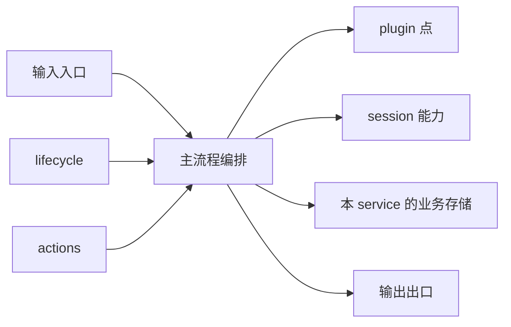
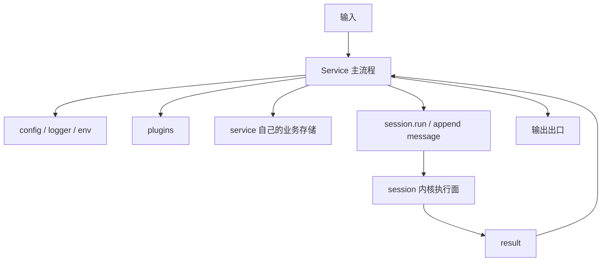

# Service 设计逻辑

这页回答的是：

- 一个 service 由哪些部分组成
- 它怎么接住输入
- 它什么时候进入 session 执行
- 它和 runtime、plugin、session 的关系应该怎么设计

先给结论：

- service 不是一组散乱函数
- service 不是被动工具箱
- service 是某类业务输入的流程编排器

如果一句话概括：

```text
service 的工作不是自己拥有所有能力，而是把外部输入组织成稳定主流程，并在正确节点调用 ExecutionContext、session 能力和 plugin 能力。
```

## 一个 service 的标准结构

从设计上，一个 service 至少要能回答五个问题：

1. 它接什么输入
2. 它的主流程是什么
3. 它什么时候进入 `session.run`
4. 它依赖哪些 runtime 能力
5. 它的结果从哪里出去



## service 的输入从哪里来

在 Downcity 里，service 的输入通常来自四类入口：

### 1. 外部实时输入

例如：

- chat 渠道消息
- webhook
- 浏览器扩展请求

### 2. 控制面输入

例如：

- `/service/<name>/<action>`
- `city service <name> <action>`
- dashboard execute

### 3. 调度输入

例如：

- task scheduler
- cron
- delayed action

### 4. service 间调用

例如：

- `context.invoke(...)`

## service 的主流程到底是什么

service 的主流程不是“调用了哪些工具”，而是“如何把输入推进成结果”。

一个典型 workflow 通常包含：

1. 解析输入
2. 做权限或前置校验
3. 归一化成内部语义对象
4. 决定是否进入 `session.run`
5. 必要时写业务侧事实流
6. 调用 plugin 点
7. 产出结果并送到出口

## 什么情况下应该进入 `session.run`

### 应该进入 session 的情况

- 需要模型推理
- 需要连续对话上下文
- 需要基于历史消息继续执行
- 需要把本轮输入沉淀到长期会话里

### 不应该进入 session 的情况

- 只是读取状态
- 只是管理配置
- 只是做简单控制命令
- 只是做纯工具型同步操作

所以 service 的关键设计动作之一就是：

- 把“纯控制 action”和“真正执行 action”分开

## service 和 ExecutionContext 的关系

service 不直接读全局单例，而是从：

- `ExecutionContext`

拿能力。

这可以被理解成：

- agent runtime 给 service 的受控能力面

它主要暴露：

- `session`
- `invoke`
- `plugins`
- `config`
- `logger`
- `env`

所以 service 代码应该尽量围绕这些稳定端口写，而不是依赖宿主内部实现细节。

## service 和 session 的关系

service 不是 session 宿主，但 service 会围绕 session 工作。

更准确地说，service 会做三件事：

1. 把输入归到某个 `sessionId`
2. 决定何时调用 `session.run`
3. 决定结果如何从业务出口出去

也就是说：

- session 负责持续执行
- service 负责流程编排

## service 和 plugin 的关系

service 负责定义 plugin 介入点。

plugin 不应该反过来主导 service 流程。

比较稳定的原则是：

- service 定义骨架
- plugin 负责局部增强

所以 service 设计时应该先回答：

- 哪些节点是主流程骨架
- 哪些节点允许被扩展

## service 自己该不该有存储

可以，但要分清楚是什么存储。

### 应该由 service 自己维护的

- 审计历史
- 路由元信息
- 渠道元信息
- 业务特有索引
- 调度队列

### 不应该重复维护的

- session 主消息事实源
- session 执行内核状态
- model 本身

这些应该交给 agent runtime 和 session 层。

## 一个 service 的完整依赖图



## 一个好 service 应该满足什么特征

### 1. 主流程清晰

能用几步讲清楚：

- 输入怎么进来
- 中间怎么走
- 结果怎么出去

### 2. 边界稳定

能明确区分：

- 哪些是自己的流程
- 哪些是 session 的职责
- 哪些是 plugin 的职责

### 3. 控制 action 和执行 action 分离

不要把：

- 读状态
- 管配置
- 真正执行

混成同一种 action。

## 一句话总结

```text
一个好的 service，应该把输入、流程、session 进入点、plugin 扩展点和输出出口清晰地组织起来，而不是把所有能力直接揉在一起。
```
