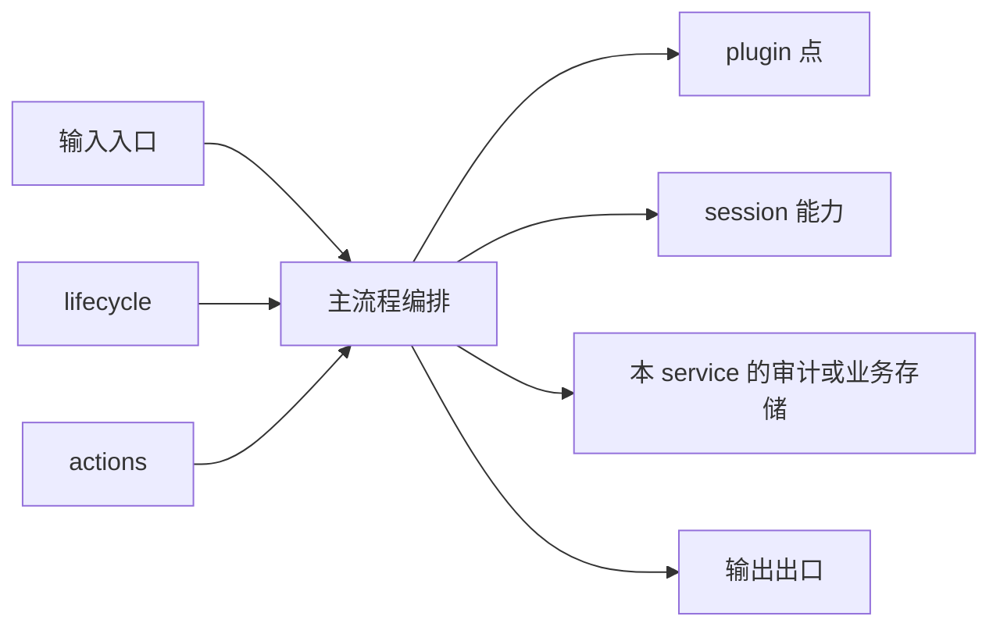
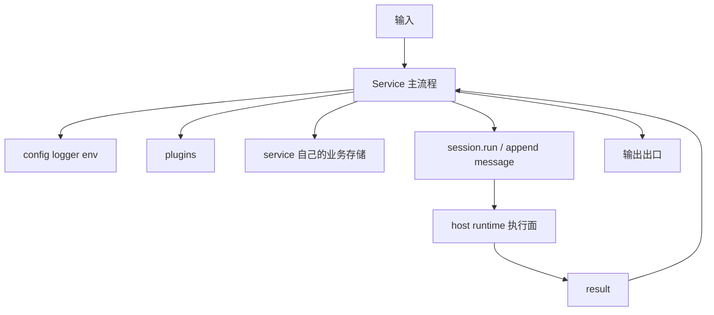

# Service 设计逻辑

这页不再只讲“service 是什么”，而是进一步回答：

- 一个 service 由哪些部分组成
- 它怎么接住输入
- 它什么时候进入 session 执行
- 它和宿主 runtime、plugin、session 的关系应该怎么设计

先给结论：

- service 不是一组散乱函数
- service 也不是一个被动工具箱
- service 是某类业务输入的流程编排器

如果一句话概括：

```text
service 的工作不是自己拥有所有能力，而是把外部输入组织成一条稳定主流程，并在正确节点调用 host runtime、session 能力和 plugin 能力。
```

## 一个 service 的标准结构

从设计上，一个 service 至少要能回答五个问题：

1. 它接什么输入
2. 它的主流程是什么
3. 它什么时候进入 `session.run`
4. 它依赖哪些 runtime 能力
5. 它的结果从哪里出去

可以把一个 service 粗分成下面几块：



这里每个块的含义是：

- `输入入口`：消息、任务、dashboard execute、HTTP action、service command
- `主流程编排`：service 自己真正拥有的业务逻辑
- `plugin 点`：流程节点增强
- `session 能力`：交给宿主执行的 session 主轴
- `本 service 的存储`：service 自己维护的事实流或元信息
- `输出出口`：回复渠道、任务结果、状态返回、日志、副作用

## service 的输入从哪里来

在 Downcity 里，service 的输入通常来自四类入口：

### 1. 外部实时输入

例如：

- chat 渠道消息
- webhook
- 浏览器扩展发来的请求

这类输入通常代表：

- 用户或外部系统主动触发

### 2. 控制面输入

例如：

- `/service/<name>/<action>`
- `city service <name> <action>`
- dashboard execute

这类输入通常代表：

- 控制面或调试入口

### 3. 调度输入

例如：

- task scheduler
- cron
- delayed action

这类输入通常代表：

- 系统内部按时间或策略触发

### 4. service 间调用

例如：

- `runtime.services.invoke(...)`

这类输入通常代表：

- 另一个 service 把某段工作委托过来

## service 的主流程到底是什么

service 的主流程不是“调用了哪些工具”，而是“如何把输入推进成结果”。

一个典型 service workflow 里通常包含：

1. 解析输入
2. 做权限或前置校验
3. 归一化成内部语义对象
4. 决定是否进入 `session.run`
5. 必要时写业务侧事实流
6. 调用 plugin 点
7. 产出结果并送到出口

所以 service 设计时最重要的不是先想工具，而是先想：

- 流程图

## 什么情况下应该进入 `session.run`

这点特别重要，因为不是每个 service action 都应该进 session。

### 应该进入 session 的情况

- 需要模型推理
- 需要连续对话上下文
- 需要基于历史消息继续执行
- 需要把本轮输入沉淀到长期会话里

### 不应该进入 session 的情况

- 只是读取状态
- 只是管理配置
- 只是做简单控制命令
- 只是做纯工具型同步操作

所以 service 的一个关键设计动作就是：

- 先把“纯控制 action”和“真正执行 action”分开

## service 和 `ServiceRuntime` 的关系

service 不直接读全局单例四处拼东西，而是从 `ServiceRuntime` 拿能力。

从设计口径上看，`ServiceRuntime` 应该被理解成：

- host runtime 给 service 的受控能力面

它解决的是：

- service 需要能力，但不应该知道宿主实现细节

目前对 service 暴露的关键能力主要是：

- `session`
- `invoke`
- `services`
- `plugins`
- `config`
- `logger`
- `env`

所以 service 的代码应该尽量围绕这些稳定端口写，而不是直接依赖宿主内部细节。

## service 和 session 的关系

service 不是 session 宿主，但 service 会围绕 session 工作。

更准确地说，service 在做三件事：

1. 把输入归到某个 `sessionId`
2. 决定何时调用 `session.run`
3. 决定结果如何从业务出口出去

也就是说：

- session 负责持续执行
- service 负责流程编排

这两个角色不能混。

## service 和 plugin 的关系

service 负责定义 plugin 介入点。

plugin 不应该反过来主导 service 流程。  
如果某个流程节点必须存在，那它应该属于 service 主流程；如果某个节点是可选增强，那它才应该做成 plugin 点。

一个比较稳定的判断方法是：

- service 定义“骨架”
- plugin 负责“局部增强”

也就是说，service 设计时应该先回答：

- 哪些节点是主流程骨架
- 哪些节点允许被扩展

## service 自己该不该有存储

可以，但要分清楚是什么存储。

### 应该由 service 自己维护的

- 审计历史
- 路由元信息
- 渠道元信息
- 业务特有索引
- 调度队列

### 不应该重复维护的

- session 主消息事实源
- session agent 的长期执行状态
- model 本身

这些应该交给宿主 runtime 和 session runtime。

## 一个 service 的完整依赖图



这张图表达的是：

- service 是流程中心
- 但执行和基础设施不都在 service 自己手里

## 一个好 service 应该满足什么特征

### 1. 主流程清晰

能用几步讲清楚：

- 输入怎么进来
- 中间怎么走
- 结果怎么出去

### 2. 边界稳定

能明确区分：

- 宿主能力
- session 能力
- plugin 能力
- service 自己维护的状态

### 3. action 和 workflow 分离

不要把 action 入口和主流程逻辑混成一层。

更好的做法是：

- action 负责承接入口
- workflow 负责真正业务逻辑

### 4. 控制路径和执行路径分离

例如：

- `status`
- `list`
- `configure`

这类 action 应该尽量不要误入 `session.run`。

### 5. 结果出口明确

service 一定要能回答：

- 最终结果发到哪里

因为这是 service 的“闭环”。

## 怎么判断某个新能力该不该做成 service

可以用这几个问题判断：

1. 它是不是拥有一条独立主流程
2. 它是不是会长期存在于 agent 运行周期中
3. 它是不是要承接一类稳定输入
4. 它是不是要在多个节点调用 session 或 plugin
5. 它是不是需要自己的 lifecycle 或 actions

如果这几个问题大多都是“是”，它更像 service。

如果不是，它可能更像：

- plugin
- helper
- runtime util
- asset

## chat 为什么是一个标准 service

`chat` 很典型，因为它完全符合 service 的特征：

- 有外部稳定输入：聊天消息
- 有自己的生命周期：渠道启动和停止
- 有自己的业务存储：chat meta、chat history、queue
- 会决定何时进入 `session.run`
- 会定义多个 plugin 点
- 有明确结果出口：聊天渠道回复

所以它不是一个“消息适配器集合”，而是一个完整 service。

## 最后的设计口径

以后如果再设计 service，建议统一用这句判断：

```text
一个 service 应该拥有一条独立业务主流程，负责把某类输入归一化、编排、必要时送入 session 执行，再把结果从明确的业务出口送出去。
```
