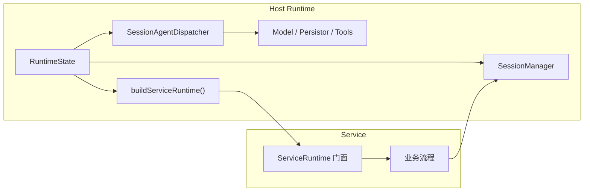
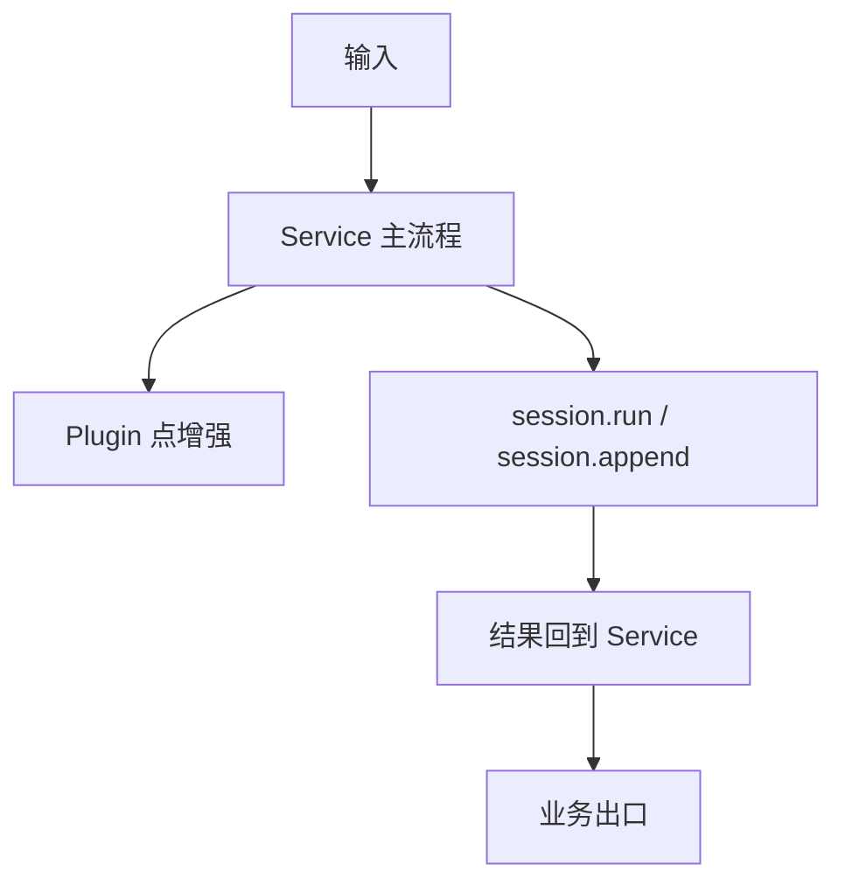

# Service 原理

这页只回答一个问题：

`service` 在 Downcity 里到底是什么。

先给结论：

- service 不是宿主运行时
- service 不是 session 宿主
- service 不是 plugin
- service 是主业务流程拥有者

也就是说，service 最重要的职责，不是“提供几个函数”，而是：

- 接住一类业务输入
- 决定这类输入的主流程怎么走
- 在合适的节点调用宿主能力与 plugin 能力

## 一句话模型

```text
host runtime 负责维护系统怎么跑
service 负责决定某类业务流程怎么走
plugin 负责在流程节点做增强
```

## service 的边界

如果一个模块满足下面几个特征，它更接近 `service`：

1. 它拥有明确的业务主流程
2. 它能接住外部输入或内部调度输入
3. 它会决定何时进入 `session.run`
4. 它会在流程节点调用 plugin
5. 它通常有 action 或 lifecycle

当前典型例子：

- `chat`
- `task`
- `memory`
- `shell`

反过来说，如果一个模块只是：

- 在某个节点被动调用
- 没有自己的主流程
- 没有独立 lifecycle
- 不负责承接业务输入

那它就不应该被理解成 `service`。

## service 和宿主运行时的关系

service 不是自己维护整套运行时。

真正持有全局运行态的是宿主侧 `RuntimeState`。  
它负责维护：

- `config`
- `logger`
- `env`
- `SessionManager`
- `SessionAgentDispatcher`
- model
- persistor

service 看到的只是一个统一注入对象：`ServiceRuntime`。

`ServiceRuntime` 更像一个门面，而不是独立 runtime。

它主要暴露：

- `session`
- `invoke`
- `services`
- `plugins`
- `config`
- `logger`
- `env`

所以更准确的关系是：



## service 和 session 的关系

service 也不是 session 宿主。

session 真正由宿主运行时维护。  
service 只是围绕 session 工作：

- 把外部输入归到某个 `sessionId`
- 给 session 注入 user message
- 决定何时调用 `session.run`
- 把执行结果再投递回业务出口

所以正确口径不是：

- session 属于某个 service

而是：

- service 围绕 session 组织自己的业务流程

## service 和 plugin 的关系

service 是流程拥有者，plugin 是节点增强器。

当前口径是：

- plugin 点由 service 定义
- 执行语义由 runtime 统一提供
- plugin 只负责实现某些点

以 `chat` 为例，service 会定义：

- `chat.augmentInbound`
- `chat.observePrincipal`
- `chat.authorizeIncoming`
- `chat.resolveUserRole`
- `chat.beforeEnqueue`
- `chat.afterEnqueue`
- `chat.beforeReply`
- `chat.afterReply`

所以：

- service 决定什么时候调用这些点
- plugin 决定某个点怎么增强

## service 的生命周期

service 通过 `lifecycle` 和 `actions` 暴露能力。

`lifecycle` 解决的是：

- 启动
- 停止
- 重启

`actions` 解决的是：

- service command
- HTTP action API
- Console 调用入口

也就是说，service 不是简单的函数集合，而是：

- 一个被宿主 runtime 托管的业务单元

## 最简关系图



## 一句话定义

```text
service 是 Downcity 里承接一类业务输入、组织主流程、调用 session 能力和 plugin 能力，并把结果送回业务出口的主流程单元。
```
