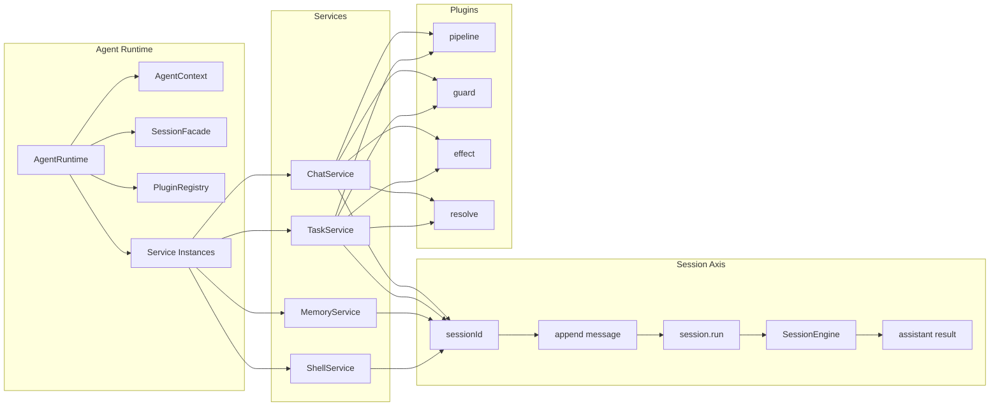

# Service 总关系图

这页的目标是把当前 package 里的主关系收成一张图。

先给结论：

- `AgentRuntime` 是能力底座
- `session` 是执行主轴
- `service` 是业务流程编排层
- `plugin` 是流程节点增强层

一句话：

```text
AgentRuntime 提供能力底座
session 承载执行主轴
service 组织业务主流程
plugin 在特定节点增强流程
```

## 最核心的总图



这张图表达了四个事实：

1. 当前能力底座是 `AgentRuntime`
2. 执行主轴是 `sessionId -> session.run`
3. service 组织业务主流程
4. plugin 只增强，不拥有主流程

## 四层分别回答什么问题

### 1. Agent Runtime

它回答的是：

- 当前项目怎么初始化
- model 从哪里来
- session 从哪里来
- service 和 plugin 怎么装配

这一层真正持有：

- `AgentRuntime`
- `AgentContext`
- `SessionFacade`
- `PluginRegistry`
- per-agent `services`

### 2. Session Axis

它回答的是：

- 输入最终归到哪个 `sessionId`
- 消息如何沉淀到会话事实源
- 什么时候进入 `session.run`
- 执行结果如何继续写回同一个 session

所以：

- Session 是执行主轴

### 3. Services

它回答的是：

- 某类输入的主流程怎么走
- 哪一步进入 session
- 哪些节点开放给 plugin
- 结果从哪里出去

所以：

- service 是流程编排层

### 4. Plugins

它回答的是：

- 某个流程节点如何增强
- 某个节点怎么校验
- 某个节点需要什么副作用

所以：

- plugin 是增强层

## 一条真实执行链怎么穿过四层


关键点：

- 输入先进入 service
- service 决定 sessionId
- 真正执行发生在 session 层
- plugin 只在 service 定义的节点插入

## 为什么 service 不能直接等于 session

如果把 service 直接等于 session，会出现几个问题：

- 一个 session 难以被多类 service 复用
- service 会同时承担流程编排和执行宿主两种职责
- 启动装配和业务主链会混在一起

更稳定的关系是：

- session 是长期执行状态
- service 是围绕 session 组织业务流程

## Chat 和 Task 在总图里的角色

### Chat

`chat` 是实时会话型 service。

它最关注：

- 渠道输入
- 入队
- 路由到 `sessionId`
- 实时回复

### Task

`task` 是离散执行型 service。

它最关注：

- task 定义
- scheduler
- run 目录
- script / agent 执行
- 结果产物

虽然两者都复用 session 内核，但进入 session 的方式不同：

- `chat` 更像实时消息驱动
- `task` 更像受控 run 驱动

## 设计时最稳定的判断顺序

以后新增 service，建议按这个顺序思考：

1. 输入是什么
2. 主流程由谁拥有
3. 哪一步需要 `sessionId`
4. 哪一步进入 `session.run`
5. 哪些节点需要 plugin
6. 结果从哪里收口
