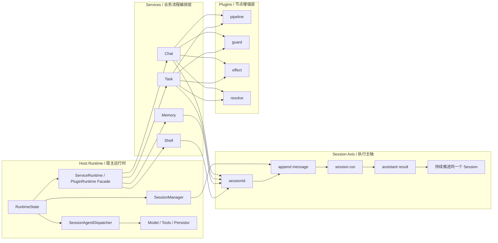
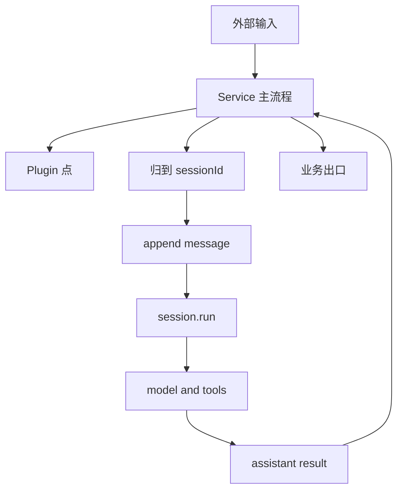

# Service 总关系图

前面几篇文档分别讲了：

- service 是什么
- service 应该怎么设计
- `chat` 怎么做
- `task` 怎么做

这页的目标是把它们收成一张总图。

先给结论：

- `host runtime` 是宿主和执行底座
- `session` 是执行主轴
- `service` 是业务流程编排层
- `plugin` 是流程节点增强层

一句话：

```text
host runtime 提供能力底座
session 承载持续执行
service 组织业务主流程
plugin 在特定节点增强流程
```

## 最核心的总图



这张图表达了四个核心事实：

1. `host runtime` 才是能力底座
2. `sessionId` 才是执行主轴
3. `service` 不是 session 宿主，而是 session 的流程组织者
4. `plugin` 不拥有主流程，只在 service 定义的节点增强流程

## 四层分别回答什么问题

### 1. Host Runtime

它回答的是：

- 系统怎么启动
- runtime 能力从哪里来
- model、persistor、session manager 谁来维护
- service 和 plugin 用什么受控端口拿能力

这一层真正持有：

- `RuntimeState`
- `SessionManager`
- `SessionAgentDispatcher`
- model
- persistor

所以：

- host runtime 是底座

### 2. Session Axis

它回答的是：

- 输入最终归到哪个 `sessionId`
- 消息如何沉淀到会话事实源
- 什么时候进入 `session.run`
- 执行结果如何继续写回同一个 session

所以：

- Session 是执行主轴

### 3. Services

它回答的是：

- 某类输入的主流程怎么走
- 什么时候做权限校验
- 什么时候写本 service 的审计或业务存储
- 什么时候进入 `session.run`
- 结果从哪个业务出口出去

所以：

- service 是流程编排层

### 4. Plugins

它回答的是：

- 某个流程节点如何增强
- 某个节点怎么校验
- 某个节点需要什么附加副作用

所以：

- plugin 是增强层，不是主流程拥有者

## 一条真实执行链是怎么穿过这四层的

下面这张图把“输入如何穿过 host runtime、service、session、plugin”压成一条线：



这条链的关键点是：

- 输入先进入 service，不是先进入 plugin
- 进入 session 之前，service 可以做归一化和前置判断
- 真正执行在 session 主轴里
- 结果出来以后，再回到 service 收口

## 为什么 service 不能直接等于 session

这是最容易误解的一点。

如果把 service 直接等于 session，会出现几个问题：

- 一个 session 无法被多个 service 复用
- service 会同时承担“流程编排”和“执行宿主”两种职责
- 控制路径和执行路径会混在一起
- 会更难抽出稳定的 `ServiceRuntime` 门面

正确关系应该是：

- session 是长期执行状态
- service 是围绕 session 编排业务流程

## 为什么 plugin 不应该主导 service

如果 plugin 反过来主导 service，就会破坏主流程边界。

比较稳定的关系是：

- service 定义骨架
- plugin 在骨架节点增强

这样才能保证：

- 主流程可读
- 插件可选
- 系统可调试

## Chat 和 Task 放进总图里分别是什么角色

### Chat

`chat` 是实时会话型 service。

它最关注：

- 渠道输入
- 路由到 `sessionId`
- 实时回复

### Task

`task` 是离散执行型 service。

它最关注：

- 任务定义
- 触发调度
- run 目录
- 结果产物

所以它们虽然都围绕 session 工作，但进入 session 的方式不同：

- `chat` 更像把实时消息送进会话
- `task` 更像围绕任务定义创建一次 run 执行

## 设计时最稳定的判断顺序

以后如果要新增一个 service，推荐按这个顺序想：

1. 输入是什么
2. 主流程怎么走
3. 哪一步需要 `sessionId`
4. 哪一步进入 `session.run`
5. 哪些节点开放给 plugin
6. 结果从哪里出去

这个顺序的好处是：

- 先把主流程和执行主轴想清楚
- 再决定扩展点

## 最后的统一口径

以后如果要统一描述这套系统，建议用这段话：

```text
Downcity 的执行底座在 host runtime 中，真正被持续推进的是 Session。
service 负责把某类输入组织成稳定业务流程，并围绕 sessionId 调用 session 能力。
plugin 不拥有主流程，只在 service 定义的节点增强流程。
```
