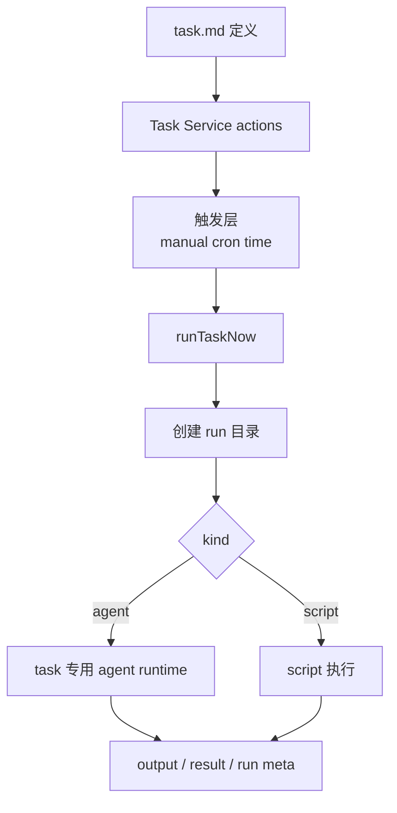
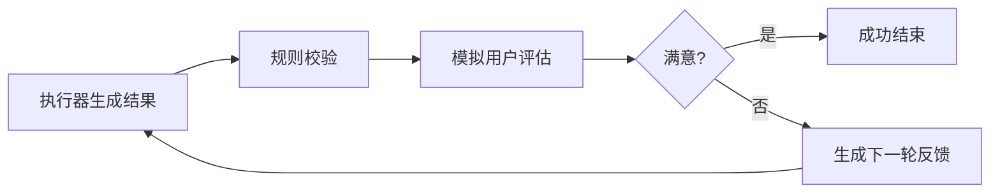

# Task 设计原理

这页专门解释 `task` service 怎么工作。

先给结论：

- `task` 是一个标准 service
- `task` 的核心不是“立即聊天执行”，而是“任务定义 + 触发 + run 执行”
- `task` 也围绕 `sessionId` 工作，但它不会直接复用 chat 的实时执行链
- `task` 执行时会创建 task 专用 runtime 和独立 run 目录

一句话概括：

```text
task service 负责把任务定义持久化、按触发条件调度执行，并在独立 run 环境里调用 agent 或 script 完成任务，再把结果写成可审计产物。
```

## Task 的真实职责

`task` service 负责：

1. 管理任务定义
2. 维护任务状态
3. 维护 cron 或定时触发
4. 启动一次具体 task run
5. 为本次 run 创建独立产物目录
6. 在 agent 模式或 script 模式下执行任务
7. 写入 run 产物和结果摘要

所以它和 `chat` 最大的区别是：

- `chat` 以“实时消息流”为核心
- `task` 以“任务定义和离散 run”为核心

## Task 的主要对象

可以把 `task` service 的核心对象分成三层：

### 1. 任务定义层

这一层对应：

- `task.md`
- frontmatter
- body

它解决的是：

- 任务是什么
- 什么触发
- 用哪个 `sessionId`
- 走 `agent` 还是 `script`

### 2. 调度与触发层

这一层对应：

- manual run
- cron runtime
- one-shot time trigger

它解决的是：

- 这条任务什么时候开始执行

### 3. run 执行层

这一层对应：

- `runTaskNow`
- run 目录
- task 专用 agent runtime
- 输出产物

它解决的是：

- 某一次任务执行到底发生了什么

## Task 的完整链路



## Task 和 Session 的关系

`task` 也围绕 `sessionId` 工作，但它和 `chat` 的方式不同。

### `sessionId` 在 task 里代表什么

任务定义中的 `sessionId` 不是说：

- 直接把任务当作 chat 的下一条实时消息发进去

而是说：

- 这条任务属于哪个语义会话
- 任务执行时需要把这个 session 语义透传进来

### task run 时真正使用的是什么

task 在执行时会创建：

- 本次 run 的执行 session
- 必要时还会创建 user simulator session

并把消息落到 run 目录里的 `messages.jsonl`，而不是直接接到普通 chat 历史后面。

所以 task 的口径应该是：

- `sessionId` 是任务语义绑定
- run session 是任务执行实例绑定

## Task 和宿主 runtime 的关系

`task` 依然依赖宿主 runtime，但方式和 `chat` 不完全一样。

`chat` 更多是通过现成的 `ServiceRuntime.session.run()` 进入宿主执行链。  
`task` 在 run 阶段则会额外创建一个 task 专用 agent runtime：

- 单独的 `Agent`
- 单独的 `Persistor`
- 单独的 run 目录
- 独立的 task profile system

这意味着：

- `task` 不只是“调用一下现成 session.run”
- 它还要为单次 run 组装一个更隔离的执行环境

## Task 专用 agent runtime 做了什么

task 的 `Runner` 会创建一个最小 task agent runtime。

它主要负责：

- 给执行器 agent 提供独立 persistor
- 把消息写到 run 目录下的 `messages.jsonl`
- 使用 `task` profile 组装 prompt system
- 在需要 review 时，再额外创建 user simulator agent

可以把它理解成：

- 从宿主 runtime 借能力
- 但在 run 目录里搭了一个隔离执行沙盒

## 为什么 Task 需要 run 目录

这是 `task` 设计里非常关键的一点。

每次执行都会生成：

- `./.downcity/task/<taskId>/<timestamp>/`

这个目录是一次 task run 的事实源。

它通常会包含：

- `input.md`
- `output.md`
- `result.md`
- `run-progress.json`
- `run.json`
- `dialogue.md`
- `dialogue.json`
- `messages.jsonl`
- `error.md`

这意味着：

- task 不是只关心“最终答案”
- task 关心“一次执行的完整审计与回放”

## Task 的两种执行模式

### 1. `kind=agent`

这是推理型任务。

它的特点是：

- 由 agent 执行任务正文
- 默认单轮执行
- 若 `review=true`，会进入“执行器 + 模拟用户”的多轮修订

所以它更适合：

- 研究
- 总结
- 分析
- 需要生成结构化文字产物的工作

### 2. `kind=script`

这是脚本型任务。

它的特点是：

- 直接把任务正文写成 shell 脚本并执行
- 输出以 stdout/stderr 为主
- 校验是否形成有效输出

所以它更适合：

- 明确 shell 操作
- 批处理型工作
- 不需要模型推理的流程

## review 为什么重要

`review=true` 时，task 不是“跑一轮就结束”，而会增加一个模拟用户评估环节。

链路会变成：



这套机制的意义是：

- 不把一次输出直接视为最终完成
- 给任务一种有限轮次的自我修订能力

但这里也有明确边界：

- 轮次有限
- 不是开放式长期对话
- 目标仍然是生成一次 run 的最终产物

## Task 的控制路径和执行路径

`task` 很典型地同时包含控制路径和执行路径。

### 控制路径

例如：

- create
- update
- delete
- set status
- list

这些主要处理：

- 定义层
- 配置层
- scheduler 重载

它们通常不需要进入真正的 task run。

### 执行路径

例如：

- manual run
- cron run
- time trigger run

这些会真正进入：

- `runTaskNow`
- run 目录
- agent/script 执行

所以 `task` service 的设计也很适合说明一条原则：

- action 不等于执行

## Task 的存储是怎么分层的

`task` 不是把所有东西都写进同一个地方，而是分成三层存储：

### 1. 定义存储

任务定义写在：

- `task.md`

它负责长期保存任务配置。

### 2. 调度状态

任务调度运行态由 cron runtime 和 scheduler 管理。

它负责：

- 哪些任务被注册
- 哪些定时器正在运行

### 3. run 产物

每次执行写到独立 run 目录。

它负责：

- 本次执行的输入
- 本次执行的中间进度
- 本次执行的最终输出

## Task 为什么也是标准 service

`task` 完全符合 service 的标准特征：

- 有独立业务输入：任务定义、调度触发、手动执行
- 有自己的 lifecycle：cron runtime start/stop/restart
- 有自己的业务存储：task.md、run 目录
- 有明确主流程：定义 -> 触发 -> run -> 产物
- 有明确出口：run 结果和产物文件

所以它不是一个简单 scheduler，也不是单纯 agent helper。

它是：

- 一个围绕“任务定义和 run 执行”组织起来的完整 service

## Task 和 Chat 的关系

`task` 和 `chat` 都是 service，但关注点完全不同。

### Chat

关注：

- 实时消息
- 渠道路由
- 对话编排
- 回消息

### Task

关注：

- 定义任务
- 触发任务
- 独立 run
- 产物沉淀

所以可以把它们理解成：

- `chat` 是实时会话型 service
- `task` 是离散执行型 service

## 最后的设计口径

以后如果再讨论 `task`，建议统一用下面这句话：

```text
task service 负责管理任务定义和触发条件，并为每次执行创建独立 run 环境，在 agent 或 script 模式下完成任务，把结果沉淀成可审计的执行产物。
```
