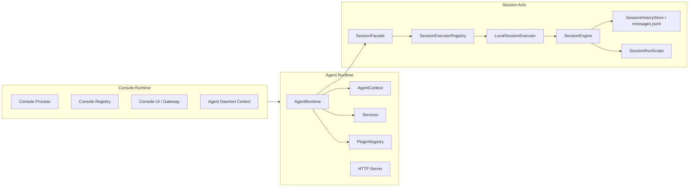
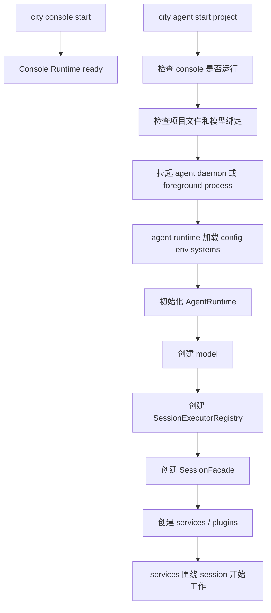
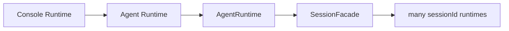

# Console Runtime 与 Session Runtime

这页只解决一个问题：

- 当我们说 `console runtime`、`agent runtime`、`session runtime` 时，当前代码里到底谁负责什么

先给结论：

- `console runtime` 是全局控制面
- `agent runtime` 是单项目执行面
- `session runtime` 不是一套独立控制面，而是 agent runtime 内部围绕 session 的执行主轴

如果压成一句话：

```text
console 管 agent 怎么被启动、登记、观测和控制
agent 管当前项目怎么执行
session runtime 是 agent 内部围绕 sessionId 组织起来的执行主轴
```

## 为什么要以 Session 为核心理解

真正被持续推进的不是：

- console 进程
- chat service
- 单次模型请求

而是：

- 某个 `sessionId` 对应的一段持续执行会话

也就是说：

- console runtime 负责管理 agent
- agent runtime 负责承载 session
- service 围绕 session 工作

所以 Session 才是执行面的真正锚点。

## 三层关系总图



最重要的两点是：

- `console runtime` 不直接拥有 session state
- `session runtime` 是 `agent runtime` 内部的一部分

## 先分清三个概念

### 1. Console Runtime 是什么

`console runtime` 是全局控制面。

它负责：

- 确保 console 进程存活
- 维护 agent registry
- 管理 agent daemon 的启动和停止
- 提供 console UI 与控制入口
- 维护全局模型配置和共享 env

它不负责：

- 持有某个项目的 `SessionFacade`
- 持有某个 session 的消息事实源
- 直接运行某个 session 的模型推理

### 2. Agent Runtime 是什么

`agent runtime` 是单项目执行面。

它负责：

- 加载当前项目的 `downcity.json`
- 加载 env 和 system prompts
- 初始化 `AgentRuntime`
- 创建 `SessionFacade`
- 创建 service 用的 model
- 注册 plugins
- 创建 per-agent services

也就是说，真正跑业务的是 agent runtime，不是 console runtime。

### 3. Session Runtime 是什么

当前代码里，session runtime 更准确地指：

- 以 `sessionId` 为键
- 以 `SessionFacade` 为入口
- 由 `SessionExecutorRegistry / LocalSessionExecutor / SessionEngine / SessionHistoryStore / SessionRunScope / Model` 共同组成的一组执行机制

所以后面讨论 session runtime 时，更准确的说法应该是：

- `SessionFacade` 及其下游执行链

## 启动链路：console 和 session 怎么串起来

### 第一步：启动 console runtime

`city console start` 先把全局控制面拉起来。

这时系统得到的是：

- console pid
- console routes
- console registry
- 全局管理入口

但这一步还没有某个项目自己的 session 执行链。

### 第二步：启动某个 agent runtime

`city agent start <project>` 会先要求：

- console 已启动
- 项目初始化文件完整
- `downcity.json` 存在
- `model.primary` 可用

通过后，系统会拉起一个单独的 agent 进程。

### 第三步：agent runtime 初始化 session 主轴

在 agent 进程内部，会做这些事：

- 创建 `AgentRuntime`
- 创建 model
- 创建 `SessionExecutorRegistry`
- 创建 `SessionFacade`
- 绑定 tools、history store、prompt system
- 创建 services 与 plugins

直到这一步完成之后，当前项目才真正拥有可执行的 session runtime。

### 启动总图



## Console Runtime 和 Session Runtime 的真正关系

两者的关系不是“父对象直接持有子对象”，而是：

- console runtime 管控 agent runtime
- agent runtime 持有 session runtime

换句话说：

- console 管的是项目级 daemon 和控制入口
- session runtime 管的是当前项目内部每个 session 的执行



## console “知道 session” 到什么程度

console 不拥有 session，但它并不是完全看不见 session。

它可以通过 dashboard 或 agent API 间接看到 session 摘要，例如：

- session 列表
- message 数量
- 最后一条消息摘要
- 当前是否正在执行

但这些都是：

- 观测结果
- 查询视图

不是：

- session state 的所有权

## 一句话总结

```text
console runtime 负责控制和观测 agent，agent runtime 用 AgentRuntime 持有 SessionFacade，session runtime 则是 agent 内部围绕 sessionId 组织起来的执行主轴。
```
