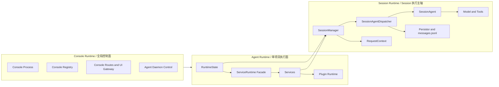
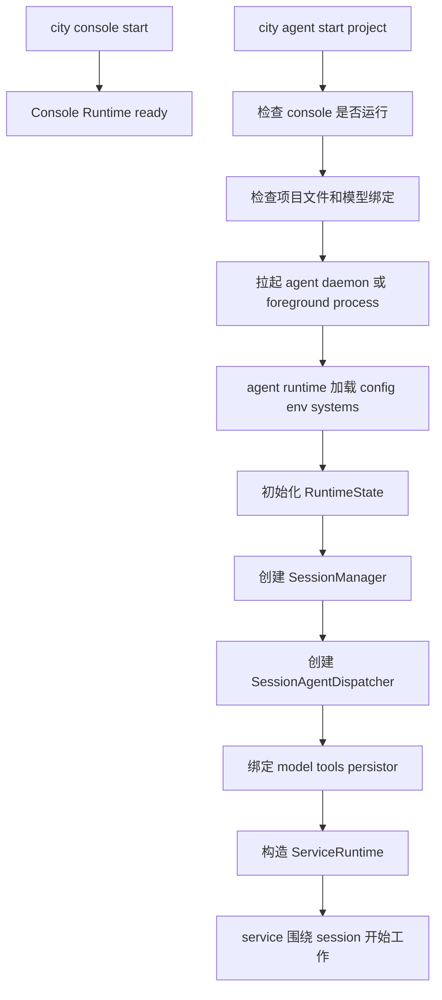
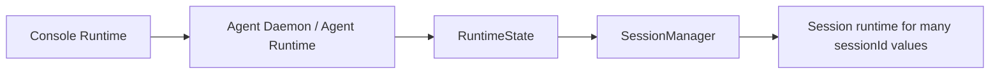
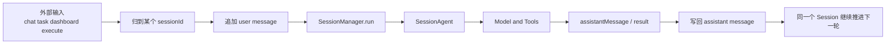

# Console Runtime 与 Session Runtime

这页只解决一个问题：

当我们说 `console runtime`、`agent runtime`、`session runtime` 的时候，到底谁负责什么。

先给结论：

- `console runtime` 是全局控制面
- `agent runtime` 是单项目执行面
- 所谓 `session runtime`，并不是一个单独命名的 runtime 类
- 更准确地说，它是 agent runtime 里以 `SessionManager` 为核心的一组 session 执行组件

如果要再压成一句话：

```text
console runtime 管 agent 怎么被启动、登记、观测和控制
agent runtime 管当前项目怎么执行
session runtime 是 agent runtime 内部围绕 sessionId 组织起来的执行主轴
```

## 为什么要以 Session 为核心理解

如果只按“进程”理解，很容易把系统看扁。

因为真正被持续推进的不是：

- console 进程
- chat service
- 单次模型请求

而是：

- 某个 `sessionId` 对应的一段持续执行会话

也就是说：

- console runtime 负责管理 agent
- agent runtime 负责承载 session
- service 围绕 session 工作

所以 Session 才是执行面的真正锚点。

## 三层关系总图



这张图里最重要的两点是：

- `console runtime` 不直接拥有 session state
- `session runtime` 是 `agent runtime` 内部的一部分，不是平行于 agent runtime 的另一套宿主

## 先分清三个概念

### 1. Console Runtime 是什么

`console runtime` 是全局控制面。

它负责：

- 确保 console 进程存活
- 维护 agent registry
- 管理 agent daemon 的启动和停止
- 提供 console UI 与 service control 路由
- 维护全局模型池和控制入口

它最关心的是：

- 哪些项目 agent 正在运行
- 某个 agent 是否可达
- 如何给某个 agent 发送控制或查询请求

它不负责：

- 持有某个项目的 `SessionManager`
- 持有某个 session 的消息事实源
- 直接运行某个 session 的模型推理

### 2. Agent Runtime 是什么

`agent runtime` 是单项目执行面。

它负责：

- 加载当前项目的 `downcity.json`
- 加载 env 和 system prompts
- 初始化 `RuntimeState`
- 创建 `SessionManager`
- 创建 service 用的 model
- 注册 plugins 和 assets
- 给 services 注入 `ServiceRuntime`

也就是说，真正跑业务的是 agent runtime，不是 console runtime。

### 3. Session Runtime 是什么

代码里没有一个正式类叫 `SessionRuntime`，但这个概念是成立的。

如果从职责上定义，`session runtime` 指的是：

- 以 `sessionId` 为键
- 以 `SessionManager` 为入口
- 由 `SessionAgentDispatcher / SessionAgent / Persistor / RequestContext / Model` 共同组成的一组执行机制

所以后面讨论 session runtime 时，更准确的说法应该是：

- `SessionManager` 及其下游执行链

## 启动链路：console 和 session 是怎么串起来的

### 第一步：启动 console runtime

`city console start` 先把全局控制面拉起来。

这时系统得到的是：

- console pid
- console routes
- console registry
- 全局管理入口

但这一步还没有某个项目的 session runtime。

### 第二步：启动某个 agent runtime

`city agent start <project>` 会先要求：

- console 已启动
- 项目初始化文件完整
- `downcity.json` 存在
- `model.primary` 可用

通过后，系统会拉起一个单独的 agent 进程。

这意味着：

- console runtime 和 agent runtime 是两个不同层级
- agent runtime 不是 console 的一个对象，而是被 console 管理的单项目执行宿主

### 第三步：agent runtime 初始化 session 主轴

在 agent 进程内部，会做这些事：

- 创建 `RuntimeState`
- 创建 `SessionManager`
- 创建 `SessionAgentDispatcher`
- 绑定 model、persistor、tools
- 构造 `ServiceRuntime`

直到这一步完成之后，当前项目才真正拥有可执行的 session runtime。

### 启动总图



## Console Runtime 和 Session Runtime 的真正关系

这两者的关系不是“父对象直接持有子对象”，而是：

- console runtime 管控 agent runtime
- agent runtime 持有 session runtime

换句话说：

- console 管的是“项目级 daemon 和控制入口”
- session runtime 管的是“当前项目内部每个 session 的执行”

### 一张更准确的控制关系图



这里特别要注意：

- console 不直接管理 `sessionId -> SessionAgent`
- 这个映射是在 agent 进程内部，由 `SessionManager` 和 `SessionAgentDispatcher` 管的

## SessionManager 为什么属于 agent runtime，而不是 console runtime

这个问题最容易混淆。

答案是：

- 从“进程所在位置”看，它确实不在 chat service 里，而在宿主侧
- 但这个宿主侧是单项目的 agent runtime，不是全局 console runtime

也就是说：

- `SessionManager` 不是 console registry 的一部分
- `SessionManager` 是当前 agent 进程内部运行态的一部分

所以最准确的口径不是：

- `SessionManager` 属于 console runtime

而是：

- `SessionManager` 属于 agent runtime 的宿主层
- console runtime 只负责把 agent runtime 拉起来并管理它

## console “知道 session” 到什么程度

console 不拥有 session，但它并不是完全看不见 session。

它可以通过 dashboard 或 service routes 间接看到 session 摘要，例如：

- session 列表
- message 数量
- 最后一条消息摘要
- chat 元信息
- 当前是否正在执行

但是这些都是：

- 观测结果
- 查询视图

不是：

- session state 的所有权

换句话说，console 对 session 的认知是：

- `observe`
- `inspect`
- `control entry`

而不是：

- `own`
- `execute directly`
- `store directly`

## 什么东西真正围绕 Session 组织

如果把执行面按 Session 看，下面这些能力都围绕 Session 组织：

- user message append
- assistant message append
- persistor 读写
- compact / archive
- request scope 绑定
- model run
- tool loop
- service 业务流程入口

这意味着：

- `chat` 不是执行主轴
- `service` 也不是执行主轴
- Session 才是执行主轴

## service 为什么只是围绕 Session 工作

service 的职责是：

- 把某类业务输入接进来
- 决定进入哪个 `sessionId`
- 决定什么时候调用 `session.run`
- 决定结果怎么从业务出口发回去

以 `chat` 为例：

- 用户消息先进入 `chat service`
- `chat service` 把消息归到 `sessionId`
- `chat service` 调 `ServiceRuntime.session.run()`
- 最终真正执行的是 `SessionManager.run()`

所以：

- service 是 session 的流程组织者
- session 是 service 背后的执行主轴

## Session 为核心的真实执行图



这张图表达的核心是：

- 一切执行最后都归到某个 `sessionId`
- 这条 `sessionId` 线才是系统的真实主轴

## Console Runtime、Agent Runtime、Session Runtime 的一句话区分

### Console Runtime

全局控制面，负责：

- 管 agent
- 管 registry
- 管 daemon
- 管控制入口

### Agent Runtime

单项目宿主，负责：

- 初始化当前项目运行态
- 持有 `RuntimeState`
- 组装 service、plugin、session 所需能力

### Session Runtime

agent runtime 内部围绕 `sessionId` 组织起来的执行链，负责：

- 持久会话
- 连续执行
- 模型与工具运行
- 消息事实源维护

## 最后的设计口径

以后如果再讨论这块，建议统一用下面这段话：

```text
console runtime 是全局控制面，它不直接拥有 session。
session runtime 实际上是 agent runtime 内部以 SessionManager 为核心的一组执行机制。
service 只是围绕 session 组织业务流程，而不是 session 的宿主。
```
