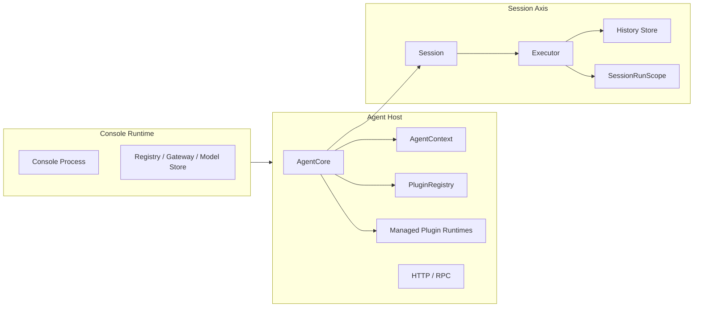
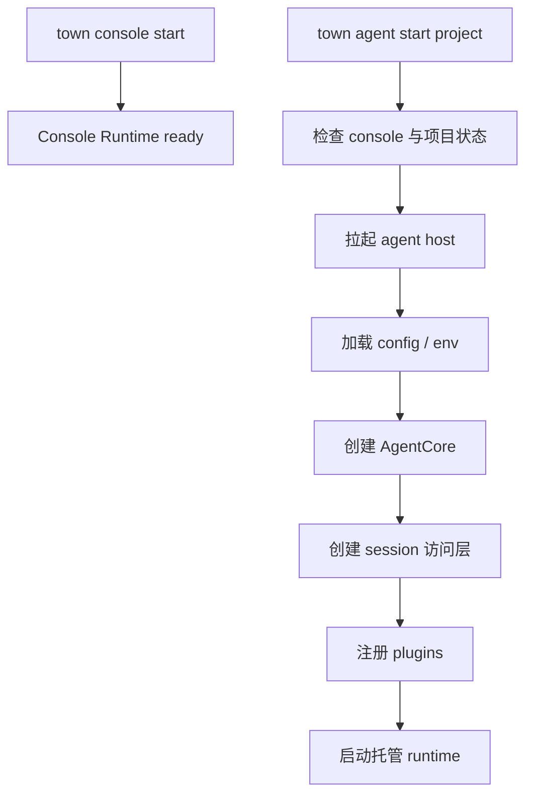

# Console Runtime 与 Session Runtime

这页只解决一个问题：

- 当我们说 `console runtime`、`agent host`、`session runtime` 时，当前代码里到底谁负责什么

## 先说结论

- `console runtime` 是全局控制面
- `agent host` 是单项目执行面
- `session runtime` 不是独立平台，而是 agent host 内部围绕 session 组织起来的执行主轴

压成一句话：

```text
console 管 agent 怎么被启动、登记、观测和控制
agent host 管当前项目怎么执行
session runtime 是 agent host 内部围绕 sessionId 组织起来的执行主轴
```

## 为什么要以 Session 为核心理解

真正被持续推进的不是：

- console 进程
- 某个入口模块
- 单次模型请求

而是：

- 某个 `sessionId` 对应的一段持续执行会话

## 三层关系总图



## 三层分别负责什么

### Console runtime

负责：

- 维护 registry
- 管理 agent daemon
- 暴露 Console UI 与控制入口
- 管理共享配置与模型池

它不负责：

- 持有某个 session 的历史
- 直接执行某一轮模型推理

### Agent host

负责：

- 加载项目配置与 env
- 创建 `AgentCore`
- 创建 session 访问能力
- 注册 plugins
- 启动托管 plugin runtime

### Session runtime

更准确地说，它指的是：

- 以 `sessionId` 为键
- 以 `Session` 为入口
- 由 `Executor`、history store 与 run scope 组成的执行链

## 启动链路



## 一句话总结

```text
console runtime 负责控制和观测 agent，agent host 用 AgentCore 承载 Session，session runtime 则是 agent 内部围绕 sessionId 组织起来的执行主轴。
```
