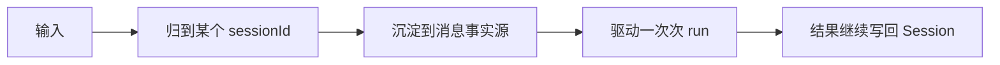

# Session 设计逻辑

## 先说结论

Downcity 真正的执行主轴应该叫 `Session`，不是 `Context`，也不是某个独立工作流层。

因为系统真正要持续推进的，不是：

- 单条 message
- 某次模型输入
- 某个额外分层概念

而是：

- 一个可以被持续推进、持久化、复用的执行会话

## 为什么不是 message

message 太小，无法承载：

- 连续执行
- 生命周期
- compact
- recall
- 后处理

## 为什么不是独立工作流层

当前实现里：

- session 拥有执行权
- 托管 plugin 围绕 session 工作
- plugin hook 只做增强，不拥有 turn 本身

这已经说明：

- 运行时能力围绕会话工作
- 而不是会话围绕某个额外层工作

## 为什么 Session 是最好的锚点

因为它：

- 稳定
- 可持久化
- 可复用
- 可被多个入口协作访问
- 可挂接后处理链路

## Session 的核心逻辑



真正关键的是：

- 下一次还从同一个 Session 出发

## Session 和 plugin 的关系

最准确的说法是：

- Session 是执行主轴
- 托管 plugin 是入口适配器或长期运行模块
- 其他 plugin 负责增强这些运行时点

例如：

- `chat` 是一个托管 plugin runtime
- `memory` 是一个托管长期状态 runtime
- `task` 是另一种执行入口

## 一句话定义

```text
系统围绕 Session 设计，是因为真正需要被持续推进的是会话，而不是消息、某个额外层，或某次模型上下文。
```
