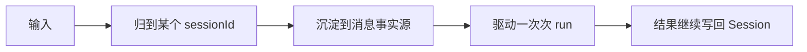

# Session 设计逻辑

## 先说结论

Downcity 真正的主轴应该叫 `Session`，不是 `Context`。

因为系统真正要维护的，不是：

- 单条 message
- 某个 service
- 某次模型输入

而是：

- 一个可以持续推进的执行会话

## 为什么不是 message

因为 message 太小，无法承载：

- 连续执行
- 生命周期
- compact
- recall
- 后处理

## 为什么不是 service

因为 service 在当前 package 里是能力层，不是会话宿主。

`ServiceRuntime` 把 `context` 注入给所有 service，这已经说明：

- service 围绕会话工作
- 而不是会话围绕 service 工作

## 为什么 Session 是最好的锚点

因为它：

- 稳定
- 可持久化
- 可复用
- 可被多 service 协作
- 可挂接后处理链路

## Session 的核心逻辑



这条链路最关键的是：

- 下一次还从同一个 Session 出发

## Session 和 service 的关系

最准确的说法是：

- Session 是执行主轴
- service 是围绕 Session 工作的能力层

### chat service

是 Session 的入口适配器。

### memory service

是 Session 的长期状态外挂层。

### task service

是 Session 语义在另一种执行场景下的延展。

## 一句话定义

```text
系统围绕 Session 设计，是因为真正需要被持续推进的是会话，而不是消息、service 或某次模型上下文。
```
