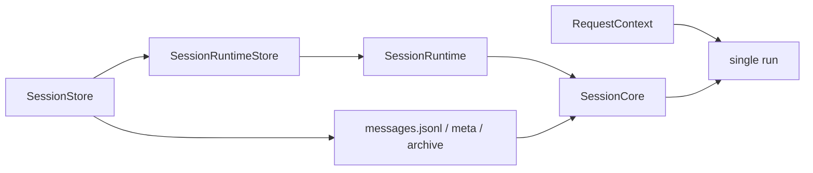

# Session 总览

这页只回答一个问题：

- 当前 Downcity 里，什么才算一个 Session

先给结论：

- `Session` 是以 `sessionId` 为标识的一段长期会话执行状态
- `RequestContext` 是单次请求链路上下文
- `Context` 不是当前代码里的中心对象名

一句话：

```text
Session 是长期会话容器，RequestContext 是单次 run 的临时上下文。
```

## Session 的真实组成

当前代码里，一个 Session 主要由这些部分构成：

- `sessionId`
- `SessionStore`
- `SessionRuntimeStore`
- `SessionRuntime`
- `SessionCore`
- `FilePersistor`
- `messages.jsonl`
- `meta.json`
- `archive/`

它们合起来，才是当前运行时里的 Session 语义。

## 为什么现在不该再用 `contextId`

旧语境里很多概念会把会话实体叫成 `context`。

但当前实现里，真正稳定的长期标识已经是：

- `sessionId`

会话读写、runtime 缓存、消息持久化、task run session，都是围绕 `sessionId` 运转，而不是文档里的 `contextId`。

## Session 的三层结构

### 1. `SessionStore`

这是 agent 持有的统一会话门面。

负责：

- 获取 runtime
- 获取 persistor
- 执行 run
- 追加 user / assistant 消息
- 维护执行状态

### 2. `SessionRuntimeStore`

这是 runtime 缓存层。

负责：

- 按 `sessionId` 创建或复用 `SessionRuntime`
- 管理 persistor 与 runtime 的绑定关系

### 3. `SessionCore`

这是实际执行内核。

负责：

- 读取 system
- 装配 tools
- 读取消息历史
- compact
- 调用模型
- 收敛 assistant 输出

## Session 和 RequestContext 的区别

### Session

长期存在，跨多次 run。

它负责沉淀：

- 历史消息
- meta
- archive
- runtime 缓存关系

### RequestContext

只存在于单次请求链路里。

它负责透传：

- 当前 `sessionId`
- 当前 `requestId`
- `onStepCallback`
- `onAssistantStepCallback`
- 延迟注入消息等运行期信号

关键点：

- Session 是长期状态
- RequestContext 是本轮 run 的临时状态

## Session 和模型输入的区别

Session 不是“这次送给模型的完整上下文文本”。

更准确地说：

- Session 持有长期历史和运行组件
- 本轮模型输入是 `SessionCore` 在执行时，从 Session 历史里裁剪、压缩、拼装出来的结果

所以：

- Session 是长期容器
- 模型输入是一次性执行材料

## 一张图看关系



## chat、task、api 怎么复用 Session

当前三个常见入口都会复用同一套 session 机制：

### chat

- 渠道消息进入 chat service
- 路由到某个 `sessionId`
- 追加消息后执行 `session.run`

### api

- `/api/execute` 把请求写入 `api:chat:<chatId>` 这样的 `sessionId`
- 再调用 `sessionStore.run`

### task

- task runtime 会生成自己的 task run sessionId
- 但底层仍然复用 session 执行内核

## 一句话定义

```text
Session = 以 sessionId 标识、由 SessionStore / SessionRuntime / FilePersistor 共同维护的长期会话执行状态。
```
