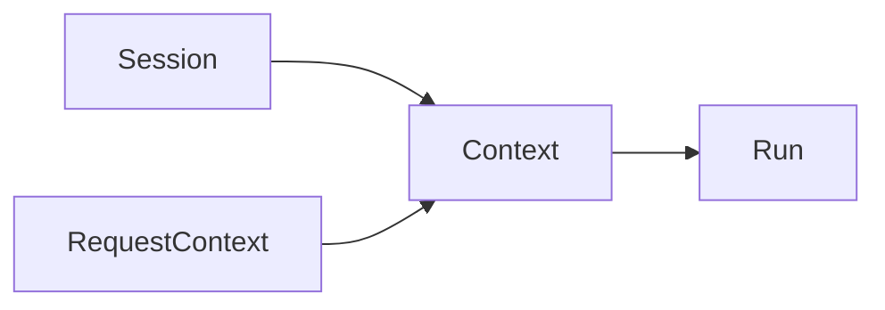

# Session 总览

这篇文档给出新的主轴定义。

## 先给结论

在 Downcity 里，之前很多叫 `Context` 的东西，语义上其实更准确地应该叫：

- `Session`

`Session` 指的是：

- 一个以 `contextId` 为内部标识的持久执行会话

也就是说，当前代码里的：

- `contextId`
- `SessionAgent`
- `messages.jsonl`
- persistor
- compact / archive
- after-update hooks

合起来更接近一个 `Session`。

一句话：

```text
Session 是会话本体，Context 只是这次送给模型的输入。
```

## 为什么 `Session` 比 `Context` 更准确

因为这个实体具备的是会话特征，而不是输入特征：

- 能跨多轮 run 持续存在
- 有自己的持久消息事实源
- 有自己的生命周期
- 可以被 chat / memory / task 复用

这些都更像：

- session

而不像：

- context

## 当前代码里 Session 由什么组成

### 1. `contextId`

今天代码里还叫 `contextId`，但语义上更像：

- `sessionId`

### 2. `SessionAgent`

现在代码里的主执行装配器已经改名为：

- `SessionAgent`

### 3. `messages.jsonl`

这是 Session 的消息事实源。

### 4. compact / archive / meta

这些都是 Session 的维护机制。

## Session 和 RequestContext 的区别

### Session

持久存在，跨多次 run。

### RequestContext

只存在于单次请求链路里。

## Session 和 Context 的区别

### Session

是这段会话的长期执行状态。

### Context

是这一次真正送给模型的输入。

## 一张图看关系



## 一句话定义

```text
Session = 以 contextId 为内部标识的持久执行会话。
```
