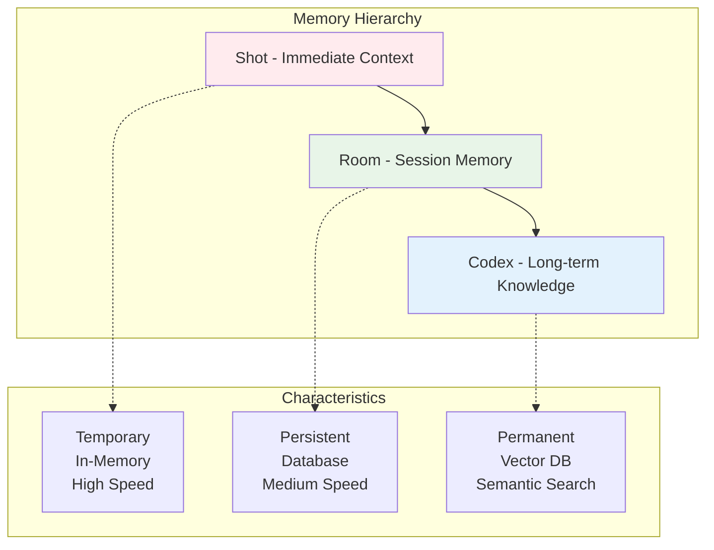
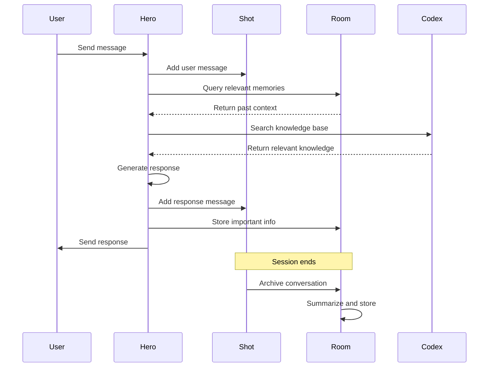
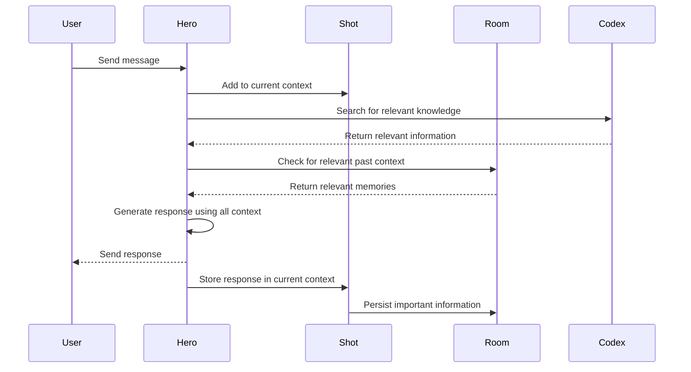

# Memory System

downcity implements a sophisticated three-tier memory system that enables AI agents to maintain context, learn from interactions, and provide consistent experiences across sessions. This system is inspired by human memory patterns and optimized for AI agent workflows.

## Memory Architecture Overview

The memory system consists of three interconnected tiers:



## Tier 1: Shot (Immediate Context)

The **Shot** represents the current conversation session and maintains immediate context.

### Characteristics
- **Lifetime**: Current session only
- **Storage**: In-memory
- **Speed**: Fastest access
- **Purpose**: Maintain conversation flow and immediate context

### What's Stored
- Current conversation messages
- Temporary variables and state
- Session-specific context
- User inputs and agent responses

### Example Usage
```typescript
import { Hero } from 'downcity';

const hero = Hero.create().avatar("You are a helpful assistant");

// Each chat message is stored in the current Shot
await hero.chat("Hi, my name is Sarah");
await hero.chat("I'm working on a TypeScript project");
await hero.chat("Can you help me with interfaces?");

// All messages are available in the current Shot context
const currentShot = hero.getCurrentShot();
console.log("Messages in current session:", currentShot.getMessages());
```

## Tier 2: Room (Session Memory)

The **Room** manages persistent memory across multiple sessions and provides continuity.

### Characteristics
- **Lifetime**: Configurable (days to months)
- **Storage**: Persistent database (SQLite, PostgreSQL, etc.)
- **Speed**: Fast database queries
- **Purpose**: Cross-session continuity and user context

### What's Stored
- Multiple Shot sessions
- User preferences and patterns
- Important conversation summaries
- Session metadata and relationships

### Example Usage
```typescript
import { Hero, SQLitePersistor } from 'downcity';

// Create persistent memory
const persistor = new SQLitePersistor('./agent-memory.db');
const hero = Hero.create()
  .avatar("You are a helpful assistant with memory")
  .memory(persistor);

// First session
await hero.chat("Hi, I'm Sarah and I prefer detailed explanations");
await hero.chat("I'm learning TypeScript");

// Simulate new session (restart application)
const newHero = Hero.create()
  .avatar("You are a helpful assistant with memory")
  .memory(persistor);

// Agent remembers previous context
await newHero.chat("Hi, it's Sarah again. Do you remember what I'm learning?");
// Response will reference TypeScript and preference for detailed explanations
```

## Tier 3: Codex (Long-term Knowledge)

The **Codex** provides semantic knowledge storage and retrieval capabilities.

### Characteristics
- **Lifetime**: Permanent until explicitly removed
- **Storage**: Vector database with embeddings
- **Speed**: Semantic search with vector similarity
- **Purpose**: Domain knowledge and factual information

### What's Stored
- Domain-specific knowledge
- Facts and reference information
- Learned information from interactions
- External documents and data

### Example Usage
```typescript
import { Hero, Codex } from 'downcity';

// Create knowledge base
const codex = Codex.create({ tableName: "programming_knowledge" });

// Add knowledge
await codex.add("TypeScript interfaces define the shape of objects", {
  category: "typescript",
  topic: "interfaces",
  difficulty: "beginner"
});

await codex.add("Generic types in TypeScript allow for reusable components", {
  category: "typescript", 
  topic: "generics",
  difficulty: "intermediate"
});

// Create hero with knowledge access
const hero = Hero.create()
  .avatar("You are a TypeScript expert with access to comprehensive knowledge")
  .study(codex);

// Agent can now access and use the knowledge
await hero.chat("Explain TypeScript interfaces");
// Response will use knowledge from Codex
```

## Memory Flow and Interactions



### Information Flow


### Memory Retrieval Process

1. **Immediate Context**: Hero checks current Shot for conversation context
2. **Knowledge Search**: Hero queries Codex for relevant domain knowledge
3. **Memory Recall**: Hero searches Room for relevant past interactions
4. **Context Integration**: All information is combined for response generation
5. **Memory Storage**: Important new information is stored appropriately

## Memory Management Strategies

### Automatic Cleanup

downcity implements intelligent cleanup strategies:

```typescript
// Room automatically manages Shot lifecycle
const room = new Room(persistor, {
  maxShots: 50,           // Maximum number of shots to keep
  cleanupInterval: 3600,  // Cleanup every hour (seconds)
  retentionDays: 30       // Keep shots for 30 days
});
```

### Manual Memory Management

You can also manage memory manually:

```typescript
const hero = Hero.create().memory(persistor);

// Get all sessions
const sessions = hero.getAllShots();
console.log(`Total sessions: ${sessions.length}`);

// Delete old sessions
const oldSessions = sessions.filter(s => 
  Date.now() - new Date(s.meta.createdAt).getTime() > 7 * 24 * 60 * 60 * 1000
);

oldSessions.forEach(session => {
  hero.deleteShot(session.id);
  console.log(`Deleted old session: ${session.id}`);
});
```

### Memory Summarization

For long conversations, implement summarization:

```typescript
class MemoryManager {
  private hero: Hero;
  private messageThreshold = 50;

  constructor(hero: Hero) {
    this.hero = hero;
  }

  async checkAndSummarize() {
    const currentShot = this.hero.getCurrentShot();
    const messageCount = currentShot.getMessages().length;

    if (messageCount > this.messageThreshold) {
      await this.summarizeAndArchive();
    }
  }

  private async summarizeAndArchive() {
    // Generate summary
    const summary = await this.hero.chat(
      "Please provide a concise summary of our conversation, " +
      "highlighting key points, decisions, and context that should be remembered."
    );

    // Store summary in Room metadata
    const currentShot = this.hero.getCurrentShot();
    currentShot.setMetadata({
      ...currentShot.getMetadata(),
      summary: summary,
      archived: true,
      archivedAt: new Date().toISOString()
    });

    // Start fresh session
    this.hero.newShot();
    
    // Provide context from summary
    await this.hero.chat(
      `Previous conversation summary: ${summary}\n\n` +
      "Let's continue our conversation with this context in mind."
    );
  }
}
```

## Advanced Memory Patterns

### Contextual Memory Retrieval

Implement smart memory retrieval based on current context:

```typescript
class ContextualMemoryAgent {
  private hero: Hero;
  private room: Room;

  constructor() {
    this.room = new Room(new SQLitePersistor('./contextual-memory.db'));
    this.hero = Hero.create()
      .avatar("You are an assistant with contextual memory")
      .memory(this.room);
  }

  async chatWithContext(message: string, context?: string[]) {
    // Retrieve relevant past conversations
    if (context) {
      const relevantMemories = await this.findRelevantMemories(context);
      const contextPrompt = this.buildContextPrompt(relevantMemories);
      
      // Add context to current message
      const enhancedMessage = `${contextPrompt}\n\nCurrent message: ${message}`;
      return await this.hero.chat(enhancedMessage);
    }

    return await this.hero.chat(message);
  }

  private async findRelevantMemories(keywords: string[]) {
    const allShots = this.hero.getAllShots();
    const relevantShots = [];

    for (const shot of allShots) {
      const shotData = this.room.getShot(shot.id);
      if (shotData && this.containsKeywords(shotData, keywords)) {
        relevantShots.push(shotData);
      }
    }

    return relevantShots.slice(0, 3); // Limit to most relevant
  }

  private containsKeywords(shotData: any, keywords: string[]): boolean {
    const content = JSON.stringify(shotData).toLowerCase();
    return keywords.some(keyword => content.includes(keyword.toLowerCase()));
  }

  private buildContextPrompt(memories: any[]): string {
    if (memories.length === 0) return "";

    const contextSummaries = memories.map(memory => 
      memory.meta?.summary || "Previous conversation context"
    );

    return `Relevant context from previous conversations:\n${contextSummaries.join('\n')}`;
  }
}
```

### Memory-Based Learning

Implement agents that learn from their interactions:

```typescript
class LearningMemoryAgent {
  private hero: Hero;
  private codex: Codex;
  private learningPatterns: Map<string, number> = new Map();

  constructor() {
    this.codex = Codex.create({ tableName: "learned_knowledge" });
    this.hero = Hero.create()
      .avatar("You are a learning assistant that improves over time")
      .memory(new SQLitePersistor('./learning-memory.db'))
      .study(this.codex);
  }

  async chat(message: string): Promise<string> {
    // Analyze message for learning opportunities
    await this.analyzeForLearning(message);

    const response = await this.hero.chat(message);

    // Learn from the interaction
    await this.learnFromInteraction(message, response);

    return response;
  }

  private async analyzeForLearning(message: string) {
    // Extract topics and patterns
    const topics = this.extractTopics(message);
    
    topics.forEach(topic => {
      const count = this.learningPatterns.get(topic) || 0;
      this.learningPatterns.set(topic, count + 1);
    });
  }

  private async learnFromInteraction(message: string, response: string) {
    // If this is a frequently discussed topic, store the knowledge
    const topics = this.extractTopics(message);
    
    for (const topic of topics) {
      const frequency = this.learningPatterns.get(topic) || 0;
      
      if (frequency > 3) { // Learn after 3+ mentions
        await this.codex.add(
          `User frequently asks about ${topic}. Context: ${message}. Response pattern: ${response}`,
          {
            category: "learned_patterns",
            topic: topic,
            frequency: frequency,
            learned_at: new Date().toISOString()
          }
        );
      }
    }
  }

  private extractTopics(text: string): string[] {
    // Simple topic extraction (in practice, use NLP libraries)
    const commonTopics = ['typescript', 'javascript', 'react', 'node', 'api', 'database'];
    return commonTopics.filter(topic => 
      text.toLowerCase().includes(topic)
    );
  }
}
```

## Performance Optimization

### Memory Indexing

Optimize memory retrieval with proper indexing:

```typescript
// When using SQLite persistor, create indexes
const persistor = new SQLitePersistor('./optimized-memory.db', {
  indexes: [
    'CREATE INDEX IF NOT EXISTS idx_shots_created_at ON shots(created_at)',
    'CREATE INDEX IF NOT EXISTS idx_shots_metadata ON shots(metadata)',
    'CREATE INDEX IF NOT EXISTS idx_messages_timestamp ON messages(timestamp)'
  ]
});
```

### Memory Compression

Implement memory compression for large datasets:

```typescript
class CompressedMemoryAgent {
  private hero: Hero;
  private compressionThreshold = 1000; // messages

  constructor() {
    this.hero = Hero.create()
      .avatar("You are an efficient assistant with compressed memory")
      .memory(new SQLitePersistor('./compressed-memory.db'));
  }

  async maintainMemory() {
    const sessions = this.hero.getAllShots();
    
    for (const session of sessions) {
      const shotData = this.hero.getCurrentShot();
      const messageCount = shotData.getMessages().length;
      
      if (messageCount > this.compressionThreshold) {
        await this.compressSession(session.id);
      }
    }
  }

  private async compressSession(shotId: string) {
    // Switch to the session
    this.hero.switchShot(shotId);
    
    // Generate compressed summary
    const summary = await this.hero.chat(
      "Create a detailed but concise summary of this entire conversation, " +
      "preserving all important information, decisions, and context."
    );

    // Replace session content with summary
    const shot = this.hero.getCurrentShot();
    shot.setMetadata({
      ...shot.getMetadata(),
      compressed: true,
      originalMessageCount: shot.getMessages().length,
      compressedAt: new Date().toISOString(),
      summary: summary
    });

    // Clear messages and add summary
    shot.clearMessages();
    await this.hero.chat(`Session summary: ${summary}`);
  }
}
```

## Best Practices

### 1. Memory Design
- **Hierarchical Storage**: Use appropriate tier for each type of information
- **Retention Policies**: Implement cleanup strategies to manage storage
- **Metadata**: Use rich metadata for better organization and retrieval

### 2. Performance
- **Indexing**: Create database indexes for frequently queried fields
- **Compression**: Summarize old conversations to reduce storage
- **Caching**: Cache frequently accessed memories

### 3. Privacy and Security
- **Data Encryption**: Encrypt sensitive memory data
- **Access Control**: Implement proper access controls for memory
- **Data Retention**: Follow privacy regulations for data retention

### 4. Monitoring
- **Memory Usage**: Monitor storage growth and performance
- **Retrieval Patterns**: Analyze memory access patterns
- **Cleanup Effectiveness**: Monitor cleanup processes

## Common Use Cases

### Personal Assistant
```typescript
// Long-term user preferences and history
const personalAssistant = Hero.create()
  .avatar("You are a personal assistant who knows me well")
  .memory(new SQLitePersistor('./personal-assistant.db'))
  .study(personalKnowledgeCodex);
```

### Customer Support
```typescript
// Customer interaction history and knowledge base
const supportAgent = Hero.create()
  .avatar("You are a customer support agent")
  .memory(new SQLitePersistor('./customer-support.db'))
  .study(productKnowledgeCodex);
```

### Educational Tutor
```typescript
// Student progress and curriculum knowledge
const tutor = Hero.create()
  .avatar("You are an adaptive tutor")
  .memory(new SQLitePersistor('./student-progress.db'))
  .study(curriculumCodex);
```

## Next Steps

- [Room Component](/docs/core-concepts/room) - Deep dive into persistent memory
- [Shot Component](/docs/core-concepts/shot) - Understanding session context
- [Codex Component](/docs/core-concepts/codex) - Knowledge base implementation
- [Memory Management Guide](/docs/guides/memory-management) - Advanced patterns and strategies