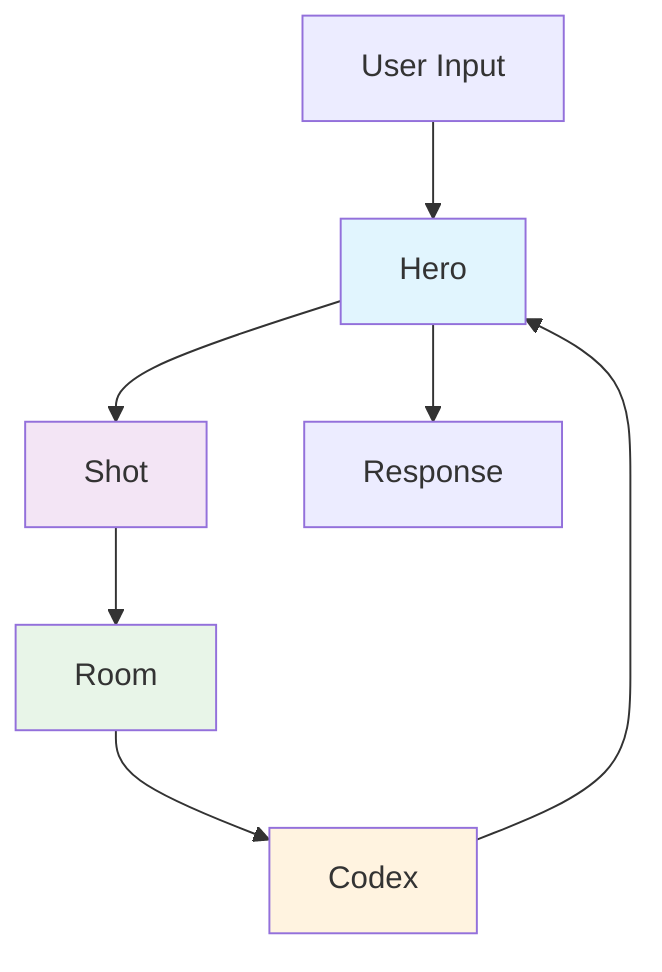

# Framework Overview

downcity is a comprehensive framework for building intelligent AI agents with persistent memory and knowledge management capabilities. It provides a structured approach to creating agents that can learn, remember, and evolve over time.

## Architecture Philosophy

downcity is built around the concept of **intelligent agents with memory**. Unlike simple chatbots that forget everything between conversations, downcity agents maintain context and knowledge across sessions, making them more useful for long-term interactions.

### Core Principles

1. **Memory-First Design**: Every interaction is preserved and contextualized
2. **Knowledge Integration**: Agents can learn from external knowledge sources
3. **Session Management**: Conversations are organized and persistent
4. **Modular Architecture**: Components can be used independently or together

## Component Overview

downcity consists of four main components that work together:



### 1. Hero - The AI Agent

The **Hero** is your AI agent - the main interface for interactions. It handles:

- Conversation management
- Personality and behavior configuration
- Integration with memory and knowledge systems
- Response generation

```typescript
const hero = Hero.create()
  .avatar("You are a helpful assistant")
  .memory(persistor)
  .study(codex);
```

### 2. Shot - Current Session Context

A **Shot** represents the current conversation session. It contains:

- Current conversation messages
- Temporary variables and state
- Session-specific context
- Lifecycle: Created → Active → Archived

```typescript
// Shots are managed automatically by Hero
const currentShot = hero.getCurrentShot();
const shotId = hero.getCurrentShotId();
```

### 3. Room - Persistent Memory

The **Room** manages multiple shots and provides persistent memory:

- Cross-session memory storage
- Shot lifecycle management
- Memory summarization and retrieval
- Long-term context preservation

```typescript
const room = new Room(new SQLitePersistor('./memory.db'));
const hero = Hero.create().memory(room);
```

### 4. Codex - Knowledge Base

The **Codex** is a vector-based knowledge storage system:

- Document ingestion and indexing
- Semantic search capabilities
- Knowledge retrieval for RAG (Retrieval Augmented Generation)
- Metadata-based filtering

```typescript
const codex = Codex.create({ tableName: "knowledge" });
await codex.add("TypeScript is a typed superset of JavaScript", {
  category: "programming",
  topic: "typescript"
});
```

## Memory Hierarchy

downcity implements a three-tier memory system:

### Tier 1: Shot (Immediate Context)
- **Scope**: Current conversation
- **Lifetime**: Session duration
- **Purpose**: Maintain conversation flow and immediate context
- **Storage**: In-memory

### Tier 2: Room (Session Memory)
- **Scope**: Multiple conversations/sessions
- **Lifetime**: Configurable (days to months)
- **Purpose**: Remember user preferences, recent interactions
- **Storage**: Persistent database

### Tier 3: Codex (Long-term Knowledge)
- **Scope**: Domain knowledge and facts
- **Lifetime**: Permanent until explicitly removed
- **Purpose**: Provide factual information and learned knowledge
- **Storage**: Vector database

## Data Flow

Here's how information flows through the system:

### 1. User Input Processing
```
User Message → Hero → Shot (add to context)
```

### 2. Knowledge Retrieval
```
Hero → Codex (search relevant knowledge) → Hero
```

### 3. Memory Access
```
Hero → Room (retrieve relevant past context) → Hero
```

### 4. Response Generation
```
Hero (context + knowledge + memory) → LLM → Response
```

### 5. Memory Storage
```
Response → Shot → Room (persist important information)
```

## Component Relationships

### Hero ↔ Shot
- Hero creates and manages Shots
- Each Hero has one active Shot at a time
- Shots contain the immediate conversation context

### Hero ↔ Room
- Hero uses Room for persistent memory
- Room manages multiple Shots across sessions
- Provides cross-session continuity

### Hero ↔ Codex
- Hero queries Codex for relevant knowledge
- Codex provides context for better responses
- Enables RAG (Retrieval Augmented Generation)

### Room ↔ Shot
- Room stores and retrieves Shots
- Manages Shot lifecycle (create, archive, cleanup)
- Provides Shot metadata and summaries

## Configuration Patterns

### Basic Agent (No Persistence)
```typescript
const hero = Hero.create()
  .avatar("You are a helpful assistant");
```

### Agent with Memory
```typescript
const persistor = new SQLitePersistor('./agent-memory.db');
const hero = Hero.create()
  .avatar("You are a helpful assistant")
  .memory(persistor);
```

### Agent with Knowledge Base
```typescript
const codex = Codex.create({ tableName: "knowledge" });
const hero = Hero.create()
  .avatar("You are a knowledgeable assistant")
  .study(codex);
```

### Full-Featured Agent
```typescript
const persistor = new SQLitePersistor('./agent-memory.db');
const codex = Codex.create({ tableName: "knowledge" });

const hero = Hero.create()
  .avatar("You are an intelligent assistant with memory and knowledge")
  .memory(persistor)
  .study(codex);
```

## Use Cases

### 1. Personal Assistant
- **Components**: Hero + Room + Codex
- **Memory**: User preferences, schedules, personal information
- **Knowledge**: General facts, user-specific information

### 2. Customer Support Bot
- **Components**: Hero + Room + Codex
- **Memory**: Customer history, previous issues
- **Knowledge**: Product documentation, FAQ, policies

### 3. Educational Tutor
- **Components**: Hero + Room + Codex
- **Memory**: Student progress, learning preferences
- **Knowledge**: Curriculum content, teaching materials

### 4. Code Assistant
- **Components**: Hero + Room + Codex
- **Memory**: Project context, coding patterns
- **Knowledge**: Documentation, best practices, code examples

## Performance Considerations

### Memory Management
- Shots are automatically cleaned up based on age and relevance
- Room implements configurable retention policies
- Codex uses efficient vector indexing for fast retrieval

### Scalability
- Components can be distributed across different storage systems
- Codex supports multiple embedding models and vector databases
- Room can use different persistors (SQLite, PostgreSQL, etc.)

### Cost Optimization
- Intelligent context management reduces token usage
- Knowledge retrieval minimizes redundant API calls
- Configurable model selection for different use cases

## Best Practices

### 1. Memory Design
- Use descriptive Shot metadata for better organization
- Implement appropriate retention policies
- Regular cleanup of old, irrelevant data

### 2. Knowledge Management
- Structure knowledge with meaningful metadata
- Regular knowledge base updates and maintenance
- Use appropriate chunking strategies for documents

### 3. Agent Configuration
- Clear, specific avatar prompts
- Appropriate model selection for use case
- Error handling and fallback strategies

### 4. Performance
- Monitor memory usage and cleanup patterns
- Optimize knowledge base queries
- Implement caching where appropriate

## Next Steps

Now that you understand the overall architecture:

1. [Hero Component](/docs/core-concepts/hero) - Deep dive into AI agents
2. [Memory System](/docs/core-concepts/memory-system) - Understanding memory management
3. [Room Component](/docs/core-concepts/room) - Persistent memory details
4. [Shot Component](/docs/core-concepts/shot) - Session management
5. [Codex Component](/docs/core-concepts/codex) - Knowledge base implementation

Or jump to practical guides:
- [Building a Chatbot](/docs/guides/building-chatbot)
- [Memory Management](/docs/guides/memory-management)
- [Knowledge Integration](/docs/guides/knowledge-integration)