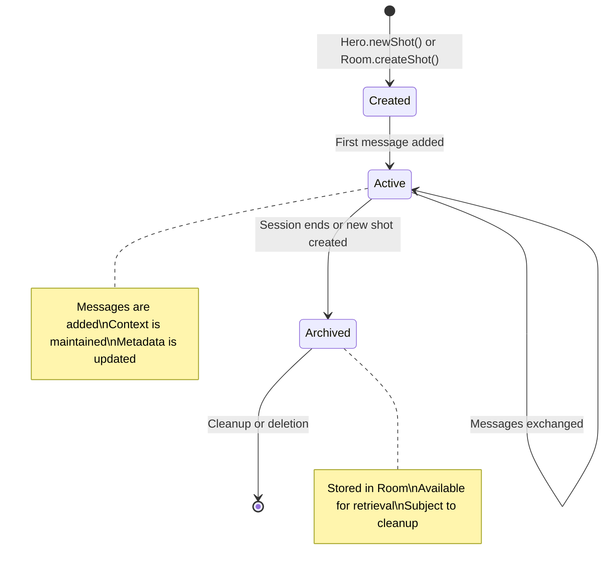

# Shot - Session Context

The **Shot** represents a single conversation session in downcity. It maintains the immediate context of the current conversation, including all messages, temporary state, and session-specific information. Think of it as the "working memory" of your AI agent.

## What is a Shot?

A Shot is responsible for:
- **Message Storage**: Keeping track of all messages in the current conversation
- **Context Management**: Maintaining conversation flow and immediate context
- **Session State**: Storing temporary variables and session-specific data
- **Metadata Management**: Tracking session information like creation time, title, and custom attributes

## Lifecycle

A Shot follows this lifecycle:



## Basic Usage

### Creating a Shot

Shots are typically created automatically by Hero, but you can create them directly:

```typescript
import { Shot } from 'downcity';

// Create a new shot
const shot = new Shot();
console.log("Shot ID:", shot.getId());

// Or create through Room
const room = new Room(persistor);
const shot = room.createShot();
```

### Adding Messages

```typescript
const shot = new Shot();

// Add user message
shot.addMessage({
  role: 'user',
  content: 'Hello, how are you?',
  timestamp: new Date().toISOString()
});

// Add assistant response
shot.addMessage({
  role: 'assistant', 
  content: 'Hello! I\'m doing well, thank you for asking.',
  timestamp: new Date().toISOString()
});

console.log("Messages:", shot.getMessages().length);
```

### Working with Metadata

```typescript
const shot = new Shot();

// Set metadata
shot.setMetadata({
  title: 'Customer Support Session',
  category: 'support',
  priority: 'high',
  customerId: 'cust-123',
  createdAt: new Date().toISOString()
});

// Get metadata
const metadata = shot.getMetadata();
console.log("Session title:", metadata.title);

// Update specific metadata
shot.updateMetadata({ 
  lastActivity: new Date().toISOString(),
  messageCount: shot.getMessages().length
});
```

## Core Methods

### Message Management

#### `addMessage(message: Message): void`

Adds a message to the conversation:

```typescript
const shot = new Shot();

shot.addMessage({
  role: 'user',
  content: 'What is TypeScript?',
  timestamp: new Date().toISOString(),
  metadata: {
    source: 'web_interface',
    sessionId: 'session-123'
  }
});
```

#### `getMessages(): Message[]`

Retrieves all messages in the conversation:

```typescript
const messages = shot.getMessages();

messages.forEach((message, index) => {
  console.log(`${index + 1}. [${message.role}]: ${message.content}`);
});
```

#### `getLastMessage(): Message | undefined`

Gets the most recent message:

```typescript
const lastMessage = shot.getLastMessage();
if (lastMessage) {
  console.log("Last message:", lastMessage.content);
}
```

#### `clearMessages(): void`

Removes all messages from the shot:

```typescript
shot.clearMessages();
console.log("Messages after clear:", shot.getMessages().length); // 0
```

### Metadata Management

#### `setMetadata(metadata: ShotMeta): void`

Sets the complete metadata object:

```typescript
shot.setMetadata({
  title: 'Project Discussion',
  category: 'work',
  participants: ['user', 'assistant'],
  createdAt: new Date().toISOString(),
  tags: ['typescript', 'project', 'planning']
});
```

#### `getMetadata(): ShotMeta`

Retrieves the current metadata:

```typescript
const metadata = shot.getMetadata();
console.log("Session info:", {
  title: metadata.title,
  category: metadata.category,
  created: metadata.createdAt
});
```

#### `updateMetadata(updates: Partial<ShotMeta>): void`

Updates specific metadata fields:

```typescript
// Update only specific fields
shot.updateMetadata({
  lastActivity: new Date().toISOString(),
  messageCount: shot.getMessages().length,
  status: 'active'
});
```

### Session Information

#### `getId(): string`

Gets the unique shot identifier:

```typescript
const shotId = shot.getId();
console.log("Shot ID:", shotId);
```

#### `getCreatedAt(): Date`

Gets the shot creation timestamp:

```typescript
const createdAt = shot.getCreatedAt();
console.log("Created:", createdAt.toISOString());
```

## Advanced Usage Patterns

### Conversation Analysis

Analyze conversation patterns and extract insights:

```typescript
class ConversationAnalyzer {
  static analyzeShot(shot: Shot) {
    const messages = shot.getMessages();
    const userMessages = messages.filter(m => m.role === 'user');
    const assistantMessages = messages.filter(m => m.role === 'assistant');

    return {
      totalMessages: messages.length,
      userMessages: userMessages.length,
      assistantMessages: assistantMessages.length,
      averageUserMessageLength: this.averageLength(userMessages),
      averageAssistantMessageLength: this.averageLength(assistantMessages),
      conversationDuration: this.calculateDuration(messages),
      topics: this.extractTopics(messages),
      sentiment: this.analyzeSentiment(userMessages)
    };
  }

  private static averageLength(messages: Message[]): number {
    if (messages.length === 0) return 0;
    const totalLength = messages.reduce((sum, msg) => sum + msg.content.length, 0);
    return totalLength / messages.length;
  }

  private static calculateDuration(messages: Message[]): number {
    if (messages.length < 2) return 0;
    const first = new Date(messages[0].timestamp);
    const last = new Date(messages[messages.length - 1].timestamp);
    return last.getTime() - first.getTime();
  }

  private static extractTopics(messages: Message[]): string[] {
    // Simple topic extraction (in practice, use NLP libraries)
    const text = messages.map(m => m.content).join(' ').toLowerCase();
    const commonTopics = ['typescript', 'javascript', 'react', 'node', 'api', 'database'];
    return commonTopics.filter(topic => text.includes(topic));
  }

  private static analyzeSentiment(messages: Message[]): 'positive' | 'neutral' | 'negative' {
    // Simple sentiment analysis (in practice, use sentiment analysis libraries)
    const text = messages.map(m => m.content).join(' ').toLowerCase();
    const positiveWords = ['good', 'great', 'excellent', 'thanks', 'helpful'];
    const negativeWords = ['bad', 'terrible', 'problem', 'issue', 'error'];
    
    const positiveCount = positiveWords.filter(word => text.includes(word)).length;
    const negativeCount = negativeWords.filter(word => text.includes(word)).length;
    
    if (positiveCount > negativeCount) return 'positive';
    if (negativeCount > positiveCount) return 'negative';
    return 'neutral';
  }
}

// Usage
const analysis = ConversationAnalyzer.analyzeShot(shot);
console.log("Conversation Analysis:", analysis);
```

### Context-Aware Shot Management

Create shots that adapt based on conversation context:

```typescript
class ContextAwareShot extends Shot {
  private contextKeywords: Set<string> = new Set();
  private importance: number = 0.5;

  addMessage(message: Message): void {
    super.addMessage(message);
    
    // Update context and importance
    this.updateContext(message);
    this.updateImportance(message);
    this.updateMetadata({
      lastActivity: new Date().toISOString(),
      messageCount: this.getMessages().length,
      importance: this.importance,
      keywords: Array.from(this.contextKeywords)
    });
  }

  private updateContext(message: Message): void {
    // Extract keywords from message
    const words = message.content
      .toLowerCase()
      .split(/\W+/)
      .filter(word => word.length > 3);
    
    words.forEach(word => this.contextKeywords.add(word));
    
    // Keep only recent keywords (last 50)
    if (this.contextKeywords.size > 50) {
      const keywordsArray = Array.from(this.contextKeywords);
      this.contextKeywords = new Set(keywordsArray.slice(-50));
    }
  }

  private updateImportance(message: Message): void {
    // Increase importance based on certain indicators
    const content = message.content.toLowerCase();
    
    if (content.includes('important') || content.includes('urgent')) {
      this.importance = Math.min(1.0, this.importance + 0.2);
    }
    
    if (content.includes('question') || content.includes('help')) {
      this.importance = Math.min(1.0, this.importance + 0.1);
    }
    
    // Decrease importance over time
    const messageCount = this.getMessages().length;
    if (messageCount > 20) {
      this.importance = Math.max(0.1, this.importance - 0.05);
    }
  }

  getContextKeywords(): string[] {
    return Array.from(this.contextKeywords);
  }

  getImportance(): number {
    return this.importance;
  }

  isHighImportance(): boolean {
    return this.importance > 0.7;
  }
}

// Usage
const contextShot = new ContextAwareShot();
contextShot.addMessage({
  role: 'user',
  content: 'This is an important question about TypeScript interfaces',
  timestamp: new Date().toISOString()
});

console.log("Keywords:", contextShot.getContextKeywords());
console.log("Importance:", contextShot.getImportance());
console.log("High importance:", contextShot.isHighImportance());
```

### Shot Templates

Create reusable shot templates for different conversation types:

```typescript
class ShotTemplate {
  static createCustomerSupportShot(customerId: string, issue: string): Shot {
    const shot = new Shot();
    
    shot.setMetadata({
      title: `Support: ${issue}`,
      category: 'customer_support',
      customerId: customerId,
      issue: issue,
      priority: 'normal',
      status: 'open',
      createdAt: new Date().toISOString(),
      tags: ['support', issue.toLowerCase().replace(/\s+/g, '_')]
    });

    // Add initial context message
    shot.addMessage({
      role: 'system',
      content: `Customer support session started for customer ${customerId} regarding: ${issue}`,
      timestamp: new Date().toISOString()
    });

    return shot;
  }

  static createEducationalShot(studentId: string, subject: string, level: string): Shot {
    const shot = new Shot();
    
    shot.setMetadata({
      title: `Learning: ${subject}`,
      category: 'education',
      studentId: studentId,
      subject: subject,
      level: level,
      progress: 0,
      createdAt: new Date().toISOString(),
      tags: ['education', subject.toLowerCase(), level]
    });

    shot.addMessage({
      role: 'system',
      content: `Educational session started for ${subject} at ${level} level`,
      timestamp: new Date().toISOString()
    });

    return shot;
  }

  static createProjectDiscussionShot(projectId: string, participants: string[]): Shot {
    const shot = new Shot();
    
    shot.setMetadata({
      title: `Project Discussion: ${projectId}`,
      category: 'project',
      projectId: projectId,
      participants: participants,
      phase: 'planning',
      createdAt: new Date().toISOString(),
      tags: ['project', 'discussion', 'planning']
    });

    shot.addMessage({
      role: 'system',
      content: `Project discussion started for ${projectId} with participants: ${participants.join(', ')}`,
      timestamp: new Date().toISOString()
    });

    return shot;
  }
}

// Usage
const supportShot = ShotTemplate.createCustomerSupportShot('cust-123', 'Login Issues');
const educationShot = ShotTemplate.createEducationalShot('student-456', 'TypeScript', 'beginner');
const projectShot = ShotTemplate.createProjectDiscussionShot('proj-789', ['alice', 'bob', 'charlie']);
```

### Shot Serialization and Export

Export shots for backup, analysis, or migration:

```typescript
class ShotExporter {
  static exportToJSON(shot: Shot): string {
    const data = {
      id: shot.getId(),
      metadata: shot.getMetadata(),
      messages: shot.getMessages(),
      createdAt: shot.getCreatedAt().toISOString(),
      exportedAt: new Date().toISOString()
    };
    
    return JSON.stringify(data, null, 2);
  }

  static importFromJSON(jsonData: string): Shot {
    const data = JSON.parse(jsonData);
    const shot = new Shot();
    
    // Set metadata
    shot.setMetadata(data.metadata);
    
    // Add messages
    data.messages.forEach((message: Message) => {
      shot.addMessage(message);
    });
    
    return shot;
  }

  static exportToMarkdown(shot: Shot): string {
    const metadata = shot.getMetadata();
    const messages = shot.getMessages();
    
    let markdown = `# ${metadata.title || 'Conversation'}\n\n`;
    markdown += `**Created:** ${shot.getCreatedAt().toISOString()}\n`;
    markdown += `**Category:** ${metadata.category || 'General'}\n`;
    markdown += `**Messages:** ${messages.length}\n\n`;
    
    if (metadata.tags && metadata.tags.length > 0) {
      markdown += `**Tags:** ${metadata.tags.join(', ')}\n\n`;
    }
    
    markdown += `---\n\n`;
    
    messages.forEach((message, index) => {
      const timestamp = new Date(message.timestamp).toLocaleString();
      markdown += `## Message ${index + 1} - ${message.role}\n`;
      markdown += `*${timestamp}*\n\n`;
      markdown += `${message.content}\n\n`;
    });
    
    return markdown;
  }

  static exportToCSV(shots: Shot[]): string {
    const headers = ['ID', 'Title', 'Category', 'Created', 'Messages', 'Last Activity'];
    let csv = headers.join(',') + '\n';
    
    shots.forEach(shot => {
      const metadata = shot.getMetadata();
      const row = [
        shot.getId(),
        `"${metadata.title || ''}"`,
        metadata.category || '',
        shot.getCreatedAt().toISOString(),
        shot.getMessages().length,
        metadata.lastActivity || ''
      ];
      csv += row.join(',') + '\n';
    });
    
    return csv;
  }
}

// Usage
const jsonExport = ShotExporter.exportToJSON(shot);
console.log("JSON Export:", jsonExport);

const markdownExport = ShotExporter.exportToMarkdown(shot);
console.log("Markdown Export:", markdownExport);

const csvExport = ShotExporter.exportToCSV([shot]);
console.log("CSV Export:", csvExport);
```

## Integration with Hero and Room

### Hero Integration

Shots are automatically managed by Hero:

```typescript
const hero = Hero.create().avatar("You are a helpful assistant");

// Hero automatically creates and manages shots
await hero.chat("Hello!"); // Creates new shot if none exists
await hero.chat("How are you?"); // Adds to current shot

// Access current shot
const currentShot = hero.getCurrentShot();
console.log("Current conversation:", currentShot.getMessages().length);

// Create new shot
hero.newShot();
await hero.chat("Starting a new conversation"); // New shot context
```

### Room Integration

Shots are persisted and managed by Room:

```typescript
const room = new Room(persistor);
const hero = Hero.create().memory(room);

// Shots are automatically saved to room
await hero.chat("This will be saved");

// Access shots through room
const allShots = room.getShotsList();
console.log("Total saved conversations:", allShots.length);

// Retrieve specific shot
const specificShot = room.getShot(allShots[0].id);
if (specificShot) {
  console.log("Retrieved conversation:", specificShot.getMessages().length);
}
```

## Best Practices

### 1. Metadata Management
- **Descriptive Titles**: Use clear, descriptive titles for shots
- **Consistent Categories**: Establish a consistent categorization system
- **Rich Metadata**: Include relevant metadata for better organization and retrieval

### 2. Message Organization
- **Timestamps**: Always include timestamps for messages
- **Message Metadata**: Use message metadata for additional context
- **Content Structure**: Keep message content well-structured and clear

### 3. Performance
- **Message Limits**: Consider implementing message limits for very long conversations
- **Cleanup**: Regularly clean up old or irrelevant shots
- **Indexing**: Use metadata for efficient searching and filtering

### 4. Context Management
- **Relevant Context**: Keep only relevant context in shots
- **Summarization**: Implement summarization for long conversations
- **Context Boundaries**: Use shot boundaries to separate different conversation contexts

## Common Patterns

### Basic Conversation Shot
```typescript
const shot = new Shot();
shot.setMetadata({
  title: 'General Conversation',
  category: 'general'
});
```

### Categorized Shot
```typescript
const shot = new Shot();
shot.setMetadata({
  title: 'TypeScript Help',
  category: 'programming',
  tags: ['typescript', 'help', 'beginner']
});
```

### Customer Support Shot
```typescript
const shot = new Shot();
shot.setMetadata({
  title: 'Support Ticket #123',
  category: 'support',
  customerId: 'cust-456',
  priority: 'high',
  status: 'open'
});
```

## Next Steps

- [Codex Component](/docs/core-concepts/codex) - Knowledge base integration
- [Memory Management Guide](/docs/guides/memory-management) - Advanced memory patterns
- [Building a Chatbot](/docs/guides/building-chatbot) - Practical implementation
- [API Reference](/docs/api-reference/shot-api) - Complete Shot API documentation