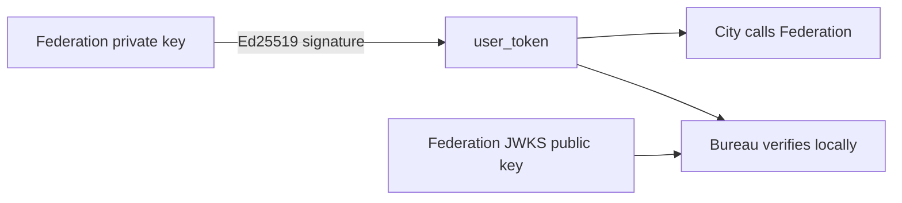
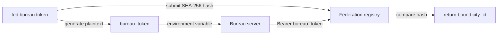

# City User Identity

Federation owns user identity and account data, and the City client connects to Federation directly. A product only deploys a Bureau when it needs its own backend capabilities. One Federation can serve multiple products, isolated by `city_id`.

## Identity boundaries

- **Federation** — stores the Ed25519 private key and issues `user_token` values
- **City** — stores `federation_url + user_token` and makes user requests
- **Bureau** — an optional product backend for a City that verifies users locally with Federation's public key
- **FederationAdmin** — the separate Federation control-plane client used by CLI and operations

## Authentication flow

1. The user selects a product `city_id` during login
2. Federation signs a `user_token` bound to that `city_id`
3. The user calls Federation through `new City({ federation_url, user_token })`
4. The user sends the same Bearer Token to the product backend
5. City sends `user_token` directly to Federation for Profile, balance, and standard Services
6. If the product has its own backend, City sends product requests to Bureau
7. Bureau verifies `user_token` locally with Federation's public key and only calls Federation when it needs current data

```ts
const city = new City({
  federation_url: "https://fed.example.com",
  user_token,
});

const profile = await city.user().profile();
```

Optional product backend:

Register the Bureau from the Federation control plane first:

```bash
fed bureau token --city city_product
```

The CLI displays the plaintext `DOWNCITY_BUREAU_TOKEN` once. Federation stores
only its hash, so Federation and Bureau can run on different servers.

```ts
const bureau = new Bureau({
  federation_url: "https://fed.example.com",
  bureau_token: process.env.DOWNCITY_BUREAU_TOKEN!,
});

const identity = await bureau.identify(request);
const profile = await (await bureau.user(request)).profile();
```

`Bureau` is optional. It uses `bureau_token` to obtain its registered City context, then verifies `user_token` locally with Federation's public key. `identify()` does not call online introspection; Bureau only requests Federation when it needs current Profile, balance, or other shared data.

## User Token and Bureau Token

Both tokens use the Bearer header, but they represent different principals and use different verification mechanisms:

| Property | `user_token` | `bureau_token` |
| --- | --- | --- |
| Principal | Federation user | Product backend for one City |
| Format | `ub_<JWT>` | `fb_<token_id>.<secret>` |
| Implementation | Ed25519 asymmetric signature | Random opaque credential and SHA-256 hash |
| Verification | Verify with Federation's JWKS public key | Federation hashes the token and queries its registry |
| Identity data | Contains `user_id`, `city_id`, `iss`, `aud`, `exp`, and `jti` | Contains no user identity; maps to a database `city_id` |
| Local verification | Bureau can verify it locally | Requires a Federation Context request |
| Revocation | Primarily bounded by expiry and current Federation state | Federation marks the registration as `revoked` |

### User Token

Federation signs the user JWT with its private key and publishes only public verification keys
through JWKS. Bureau can verify the signature, issuer, audience, expiry, and `city_id`, but a
public key cannot sign or modify user tokens.



Anyone who obtains a valid `user_token` can act as that user until the token expires. User
tokens must therefore have a finite lifetime and only travel over HTTPS.

### Bureau Token

`bureau_token` is not a JWT and has no public/private key pair. `fed bureau token` generates
the plaintext and hash locally, then registers only `token_id + token_hash + city_id` with Federation.



At runtime, Bureau sends the plaintext token to Federation over HTTPS. Federation extracts
`token_id`, computes SHA-256, and compares it with the database record. The database never
stores the plaintext token.

A leaked `bureau_token` lets an attacker impersonate that Bureau to obtain its City Context,
but cannot create or forge a `user_token`. Revoke a leaked credential with
`fed bureau revoke <token_id>`.
An already cached Context remains usable until `jwks_cache_ttl` expires; the default cache
lifetime is five minutes.

Federation still publishes Ed25519 public keys for its own token validation and other protocols:

```text
/.well-known/downcity.json
/.well-known/jwks.json
```

Federation management uses the separate `FederationAdmin` control-plane client, never Bureau.
The Admin SDK's `bureaus.register/list/revoke` methods belong only to the Federation
control plane; a Bureau never creates or manages tokens.

## Channel accounts

Bot credentials for messaging platforms are stored in `~/.downcity/downcity.db` and referenced by ID from the project:

```json
{
  "plugins": {
    "chat": {
      "channels": {
        "telegram": {
          "channelAccountId": "telegram-main"
        }
      }
    }
  }
}
```

Continue with:

- [Model Pool](/en/docs/city/model-pool)
- [Usage & Billing](/en/docs/city/usage-billing)
