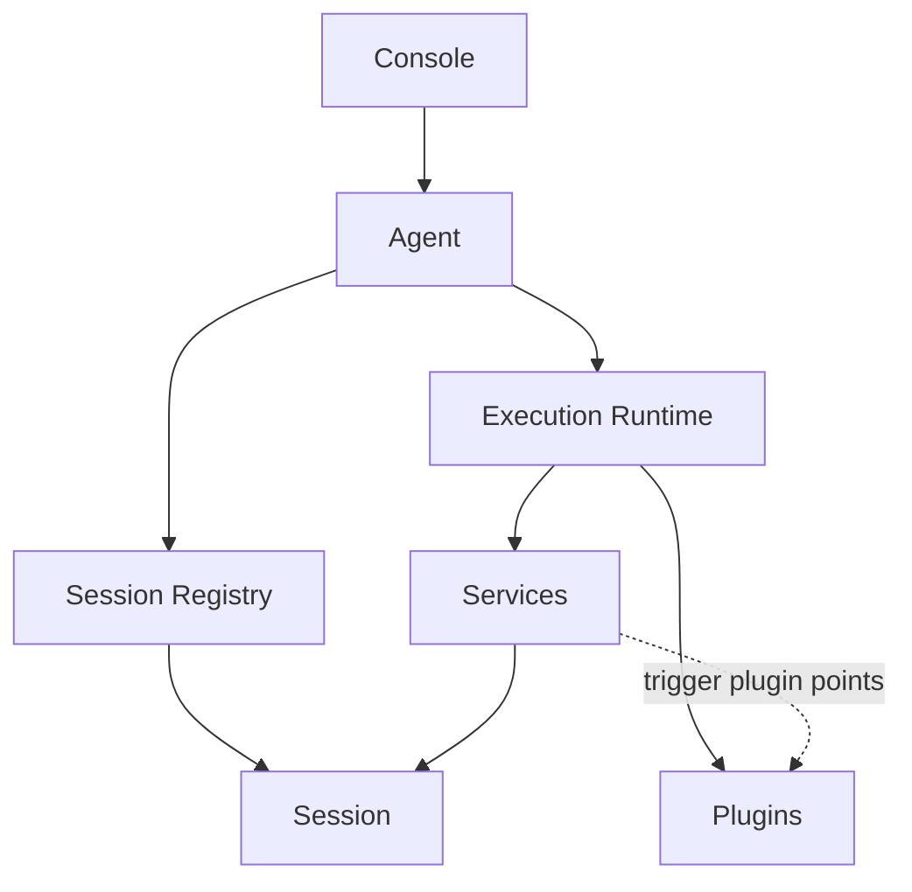

# Architecture Overview

To understand Downcity, start with 5 concepts:

- `console`: the global control plane
- `agent`: the per-project host process
- `execution runtime`: the unified capability view injected into services and plugins
- `session`: the actual execution instance for one conversation or one task run
- `service / plugin`: workflow modules and passive extension modules

## The Most Important Reading Order

Read the system from top to bottom:

1. `console` manages globally
2. `agent` hosts one project
3. `execution runtime` exposes a unified execution surface
4. `session` is where one real execution happens
5. `service` owns workflows and `plugin` augments them

That means:

- `agent` is not each individual conversation turn
- `session` is the real execution unit for chat and task runs
- `plugin` is neither a service nor an independent runtime

## Layered Structure

1. **Console Layer**
- owns registry, model pool, global config, and UI gateway
- resolves the target agent for commands and runtime requests

2. **Agent Layer**
- one project maps to one agent process
- loads project config, creates execution runtime, and owns the session registry
- persists runtime traces into `.downcity/`

3. **Execution Runtime**
- exposes `session / services / plugins / logger / config / env`
- is the shared execution-facing surface used by services and plugins
- is not a second host process, only a view derived from the agent

4. **Session Layer**
- one chat conversation is one session
- one task run is also one session
- prompt assembly, history, tools, and model execution all happen around the session

5. **Service Layer**
- domains such as `chat`, `task`, `memory`, and `shell`
- own lifecycle and workflow orchestration
- decide when to create, reuse, or clear sessions

6. **Plugin Layer**
- modules such as `skill`, `voice`, and `auth`
- attach only through service-defined extension points
- do not own lifecycle and do not own a separate runtime

## One Diagram

## The Most Important Boundary

- `service` actively participates in the main workflow
- `plugin` joins only at fixed points
- `session` owns execution state
- `agent` owns host state

So:

- workflows belong in services
- execution state belongs in sessions
- host state belongs in the agent
- extension logic belongs in plugins
- plugin dependencies stay inside the plugin

## A Concrete Example

In chat flows:

- the `chat` service owns ingress, queueing, session selection, execution, and replies
- `execution runtime` injects unified access to session and plugin capabilities
- the `voice` plugin adds transcription at voice-related points
- the `auth` plugin joins authorization-related points
- the real model run still happens inside the target `session`
