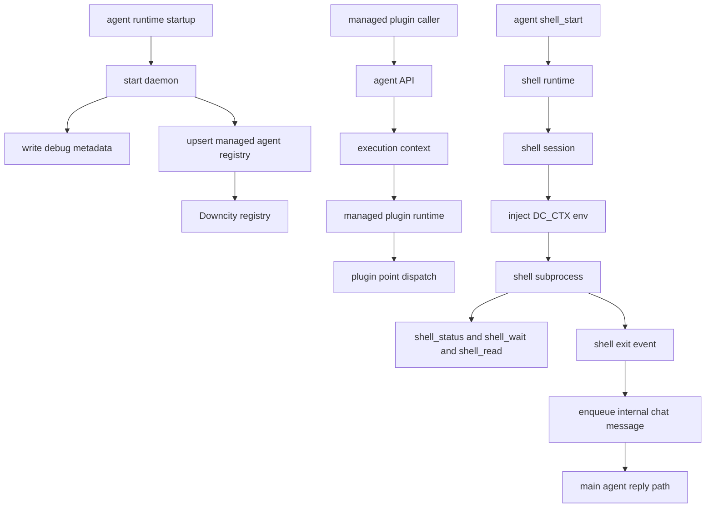

# Downcity Registration, Execution Context, and Shell Flow

## 1. Managed Agent Registration

- registry file: `~/.downcity/main/agents.json`
- stores known agents and their latest daemon metadata
- daemon startup must complete the registry write or roll back

## 2. Execution Context Flow

- one agent process binds to one `rootPath`
- the agent assembles an execution context surface
- the execution context exposes `session`, `invoke`, and `plugins`
- plugins register `pipeline`, `guard`, `effect`, and `resolve` handlers
- plugin actions and managed runtimes trigger those points during their main path

## 3. Shell Flow

- shell state is owned by the shell runtime, not by an ad-hoc tool-local process table
- `shell_start` returns a `shell_id`; it is not the same thing as a chat `contextId`
- for long-running commands, prefer `shell_status` and `shell_wait` instead of empty polling loops
- the default working directory is the current project root
- subprocesses receive injected `DC_CTX_*` environment variables
- when a shell task ends and belongs to a real chat context, the shell runtime can enqueue an internal chat message back to the main reply path

## Relationship Diagram

