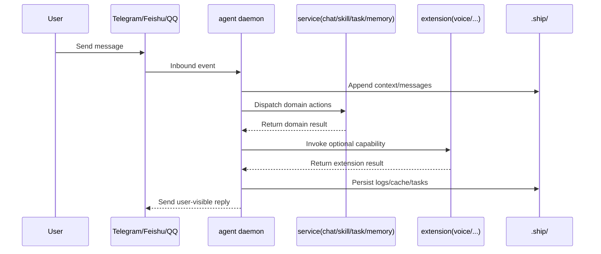

# Architecture Logic Map

This is the second page in Concepts. It focuses on one thing:

what `console`, `agent`, `service`, and `extension` each own, and how one request flows across them.

## 1. Responsibility Boundaries

- `console`: global control plane. Starts/stops console daemon, manages agent registry, and provides unified ops entry for `service` / `extension` / `config`.
- `agent`: project-scoped execution plane. Loads project context, runs model/tool execution, and persists runtime traces to `.ship/`.
- `service`: core domain modules (`chat` / `skill` / `task` / `memory`) for primary workflows.
- `extension`: shared optional capability modules (for example `voice`), managed from console side and invoked by agents when needed.

## 2. System Relationship (Control Plane vs Execution Plane)

```mermaid
flowchart LR
  subgraph CP[Control Plane (Console)]
    CLI[sma CLI] --> CONSOLE[sma console start\nconsole daemon]
    CLI --> CFG[sma console config ...\nmodel/runtime config]
    CLI --> SVCOPS[sma service ...\nservice ops]
    CLI --> EXTOPS[sma extension ...\nextension ops]
    CONSOLE --> REG[~/.ship/console/agents.json\nagent registry]
  end

  subgraph DP[Execution Plane (Per Project)]
    AGENTCMD[sma agent on] --> AGENTD[agent daemon]
    AGENTD --> SERVICES[services\nchat/skill/task/memory]
    AGENTD --> EXTS[extensions\nvoice/...]
    AGENTD --> SHIP[.ship/*\ncontext/logs/cache/tasks]
  end

  CONSOLE --> AGENTD
  SVCOPS --> AGENTD
  EXTOPS --> AGENTD
  CFG --> AGENTD
```

## 3. Request Flow (Simplified)



## 4. Key Rules

- `console` handles governance/ops, `agent` handles execution/persistence.
- `service` is the core domain layer, `extension` is the optional enhancement layer.
- `service` and `extension` are operated from console-facing commands, but execution happens inside agent runtime.
- The model pool is managed globally via `sma console model ...`; each project binds with `model.primary`.

## 5. Typical Command Order

```bash
# 1) Start global console (required)
sma console start

# 2) Init project and start agent
sma agent create .
sma agent on

# 3) Operate service / extension
sma service list
sma extension list

# 4) Check overall status
sma console status
sma agent status .
```

## Read Next

- [Architecture Overview](/en/docs/concepts/architecture)
- [Runtime Relationship & Process](/en/docs/concepts/runtime-relationship-and-process)
- [Message Processing Flow](/en/docs/concepts/message-processing)
