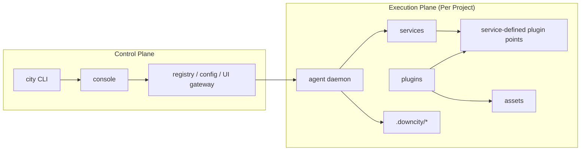
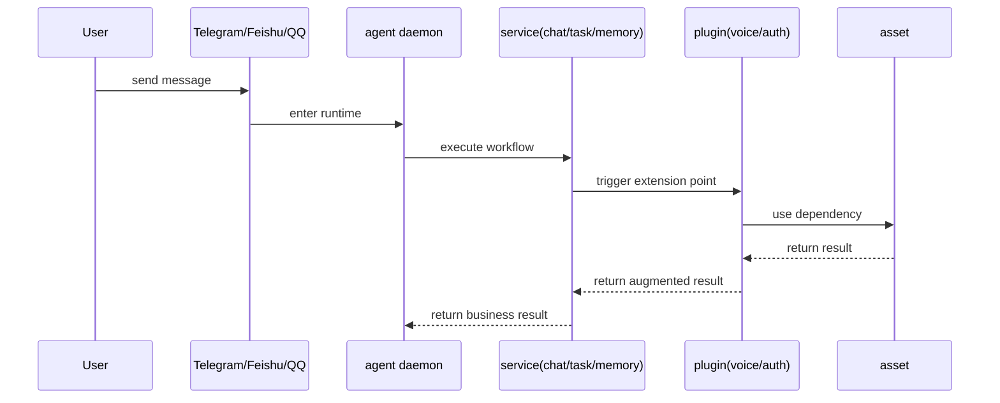

# Architecture Logic Map

This page answers one question:

what `console`, `agent`, `service`, `plugin`, and `asset` each own, and how one request flows across them.

## 1. Responsibility Boundaries

- `console`: global control plane for daemon, registry, model pool, env, and shared storage
- `agent`: per-project execution plane that loads project config and owns one runtime
- `service`: core workflow with lifecycle ownership
- `plugin`: optional enhancement module that passively attaches to service-defined points
- `asset`: installable dependency or resource behind plugins

## 2. System Relationship

## 3. Request Flow

## 4. A Real-World Reading

In `chat`:

- the service builds the inbound message
- plugins join only at fixed points
- `voice` can add transcription
- `auth` can validate access and resolve roles
- `chat` still decides whether to enqueue, when to reply, and what to persist
