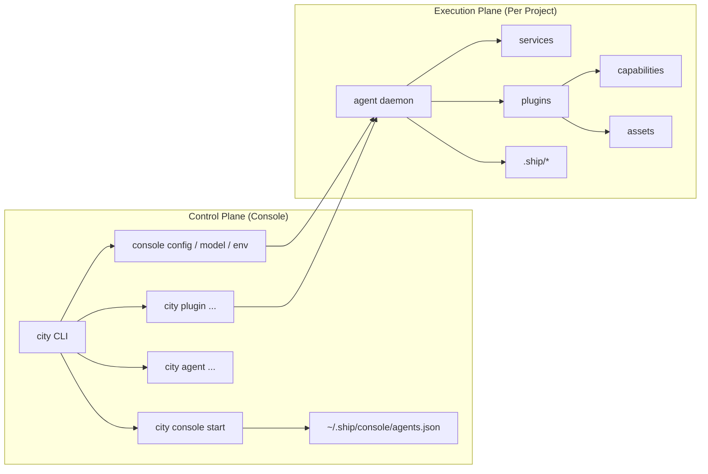
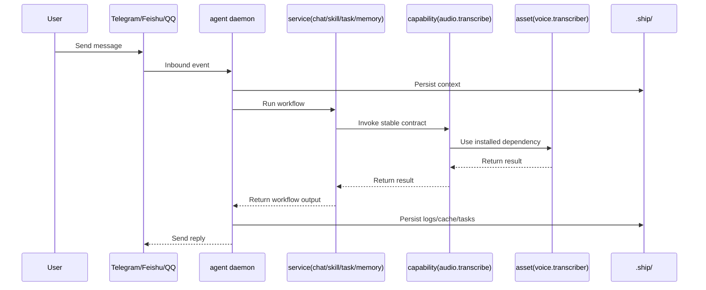

# Architecture Logic Map

This page answers one thing:

what `console`, `agent`, `service`, `plugin`, `capability`, and `asset` each own, and how one request flows across them.

## 1. Responsibility Boundaries

- `console`: global control plane. Starts/stops daemons, manages registry, model pool, env, and shared storage.
- `agent`: project-scoped execution plane. Loads project config and context, owns one runtime, persists traces.
- `service`: core domain workflows such as chat/task/memory.
- `plugin`: optional enhancement modules such as voice.
- `capability`: stable invocation contract exposed by plugins.
- `asset`: installable dependency/resource used by plugins.

## 2. System Relationship



## 3. Request Flow



## 4. Key Rules

- `console` handles governance, `agent` handles runtime execution.
- `service` is core workflow, `plugin` is optional enhancement.
- services depend on capabilities, not plugin-private details.
- plugins depend on assets, not raw model/install logic.

## 5. Typical Command Order

```bash
city console start
city agent create .
city agent start
city service list
city plugin list
city console status
```

## Read Next

- [Architecture Overview](/en/docs/concepts/architecture)
- [Runtime Relationship & Process](/en/docs/concepts/runtime-relationship-and-process)
