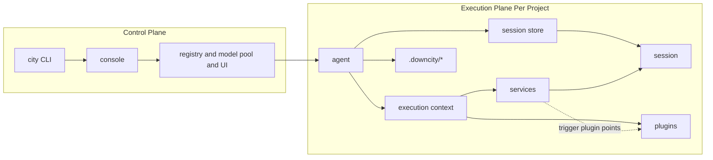
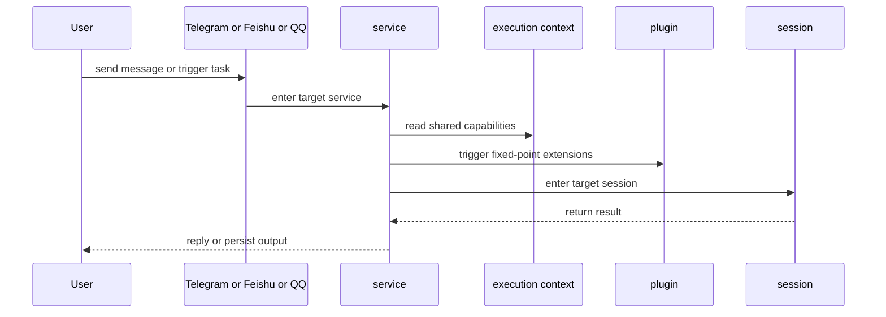

# Logic Map

This page answers one question:

How does a request move from `console` or `agent` into real execution and back to the user?

## 1. Responsibility Boundaries

- `console`: global control plane for daemon, registry, model pool, and shared UI state
- `agent`: project host that loads config and owns the session store
- `execution context`: the shared capability surface exposed to the execution chain
- `session`: where prompt, tools, history, and model execution actually happen
- `service`: main business path and domain orchestration
- `plugin`: passive extension module at fixed points

## 2. System Relationship

## 3. Request Flow

## 4. A Realistic Example

In `chat`:

- `chat service` receives the inbound channel message
- it resolves the target `sessionId`
- voice input may trigger the `asr` plugin
- access checks may trigger the `auth` plugin
- the final execution still happens inside the selected `session`
- `chat service` decides when and how to reply

## 5. What Users Should Remember

- you usually operate an agent
- the real execution unit is the session
- service owns the main path
- plugin is the extension layer
- execution context is the glue that keeps those capabilities aligned
