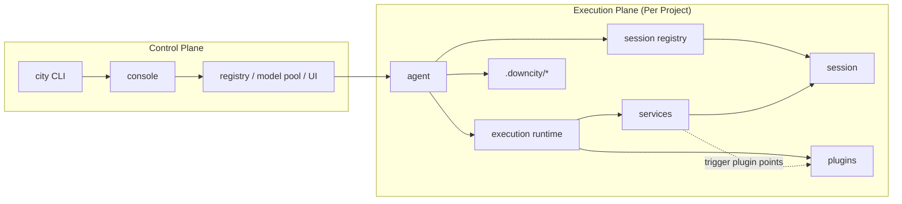
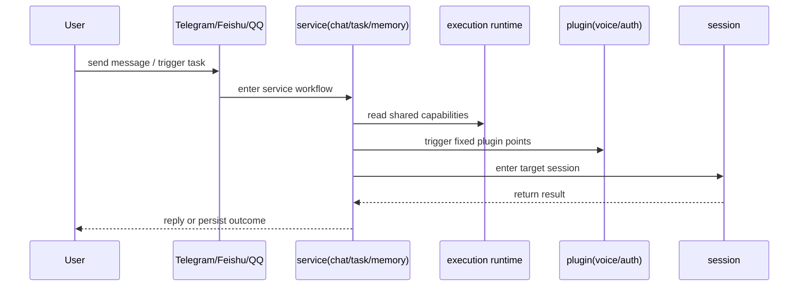

# Architecture Logic Map

This page answers one question:

how one request moves from `console` / `agent` into real execution and back to the user.

## 1. Responsibility Boundaries

- `console`: global control plane for daemon, registry, model pool, and shared storage
- `agent`: project host that loads config and owns the session registry
- `execution runtime`: the shared capability surface injected into the execution chain
- `session`: where prompt, tools, history, and model execution actually happen
- `service`: main business workflow and domain orchestration
- `plugin`: passive extension module that joins only at fixed points

## 2. System Relationship

## 3. Request Flow

## 4. A Real-World Reading

In `chat`:

- `chat service` receives the channel message
- it maintains the mapping from channel target to `sessionId`
- `voice plugin` may add transcription at fixed points
- `auth plugin` may validate access and resolve roles
- `chat service` still decides whether to enqueue, when to reply, and what to persist

## 5. What Most Users Should Remember

- you usually operate an agent
- the real execution unit is the session
- services own the main path
- plugins are the extension layer
- execution runtime is the glue that keeps those capabilities aligned
