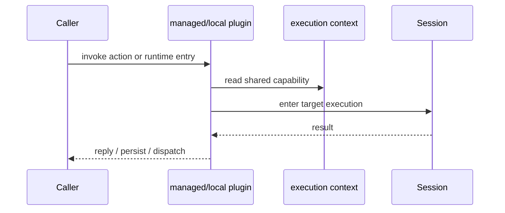

# Logic Map

The current logic map is:

- `town` manages local runtime and the managed agent registry
- `console` provides the browser control surface
- `agent` hosts one project runtime
- `session` executes one turn
- `plugins` expose and augment capability

## Capability map

- local plugins: `skill`, `web`, `asr`, `tts`
- managed plugins: `chat`, `task`, `memory`, `contact`, `shell`, `schedule`

## Request map

## Main takeaway

- plugin owns capability entry and augmentation
- session owns execution
- Town runtime and agent own runtime management
- Console observes and controls through runtime APIs
