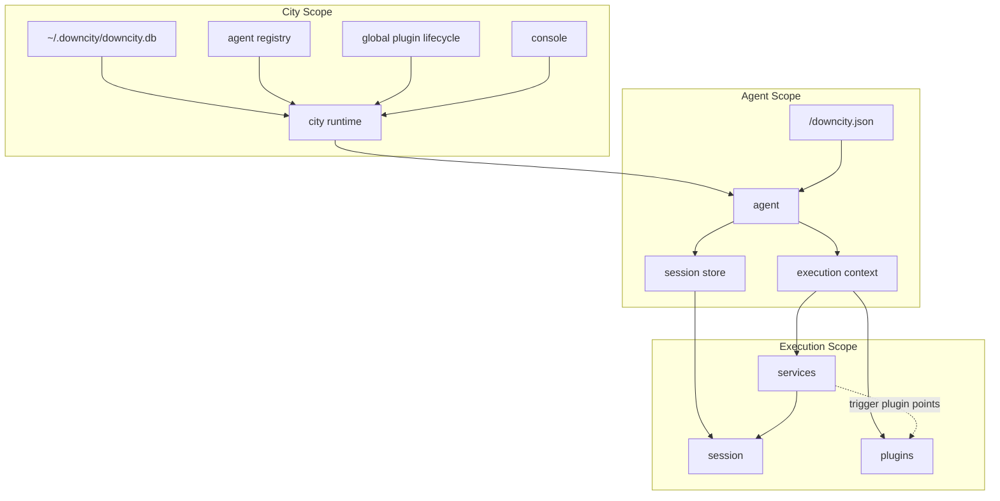
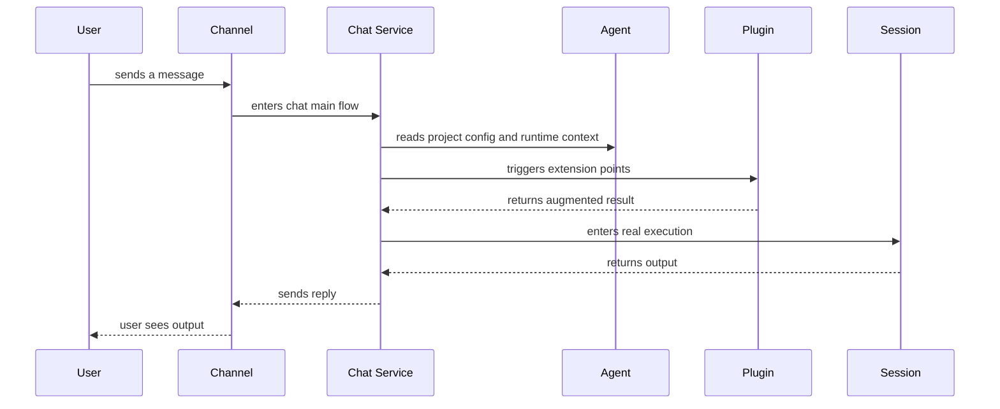

# Project Logic Overview

The fastest way to understand Downcity is not to start from commands, but from responsibilities.

You can understand the whole system through 6 objects:

- `city runtime`
- `console`
- `agent`
- `session`
- `service`
- `plugin`

## The Short Version

- `city` owns global resources and global state
- `agent` owns one project
- `session` is where real execution happens
- `service` owns the main flow
- `plugin` owns extensions
- `console` visualizes and controls all of the above

## 1. Four Scopes

You can think of the system in 4 scopes:

| Scope | Responsibility | Typical data |
| --- | --- | --- |
| `city` | global runtime, model pool, agent registry, global plugin lifecycle | `~/.downcity/downcity.db`, running agent registry |
| `agent project` | one project's execution config | `<project>/downcity.json` |
| `session` | one real chat or task execution | message history, prompt, compacted context |
| `execution` | the capability surface exposed during one run | `session`, `plugins`, `logger`, `config` |

The most important boundary is:

- `whether a plugin is enabled` belongs to `city`
- `how an agent uses that plugin` belongs to the `agent`

For example:

- whether `asr` is enabled is city-level state
- which `asr.modelId` one agent uses is agent-level config

## 2. Where Config Lives

From a user perspective, you only need to remember two places.

### Global directory

- `~/.downcity/`
- stores city-level runtime data
- such as model pool, global env, channel accounts, plugin lifecycle, and running agent registry

### Project directory

- `<project>/downcity.json`
- stores execution config for one agent project
- such as execution binding, channel binding, and plugin parameters

That means:

- for global state, look at Console or `~/.downcity`
- for project parameters, look at the project's `downcity.json`

## 3. Relationship Map



## 3.1 Key Directory Tree

This is not the full repo tree. It only keeps the directories that matter most when you are trying to understand the system.

### Repository root

```text
downcity/
├── homepage/                        # Website and user-facing docs
│   ├── app/                         # Docs site app
│   ├── content/docs/                # User docs content
│   └── public/                      # Static site assets
├── packages/
│   ├── downcity/                    # Core runtime, CLI, service, and plugin implementation
│   └── downcity-ui/                 # Shared UI component library
├── products/
│   ├── console/                     # Console frontend
│   ├── console-ui/                  # Older Console UI-related artifacts
│   └── chrome-extension/            # Browser extension
├── scripts/                         # Repo-level scripts
└── .agents/                         # Local skill and agent helper directory
```

### Core runtime source

```text
packages/downcity/src/
├── main/                            # Platform entrypoints and host orchestration
│   ├── city/                        # City runtime, global env, model pool, runtime paths
│   ├── agent/                       # Agent host, project loading, agent runtime assembly
│   ├── modules/                     # CLI, Console API, HTTP, and RPC entrypoints
│   ├── plugin/                      # Plugin registry, catalog, lifecycle, dispatch
│   └── service/                     # Service registry and shared service host logic
├── services/                        # Main-path service implementations
│   ├── chat/                        # Chat main flow, channel integration, message orchestration
│   ├── task/                        # Task main flow
│   ├── memory/                      # Memory main flow
│   └── shell/                       # Shell main flow
├── plugins/                         # Extension implementations
│   ├── auth/                        # Auth-related plugin
│   ├── skill/                       # Skill catalog and lookup/install
│   ├── web/                         # Web provider selection and prompt injection
│   ├── asr/                         # Speech recognition
│   ├── tts/                         # Text-to-speech
│   └── voice/                       # Legacy voice compatibility implementation
├── session/                         # Session execution, prompts, tools, context handling
├── shared/
│   ├── constants/                   # Shared constants
│   ├── types/                       # Global shared types
│   └── utils/                       # Shared utilities
└── services/                        # Concrete service implementations
```

### Console frontend source

```text
products/console/src/
├── app/                             # App entry
├── components/                      # Page components and dashboard modules
├── hooks/                           # Dashboard state and behavior hooks
├── lib/                             # API, routing, query, and mutation helpers
└── types/                           # Console frontend types
```

### How To Read The Tree

- if you want global model pool, global env, or global plugin lifecycle: start in `main/city`
- if you want to understand how one project agent starts and reads `downcity.json`: start in `main/agent`
- if you want to see where Console pages get data from: start in `main/modules/console` and `products/console/src/lib`
- if you want the main flow for chat, task, memory, or shell: read `services/*`
- if you want ASR, TTS, Web, or Skill capability code: read `plugins/*`
- if you want prompt, tools, and real execution logic: read `session/*`

## 4. What Each Layer Does

## `city runtime`

- the global host of the whole system
- manages the global database, runtime directories, and agent registry
- decides which plugins are enabled at the city level
- powers the Console control plane

You can think of it as the platform layer of Downcity.

## `console`

- the UI and API control plane for city
- shows agents, model pool, channel accounts, and plugin state
- `Global > Plugins` shows city-level plugin state
- it does not represent one specific agent's local parameters

## `agent`

- one project maps to one agent
- loads project config
- owns the session store
- wires `services` and `plugins` into the unified execution environment

An `agent` is a project host, not one execution turn.

## `session`

- the place where model execution actually happens
- one chat conversation is a session
- one task run is also a session
- prompt assembly, messages, context compaction, and reply generation all happen around the session

So:

- the user interacts with an agent
- the actual execution happens inside a session

## `service`

- `chat`, `task`, `memory`, and `shell` are services
- services own the main path
- they decide when to enter a session
- they decide when to trigger plugin extension points

In one line:

- put the main business flow in services

## `plugin`

- `asr`, `tts`, `web`, `skill`, and `auth` are plugins
- plugins do not own an independent main flow
- plugins only attach through predefined extension points
- plugin lifecycle is decided by city
- plugin parameters are decided by the agent project

In one line:

- plugins are an extension layer, not a main-flow layer

## 5. How One Request Runs

The most typical example is a chat message.



If the message is voice input:

- `chat service` receives the message first
- it triggers `asr` on the inbound augmentation point
- `asr` turns voice into text
- then the flow enters the session for real reasoning

If the task needs web access:

- the main path is still `chat` or `task`
- the `web` plugin only augments capability through system/provider integration
- it is not a standalone service

## 6. Why Plugins Do Not Belong To Agents

This is the boundary people usually get wrong.

The correct model is:

- plugin definitions belong to city
- plugin lifecycle belongs to city
- agents consume those plugins
- agents only store their own plugin parameters

That is why Console now shows:

- `Global > Plugins`: city-level plugin lifecycle
- `Agent > Plugins`: one agent's parameters and runtime view

These are not the same thing.

## 7. The Config Rules That Matter Most

### City-level config

Put these in global state:

- model pool
- channel accounts
- global env
- plugin enable / disable

### Agent-level config

Put these in the project:

- execution binding
- project channel bindings
- plugin parameters
- for example `plugins.asr.modelId`
- for example `plugins.tts.voice`

### Session-level state

Do not manage this as hand-written config:

- message history
- compact archives
- execution-time context state

## 8. A Practical Mental Model

If you only want to remember 5 things, remember these:

1. `city` is the global platform layer.
2. `agent` is the single-project host.
3. `session` is where execution really happens.
4. `service` owns the main flow.
5. `plugin` only owns extensions, not the main flow.

## 9. How To Read This In Console

- want global system state: go to `Global`
- want one project's runtime state: go to `Agent`
- want to know whether a plugin is enabled: go to `Global > Plugins`
- want one agent's plugin parameters: go to `Agent > Plugins`
- want to understand how one chat or task executed: go to `Session` or `Task`

## Related

- [Architecture Overview](/en/docs/concepts/architecture)
- [Architecture Logic Map](/en/docs/concepts/logic-map)
- [Runtime Relationship And Process Model](/en/docs/concepts/runtime-relationship-and-process)
- [Service Runtime](/en/docs/concepts/service-runtime)
- [Message Processing](/en/docs/concepts/message-processing)
