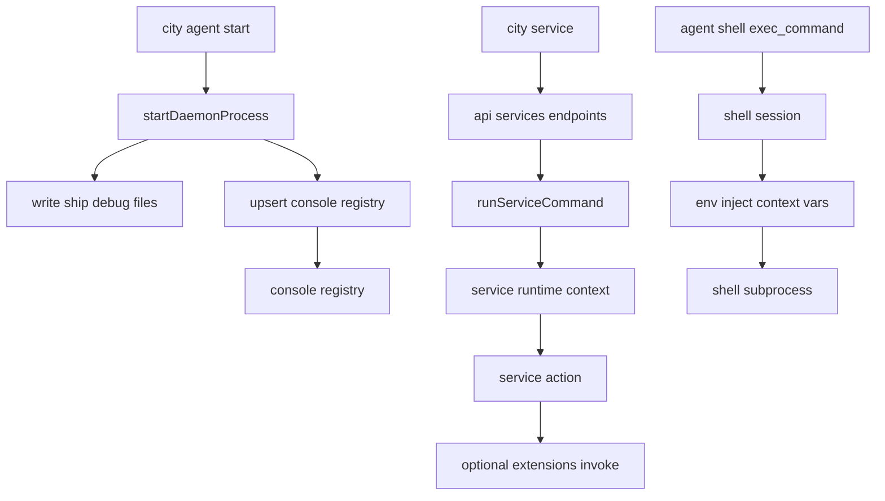

# Console Registration, Service Execution, and Shell Flow

This page covers three things:

1. how console agent registration works
2. how agent runtime executes services
3. how agent shell actually works

## 1) Console registration logic

## Core takeaways

- console registry file is `~/.ship/console/agents.json`
- registry stores “known agents + last known pid”, not live health probes
- daemon startup must successfully upsert registry, otherwise startup is rolled back

## Trigger timing

When running `city agent start` (daemon mode):

1. verify console is running
2. verify project init files (`PROFILE.md` / `ship.json`)
3. start detached child process
4. write `.ship/debug/*` (pid/meta/log)
5. call `upsertConsoleAgentEntry` to registry

If step 5 fails, daemon is killed and pid/meta are cleaned up.

## Data semantics

Each registry entry includes:

- `projectRoot`
- `pid`
- `startedAt`
- `updatedAt`

`city console agents` / `city console status` still perform pid liveness checks per project, and stale entries are cleaned.

## 2) How agent runtime executes services

## Core takeaways

- one agent process binds to one `rootPath`
- service calls use the current runtime-injected `context/config/model/logger`
- `service -> extension` is also in-runtime dispatch by default

## Runtime assembly (`RuntimeState`)

`initRuntimeState(cwd)` does:

1. resolve `rootPath` and validate project structure
2. load config and write runtime base state
3. create model (`createModel`)
4. create `ContextManager` (session/persistor/dispatcher)
5. assemble `ServiceRuntime` (including `invoke` and `extensions.invoke`)

So service execution is naturally bound to the current agent context.

## Execution path

`city service ...` -> daemon API -> service manager:

- `/api/services/list` -> `listServiceRuntimes`
- `/api/services/control` -> `controlServiceRuntime`
- `/api/services/command` -> `runServiceCommand`

`runServiceCommand` resolves service/action, executes with runtime context, and returns runtime snapshots.

## 3) Agent shell mechanism

## Core takeaways

- shell is session-based, not single-shot exec
- default workdir is runtime `rootPath`
- subprocess env includes context/server vars so commands route back to current runtime

## How it works

Shell toolset provides:

- `exec_command`
- `write_stdin`
- `close_shell`

`exec_command` creates a shell session; `write_stdin` appends input and polls output pages; output is buffered and paginated until close.

## Env injection

Shell subprocess gets:

- `DC_CTX_CONTEXT_ID`
- `DC_CTX_REQUEST_ID`
- `DC_CTX_SERVER_HOST`
- `DC_CTX_SERVER_PORT`

So `city ...` calls from shell usually target the current runtime server.

## Command bridge

For `city|downcity` commands, shell bridge can:

- accumulate output
- parse `__ship` protocol block
- inject user messages back into conversation
- suppress raw tool output and return bridge summary

This is the standard loop from shell command back to dialog context.

## Relationship Diagram (Short)

## Related docs

- [Invocation Routing and Isolation](/en/docs/concepts/invocation-routing-and-isolation)
- [Service Runtime](/en/docs/concepts/service-runtime)
- [Extension Runtime](/en/docs/concepts/extension-runtime)
