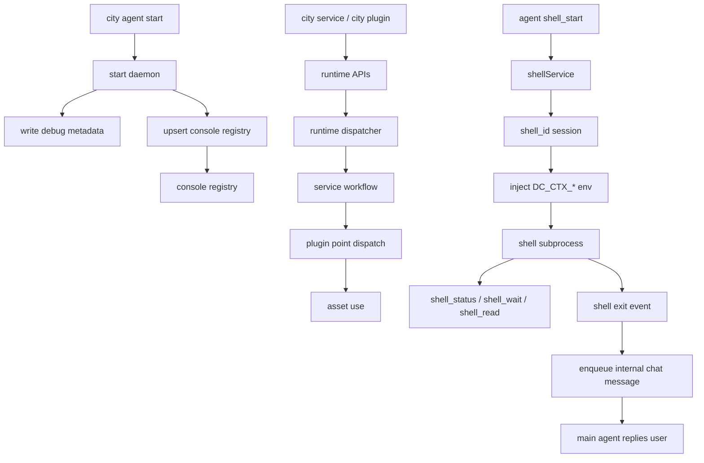

# Console Registration, Runtime Execution, and Shell Flow

## 1. Console Registration

- registry file: `~/.downcity/console/agents.json`
- stores known agents and latest daemon metadata
- daemon startup must write registry successfully or roll back

## 2. Runtime Execution

- one agent process binds to one `rootPath`
- runtime assembles `ServiceRuntime`, `PluginRuntime`, and asset infrastructure
- plugins register `pipeline / guard / effect / resolve` handlers on service-defined points
- services trigger those points during their workflow

## 3. Shell Flow

- shell state is now owned by `shellService`, not by the agent tool directly
- starting a command returns a `shell_id`; it is not the same as a chat `contextId`
- for long-running jobs, prefer `shell_status` or `shell_wait` over tight polling
- default working directory is the current project root
- subprocesses receive injected `DC_CTX_*` environment variables
- when shell exits for a real chat context, the service can enqueue an internal chat message and let the main agent reply

## Diagram

