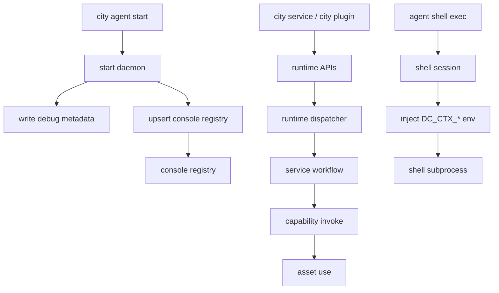

# Console Registration, Runtime Execution, and Shell Flow

## 1. Console Registration

- registry file: `~/.ship/console/agents.json`
- registry stores known agents and last known daemon metadata
- daemon startup must upsert registry successfully, otherwise startup rolls back

## 2. Runtime Execution

- one agent process binds to one `rootPath`
- runtime assembles services, plugins, capabilities, and assets
- service workflows invoke capabilities when optional plugin functionality is needed

## 3. Shell Flow

- shell is session-based, not one-shot exec
- default workdir is runtime `rootPath`
- subprocess env includes `DC_CTX_CONTEXT_ID`, `DC_CTX_REQUEST_ID`, `DC_CTX_SERVER_HOST`, `DC_CTX_SERVER_PORT`

## Relationship Diagram

