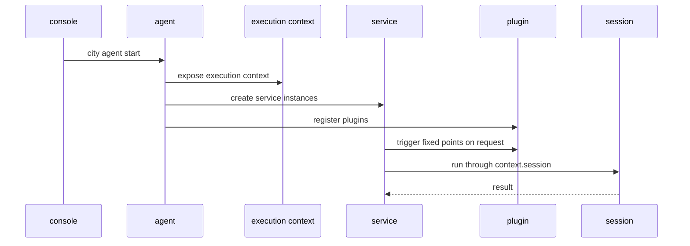

# Runtime Relationship & Process

## 1. Role Summary

- `console`: manages registry, model pool, shared storage, and UI
- `agent`: the host process for one project
- `execution context`: the unified capability surface used during execution
- `session`: a concrete execution instance
- `service`: the main path module
- `plugin`: an extension module that joins only at fixed points

In one sentence:

`console` governs, `agent` hosts, `execution context` injects, `session` executes, `service` orchestrates, and `plugin` augments.

## 2. What Happens at Startup

When you run:

```bash
city agent start
```

The usual order is:

1. the agent reads project config and env
2. the agent initializes logger, model, session store, plugin registry, and service instances
3. the agent exposes the shared `execution context`
4. services become available
5. plugin extension points become available
6. project-local traces continue to be written into `.downcity/*`

The key point:

- services and plugins are available after startup
- but no specific session execution has started yet

## 3. When Real Execution Starts

Real execution begins only when an external request arrives, for example:

- Telegram delivers a message
- dashboard executes a target session
- task scheduler triggers one task run

Then the order is usually:

1. the request enters a service
2. the service resolves the target `sessionId`
3. the service creates or reuses a session
4. the service triggers plugins at fixed points
5. the service enters execution through `context.session`
6. the session returns a result
7. the service decides how to reply or persist state

## 4. One Timeline Diagram



## 5. The Most Common Confusion

Do not mix up these 2 states:

1. `agent` has started
2. a `session` is actively executing

`agent` is the long-lived host.
`session` is the execution instance created or reused on demand.

So:

- one agent can host many sessions
- one service routes different requests into different sessions
- plugins do not create a separate execution axis
