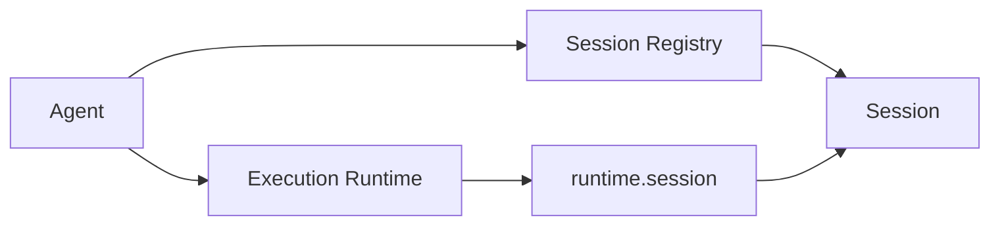
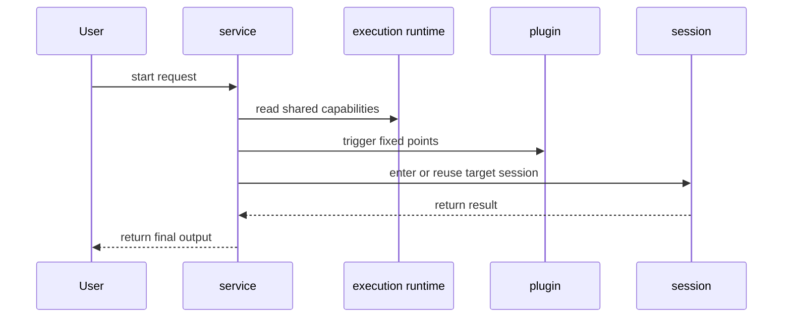

# Execution Runtime & Session

This page answers 3 questions:

1. what `execution runtime` is
2. what a `session` is
3. how `service` and `plugin` connect to them

## 1. What Execution Runtime Means

`execution runtime` is not a new process and not a separate subsystem.

It is more precisely:

**the unified capability surface that an agent exposes to services and plugins during execution.**

It usually includes:

- `config`
- `env`
- `logger`
- `session`
- `services`
- `plugins`

So it solves the question "how do execution modules access the same capabilities?" rather than "who is the host?"

## 2. What a Session Is

A `session` is the real execution instance.

You can read it as:

- one chat conversation = one session
- one task run = one session
- history, prompt building, tool use, and assistant output all happen around that session

This is why many user-facing concepts now converge on `sessionId`:

- the meaning stays stable
- chat and task can share the same execution axis
- the system does not need many parallel execution identities

## 3. Relationship Between Execution Runtime and Session

The key points are:

- the `agent` owns the session registry
- `execution runtime` exposes `runtime.session`
- services and plugins do not own sessions directly; they use session capabilities through `runtime.session`

## 4. What a Service Should Own

A service is the main workflow module.

Typical built-in services:

- `chat`
- `task`
- `memory`
- `shell`

A service should own:

- user-facing workflows
- orchestration
- domain state
- stable actions
- extension points that plugins may attach to

A service should not own:

- plugin-private implementation details
- plugin dependency installation and internal switching logic
- fragmented workflow logic that really belongs in the main path

## 5. What a Plugin Should Own

A plugin is the passive extension layer.

Its job is to:

- enhance workflow at fixed extension points
- implement guard / pipeline / effect / resolve behaviors
- manage its own dependencies, config, and internal implementation

A plugin should not:

- own an independent lifecycle
- turn into a second service
- introduce another standalone runtime concept

## 6. How They Work Together

## 7. A Chat Example

In chat flows:

- `chat service` receives Telegram / Feishu / QQ messages
- it resolves the target `sessionId`
- it enters that session through `runtime.session`
- if there is audio input, it triggers the `voice` plugin
- if access must be checked, it triggers the `auth` plugin
- `chat service` still decides how to reply to the channel

## 8. The Final Mental Model

One-line version:

- `agent` is the host
- `execution runtime` is the unified execution surface
- `session` is the actual execution unit
- `service` owns the main workflow
- `plugin` owns passive enhancement
