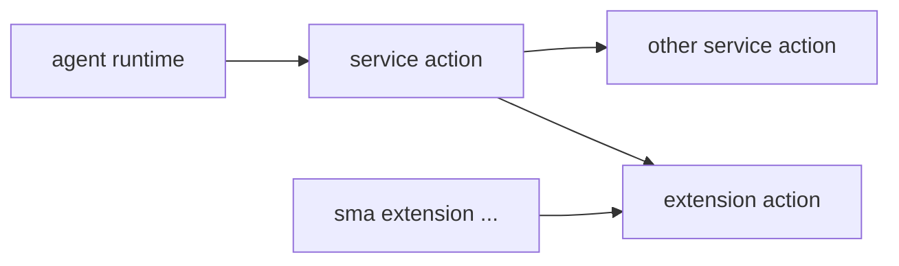

# Service vs Extension

This page is a dedicated explanation of how `service` and `extension` differ.

## One-line Summary (Essence)

- `service`: an **agent-layer mechanism** that must run with concrete `context` (conversation/model/persistence).
- `extension`: a **console/platform-layer mechanism** whose core is not conversation-context orchestration; it is invoked by services or CLI.

## Comparison

| Dimension | service | extension |
| --- | --- | --- |
| Primary role | Agent execution mechanism (context-oriented) | Console/platform extension mechanism |
| command/action | Registered and orchestrated by agent runtime | Registered and invoked by service/CLI |
| Typical call direction | `agent -> service` | `service -> extension`, `CLI -> extension` |
| Config scope | `ship.json.services.*` (per-project) | `~/.ship/ship.db` `console_config.extensions.*` (console-global) |
| Context dependency | Strong (ContextManager/model/persistor) | Weak or none as core design goal |
| Asset sharing | Mostly project runtime state (`.ship/*`) | Often global reusable assets (voice defaults to `~/.ship/models/voice`) |

## Direct Confirmation

1. `service` is an agent-layer mechanism and must be combined with concrete context.
- Confirmed: **yes**.

2. `extension` is context-independent in essence and belongs to console/platform-level extension.
- Confirmed: **directionally yes**.
- Note: extension still receives runtime input, but its core role is not conversation-context orchestration.

3. `service` and `extension` should be documented as two different mechanisms, not one generic “capabilities” bucket.
- Confirmed: **yes**.

4. Voice extension assets are globally shared by default.
- Confirmed: **yes (by default)**.
- Note:
  - voice model directory defaults to `~/.ship/models/voice`, so multiple agents can reuse downloaded models.
  - extension switches/config are managed at console-global layer (`~/.ship/ship.db` `console_config.extensions.*`).
  - if `modelsDir` is set to a project path, sharing can be disabled intentionally.

## Call Graph

## Practical Rules

- Put context-bound orchestration logic in `service`.
- Put platform-level reusable logic in `extension`.

## Related Docs

- [Invocation Routing and Isolation](/en/docs/concepts/invocation-routing-and-isolation)
- [Service Runtime](/en/docs/concepts/service-runtime)
- [Extension Runtime](/en/docs/concepts/extension-runtime)
- [Runtime Relationship & Process](/en/docs/concepts/runtime-relationship-and-process)
