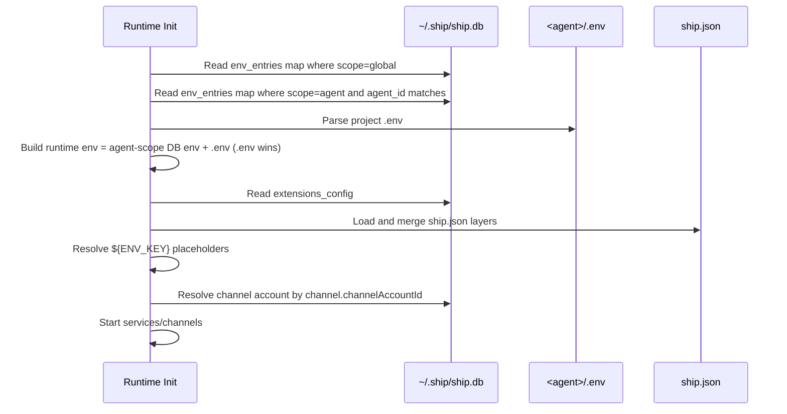

# Env and ship.db Database Design

This page is the single source of truth for environment-variable storage and `~/.ship/ship.db` table design.

## 1. Goals

1. Keep all persistent env values encrypted in `~/.ship/ship.db`.
2. Keep agent runtime isolation strict (no cross-agent env leakage).
3. Keep `ship.json` as binding config, not credential storage.
4. Keep Console UI and CLI on the same storage model.

## 2. Data Model Overview

```mermaid
flowchart LR
  subgraph ConsoleGlobal[~/.ship/ship.db]
    G[env_entries(global)]
    A[env_entries(agent)]
    B[channel_accounts]
    M1[model_providers]
    M2[models]
    S[console_secure_settings]
  end

  J[<agent>/ship.json] -->|model.primary + channel.channelAccountId| R[Agent Runtime]
  E[<agent>/.env] -->|runtime-only overlay| R
  A -->|agentId = projectRoot| R
  G -->|shared env for console/global layer| R
  B -->|resolve channel credentials by channelAccountId| R
  M1 --> R
  M2 --> R
  S -->|extensions_config| R
```

## 3. Table-by-Table Schema

## 3.1 `env_entries`

Purpose: unified env table for both console-shared and agent-private values.

| Column | Type | Notes |
|---|---|---|
| `scope` | TEXT | `global` or `agent` |
| `agent_id` | TEXT | Empty string for global rows; agent project root for agent rows |
| `key` | TEXT | Env key (for example `OPENAI_API_KEY`) |
| `value_encrypted` | TEXT | AES-GCM encrypted value |
| `created_at` | TEXT | ISO timestamp |
| `updated_at` | TEXT | ISO timestamp |

Constraints:

1. Primary key: `(scope, agent_id, key)`
2. Index: `scope`
3. Index: `agent_id`

## 3.2 `channel_accounts`

Purpose: central credential vault for chat channels.

| Column | Type | Notes |
|---|---|---|
| `id` | TEXT PK | Bot account id used by `ship.json` binding |
| `channel` | TEXT | `telegram` / `feishu` / `qq` |
| `name` | TEXT | Display name |
| `identity` | TEXT | Optional human-readable identity |
| `owner` | TEXT | Optional owner info (auto-sync when available) |
| `creator` | TEXT | Optional creator info (auto-sync when available) |
| `bot_token_encrypted` | TEXT | Telegram token (encrypted) |
| `app_id_encrypted` | TEXT | App id (encrypted) |
| `app_secret_encrypted` | TEXT | App secret (encrypted) |
| `domain` | TEXT | Optional domain (mainly Feishu/Lark) |
| `sandbox` | INTEGER | QQ sandbox flag (`0/1`) |
| `auth_id` | TEXT | Optional master auth id |
| `created_at` | TEXT | ISO timestamp |
| `updated_at` | TEXT | ISO timestamp |

## 3.3 Existing tables still used

1. `model_providers` / `models`: global model pool.
2. `console_secure_settings`: non-env secure JSON (currently `extensions_config`).

## 4. Encryption Boundaries

1. Encrypted fields:
- `env_entries.value_encrypted`
- `channel_accounts.*_encrypted`
- `console_secure_settings.value_encrypted`
- model provider `api_key_encrypted`

2. Decryption only happens in runtime memory or API service logic.

3. `ship.json` does not store plaintext chat credentials.

## 5. ship.json Binding Model

`ship.json` stores binding ids, not secrets:

```json
{
  "model": {
    "primary": "default"
  },
  "services": {
    "chat": {
      "channels": {
        "qq": {
          "enabled": true,
          "channelAccountId": "qq-main"
        }
      }
    }
  }
}
```

Rules:

1. `model.primary` binds to `models.id`.
2. `services.chat.channels.<channel>.channelAccountId` binds to `channel_accounts.id`.
3. Channel startup requires:
- channel enabled
- `channelAccountId` exists
- required credential fields present in the bound account

## 6. Runtime Load and Merge Order



## 7. Where Data Is Written

1. Console UI / Channel Accounts page:
- writes `channel_accounts`

2. Console UI / Model page and model CLI:
- writes `model_providers`, `models`

3. Console config (extensions scope) and extension commands:
- writes `console_secure_settings.extensions_config`

4. Agent channel configure action:
- writes `ship.json` binding (`channelAccountId`, `enabled`)

## 8. Operational Notes

1. `<agent>/.env` is user-managed and runtime-only overlay.
2. DB `env_entries(scope=agent)` is also agent-private; both are merged with `.env` taking precedence.
3. Console shared env is only from `env_entries(scope=global)`.
4. For new agents, no credential auto-reuse should happen unless explicitly bound to a channel account.

## 9. Quick Verification Checklist

1. `channel_accounts` has expected rows.
2. Target agent `ship.json` channel has `channelAccountId`.
3. Runtime `chat status` shows:
- `enabled=true`
- `configured=true`
- channel link status not `config_missing`

4. New agent without binding should show channel disabled or config missing, not inherited secrets.
