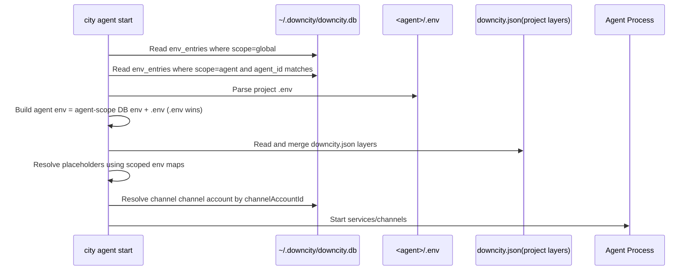
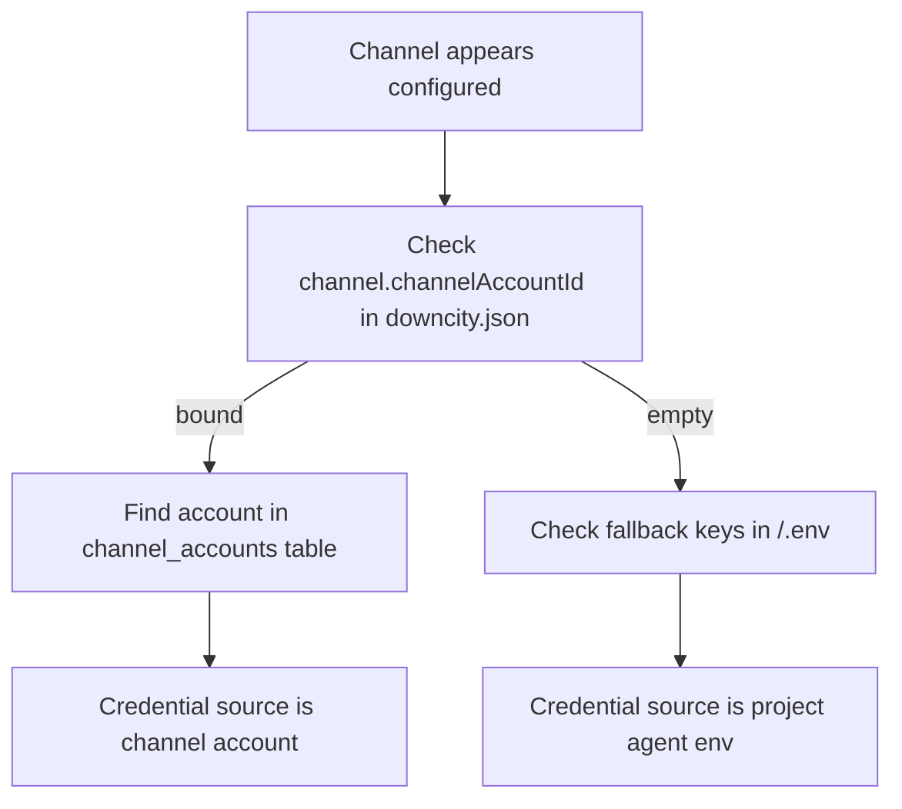

> Canonical schema doc: [Env and downcity.db Database Design](/en/docs/configuration/env-downcitydb-design)


# Environment Variable Strategy (Console Shared vs Agent Private)

This page answers 4 practical questions:

1. How many types of env-related variables exist?
2. Where is each type stored?
3. How are they loaded and merged at startup?
4. What reads project `.env`, and what does not?

## 1. Scope Matrix

| Layer | Source | Persisted | Scope | Typical content |
|---|---|---|---|---|
| Console shared env | `~/.downcity/downcity.db` `env_entries` (`scope=global`) | Yes (encrypted) | All agents | shared API keys and shared placeholders |
| Agent private env (DB) | `~/.downcity/downcity.db` `env_entries` (`scope=agent`, `agent_id`) | Yes (encrypted) | One agent (`agent_id`) | project-level secret keys |
| Agent private env (file) | `<agent>/.env` | User-managed file | One agent | runtime overlay values |
| Bot credentials | `~/.downcity/downcity.db` `channel_accounts` | Yes (encrypted fields) | Reusable by binding | Telegram/Feishu/QQ bot secrets |
| Runtime context vars | process memory (`DC_CTX_*`) | No | single request | channel/chat/user context |

Key points:

1. All persisted env-like secrets are in `downcity.db` encrypted tables.
2. `<agent>/.env` is runtime-only overlay for that agent.
3. `downcity.json` stores bindings (`model.primary`, `channel.channelAccountId`), not plaintext credentials.

## 2. Data Flow (diagram)



## 3. Load Priority (who wins)

### 3.1 Agent env merge

1. Agent-scope DB env loads first.
2. `<agent>/.env` overlays it.
3. `.env` wins on key conflicts.

### 3.2 `shell` session injection

1. A shell subprocess starts from the host process `process.env`.
2. Console shared env (`scope=global`) overlays that base.
3. Current agent env (`agent-scope DB env + <agent>/.env`) overlays shared env.
4. Request-scoped context vars such as `DC_CTX_*` are injected last.

So key precedence inside `shell` sessions is: `DC_CTX_*` > agent env > global env > host process env.

### 3.3 Channel credential resolution

1. `downcity.json` channel config only binds `channelAccountId`.
2. Runtime resolves real credentials from `channel_accounts`.
3. Missing binding or missing required secrets => `config_missing`.

## 4. What Reads `.env` and What Does Not

### 4.1 Reads project `.env`

1. Project-layer `${ENV_KEY}` resolution.
2. Agent process env injection (`agent env in env_entries + .env`).
3. `shell` subprocess injection (global env + current agent env + `DC_CTX_*`).
4. Optional fallback paths in some service auth helpers.

### 4.2 Does not read project `.env`

1. Global model/provider pool (`model_providers`, `models`) from `downcity.db`.
2. Plugin config from project `downcity.json` (`plugins.*`, including plugin-owned dependency config).
3. Bot account credential source of truth (`channel_accounts`).
4. Runtime context vars (`DC_CTX_*`) are generated at request time.

## 5. Save Paths

1. Console UI `Global / Env` writes `env_entries` with `scope=global` or `scope=agent`.
2. Bot account CRUD (UI): writes `channel_accounts`.
3. Model CRUD (CLI/UI): writes `model_providers`, `models`.
4. Plugin config (`city plugin action ...`, `city asr ...`, or `city tts ...`): writes project `downcity.json`.
5. Channel configure action: writes `downcity.json` (`enabled`, `channelAccountId`).
6. User manual `.env` edit: affects that agent only.

## 6. FAQ and Troubleshooting

### 6.1 Why does a new agent show existing channel credentials?

Most common reasons:

1. The channel is bound to an existing `channelAccountId`.
2. The new project `.env` already contains fallback keys.



## 7. Recommended Setup

1. Initialize console-global data once:

```bash
city init
city model create
city plugin action asr configure --payload '{"modelId": "SenseVoiceSmall"}'
```

2. Manage shared env in Console UI `Global / Env` (writes `env_entries`).
3. Create channel accounts in Console UI `Global / Channel Accounts`.
4. In each agent `downcity.json`, bind channel to `channelAccountId`.
5. Keep agent-private runtime keys in `<agent>/.env` only when needed.

## 8. Best-Practice Checklist

1. Keep persisted secrets in `downcity.db` encrypted tables.
2. Keep `downcity.json` as binding/config file, not secret storage.
3. Use `<agent>/.env` as agent-local runtime overlay only.
4. Validate channel status via `chat status` after changing bindings.
5. If values look inherited, check both `channelAccountId` and project `.env`.

## 9. Homepage Agent Marketplace

The homepage community marketplace now uses PostgreSQL-compatible storage and works well with Supabase.

Required environment variables:

1. `DATABASE_URL`: point this to your Supabase Postgres connection string so repository submissions and review states can be stored centrally.

Behavior:

1. Public submissions are inserted with `review_status = pending`.
2. Managers approve or reject records manually in Supabase.
3. Only `approved` records are shown on the public marketplace page.

## 10. Console public address override

When you use `city start -p` or `city console start -p`, the CLI tries to print `Public URL` in startup output.

If the runtime cannot know the real external address by itself (for example behind NAT, reverse proxy, or load balancer), set one of these explicitly:

1. `DOWNCITY_PUBLIC_URL`: full external URL, for example `https://console.example.com`
2. `DOWNCITY_PUBLIC_HOST`: external host only; the CLI expands it to `http://<host>:5315`

When no explicit public address is configured, `city start` automatically detects the public IP and stores it in global Console Env as `DOWNCITY_PUBLIC_HOST`. Agent `contact link` generation also uses this value to create transferable contact codes.

Priority:

1. `DOWNCITY_PUBLIC_URL`
2. `DOWNCITY_PUBLIC_HOST`
3. the current bind host (when it is already directly reachable)
4. a detected public IPv4 from local network interfaces
