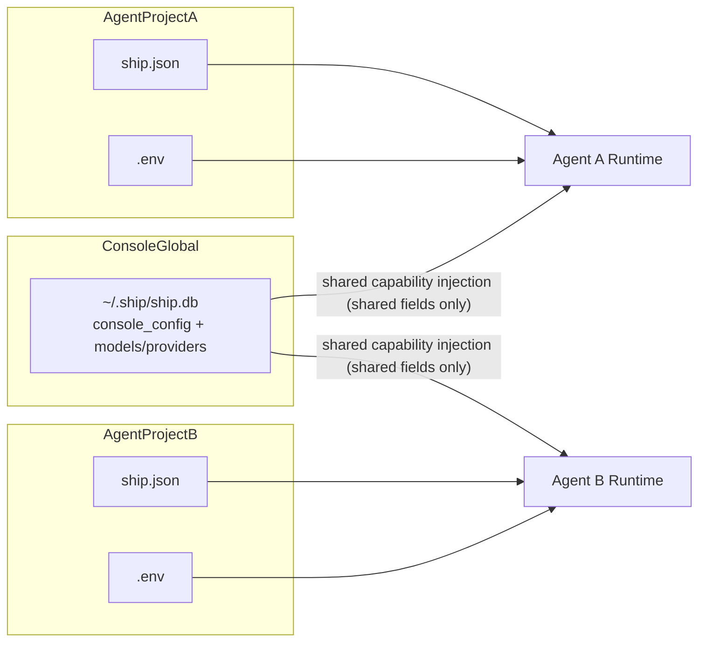
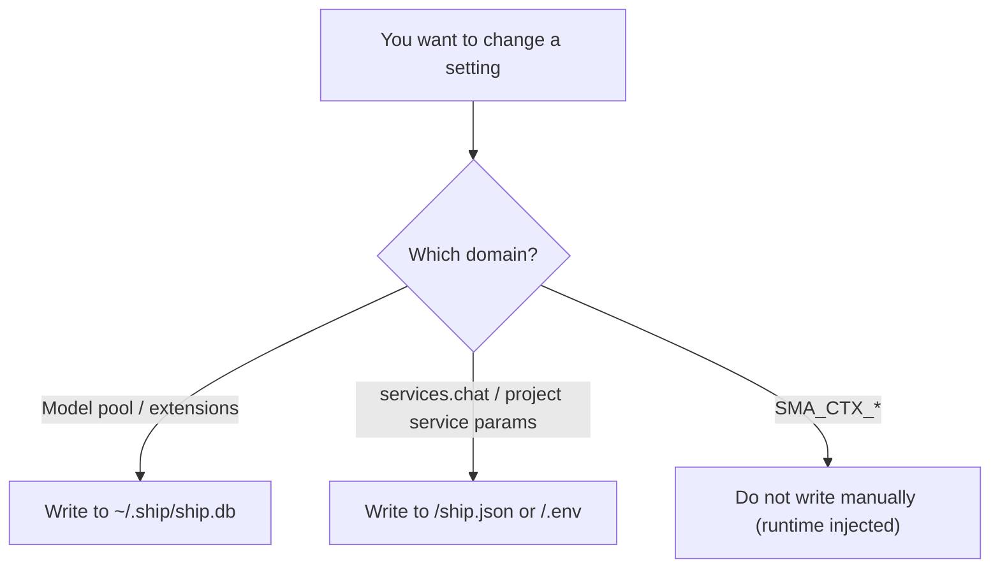
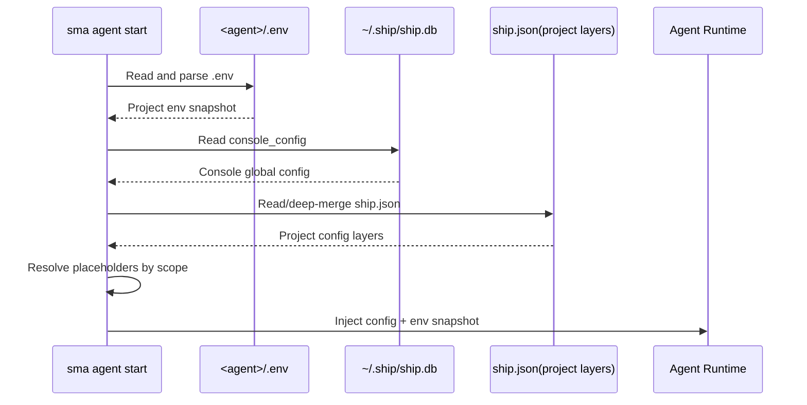
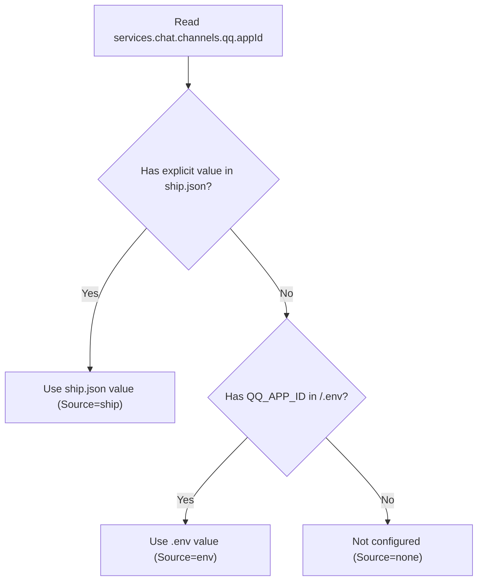
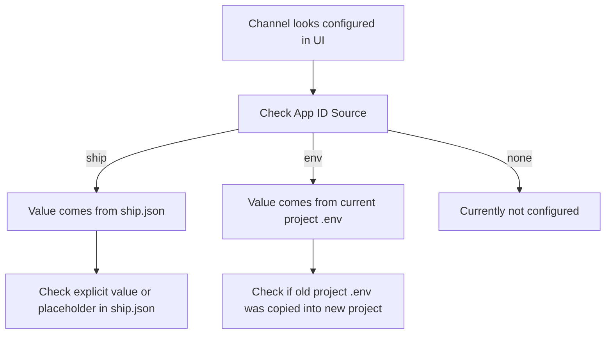

# Environment Variable Strategy (Console Shared vs Agent Private)

This page answers 4 practical questions:

1. How many types of env-related variables exist?
2. Where is each type stored?
3. How are they loaded and merged at startup?
4. What reads project `.env`, and what does not?

## 1. One-Page Overview

### 1.1 Three categories (clear naming first)

| Category | Typical Keys | Storage | Scope | Should you configure manually? |
|---|---|---|---|---|
| Console shared config variables | provider API keys, `extensions.*` | `~/.ship/ship.db` | All agents | Yes (via `sma console ...`) |
| Agent private config variables | `QQ_APP_ID`, `TELEGRAM_BOT_TOKEN` | `<agent>/.env` | Current agent only | Yes (inside project) |
| Runtime context variables | `SMA_CTX_CHANNEL`, `SMA_CTX_CHAT_ID` | process env (not persisted) | Single request | No (injected automatically) |

### 1.2 Architecture map (storage boundaries)



Key points:

1. `ship.db` is the console-global source of truth.
2. Each agent reads only its own `.env`.
3. There is no path where project A `.env` leaks into project B runtime.

## 2. Save Logic (where changes are written)

### 2.1 Writes to Console shared storage

The following write to `~/.ship/ship.db`:

1. `sma console model ...`
2. `sma console config set extensions...`
3. `sma voice ...` (internally updates `extensions.voice`)

### 2.2 Writes to Agent private storage

Inside a project, edits to:

1. `<agent>/ship.json`
2. `<agent>/.env`

affect only that agent.

### 2.3 Save-path decision flow



## 3. Load Logic (how values become effective)

At agent startup (`sma agent start` or daemon starting an agent), the high-level order is:

1. Read `<agent>/.env` into an in-memory private snapshot (without mutating global `process.env`).
2. Read `console_config` from `~/.ship/ship.db`.
3. Inject only shared fields from console config (currently mainly `extensions`).
4. Read project `ship.json` layers and deep-merge.
5. Resolve `${ENV_KEY}` placeholders:
   1. Project layers read project `.env` snapshot only.
   2. Console layer reads system environment only.
6. Start services with merged config + project env snapshot.

### 3.1 Startup sequence diagram



## 4. Priority Logic (who wins)

### 4.1 Chat credentials priority

For QQ (same pattern for Telegram/Feishu):

1. Use explicit `ship.json` value first (`services.chat.channels.qq.appId`).
2. If missing, fallback to project `.env` (`QQ_APP_ID`).
3. If both missing, treat as not configured.

### 4.2 Priority flow (`appId` example)



## 5. Where project `.env` is read vs not read

### 5.1 Reads project `.env` (current agent)

1. `${ENV_KEY}` resolution in project `ship.json` layers.
2. Chat credential resolution for Telegram/Feishu/QQ.
3. Some extension local fallback runs (when daemon is unavailable) using the same project env snapshot.

### 5.2 Does not read project `.env`

1. Console model pool source of truth (providers/models): comes from `ship.db`.
2. `extensions.*` global switches and config: comes from `ship.db` `console_config.extensions`.
3. `SMA_CTX_*`: runtime request context, not configuration.

## 6. Common Misunderstandings and Troubleshooting

### 6.1 "Why does a new agent already show QQ appId?"

Most common reason: that project `.env` already has `QQ_APP_ID`.  
This means env fallback is working, not that `ship.json` was auto-written.

### 6.2 Troubleshooting flow



## 7. Recommended Setup Templates

### 7.1 Console shared capabilities

```bash
sma console init
sma console model create
sma console config set extensions.voice.enabled true
```

### 7.2 Agent private capabilities

`ship.json`:

```json
{
  "services": {
    "chat": {
      "channels": {
        "qq": {
          "enabled": true,
          "appId": "${QQ_APP_ID}",
          "appSecret": "${QQ_APP_SECRET}",
          "auth_id": ""
        }
      }
    }
  }
}
```

`.env`:

```bash
QQ_APP_ID=your_qq_app_id
QQ_APP_SECRET=your_qq_app_secret
```

## 8. Best-Practice Checklist

1. Keep model pool and extensions in `ship.db`.
2. Keep service secrets in project `.env`, and reference via `${ENV_KEY}` in `ship.json`.
3. Treat `SMA_CTX_*` as runtime context, never as persisted config.
4. Keep `.env` isolated per project when running multiple agents.
5. After changes, restart the target agent and verify `Source` in Console UI.
