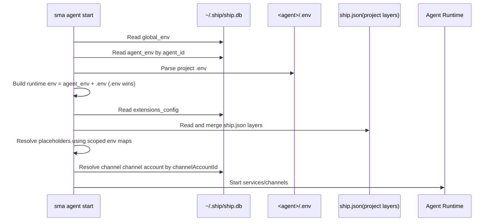

> Canonical schema doc: [Env and ship.db Database Design](/en/docs/configuration/env-shipdb-design)


# Environment Variable Strategy (Console Shared vs Agent Private)

This page answers 4 practical questions:

1. How many types of env-related variables exist?
2. Where is each type stored?
3. How are they loaded and merged at startup?
4. What reads project `.env`, and what does not?

## 1. Scope Matrix

| Layer | Source | Persisted | Scope | Typical content |
|---|---|---|---|---|
| Console shared env | `~/.ship/ship.db` `global_env` | Yes (encrypted) | All agents | shared API keys and shared placeholders |
| Agent private env (DB) | `~/.ship/ship.db` `agent_env` | Yes (encrypted) | One agent (`agent_id`) | project-level secret keys |
| Agent private env (file) | `<agent>/.env` | User-managed file | One agent | runtime overlay values |
| Bot credentials | `~/.ship/ship.db` `channel_accounts` | Yes (encrypted fields) | Reusable by binding | Telegram/Feishu/QQ bot secrets |
| Runtime context vars | process memory (`SMA_CTX_*`) | No | single request | channel/chat/user context |

Key points:

1. All persisted env-like secrets are in `ship.db` encrypted tables.
2. `<agent>/.env` is runtime-only overlay for that agent.
3. `ship.json` stores bindings (`model.primary`, `channel.channelAccountId`), not plaintext credentials.

## 2. Data Flow (diagram)



## 3. Load Priority (who wins)

### 3.1 Runtime env merge

1. `agent_env` (DB) loads first.
2. `<agent>/.env` overlays it.
3. `.env` wins on key conflicts.

### 3.2 Channel credential resolution

1. `ship.json` channel config only binds `channelAccountId`.
2. Runtime resolves real credentials from `channel_accounts`.
3. Missing binding or missing required secrets => `config_missing`.

## 4. What Reads `.env` and What Does Not

### 4.1 Reads project `.env`

1. Project-layer `${ENV_KEY}` resolution.
2. Agent runtime process env injection (`agent_env + .env`).
3. Optional fallback paths in some service auth helpers.

### 4.2 Does not read project `.env`

1. Global model/provider pool (`model_providers`, `models`) from `ship.db`.
2. Extension global config from `console_secure_settings.extensions_config`.
3. Bot account credential source of truth (`channel_accounts`).
4. Runtime context vars (`SMA_CTX_*`) are generated at request time.

## 5. Save Paths

1. Bot account CRUD (UI): writes `channel_accounts`.
2. Model CRUD (CLI/UI): writes `model_providers`, `models`.
3. Extension config (`sma console config set extensions.*`): writes `extensions_config`.
4. Channel configure action: writes `ship.json` (`enabled`, `channelAccountId`).
5. User manual `.env` edit: affects runtime only for that agent.

## 6. FAQ and Troubleshooting

### 6.1 Why does a new agent show existing channel credentials?

Most common reasons:

1. The channel is bound to an existing `channelAccountId`.
2. The new project `.env` already contains fallback keys.


## 7. Recommended Setup

1. Initialize console-global data once:

```bash
sma console init
sma console model create
sma console config set extensions.voice.enabled true
```

2. Create channel accounts in Console UI `Global / Channel Accounts`.
3. In each agent `ship.json`, bind channel to `channelAccountId`.
4. Keep agent-private runtime keys in `<agent>/.env` only when needed.

## 8. Best-Practice Checklist

1. Keep persisted secrets in `ship.db` encrypted tables.
2. Keep `ship.json` as binding/config file, not secret storage.
3. Use `<agent>/.env` as agent-local runtime overlay only.
4. Validate channel status via `chat status` after changing bindings.
5. If values look inherited, check both `channelAccountId` and project `.env`.
