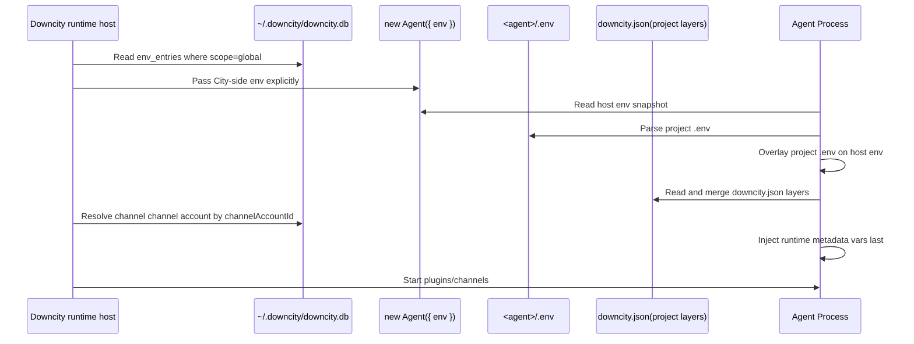
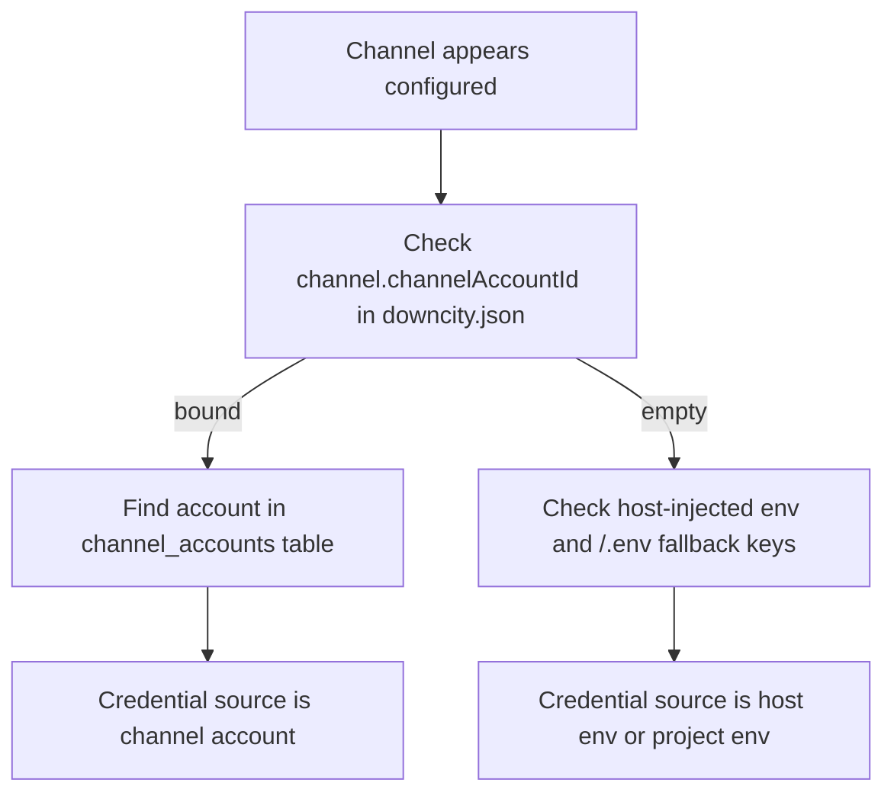

> Canonical schema doc: [Env and downcity.db Database Design](/en/docs/configuration/env-downcitydb-design)

# Environment Variable Strategy (Host Env, Project `.env`, Runtime Metadata)

This page answers 4 practical questions:

1. How many types of env-related variables exist?
2. Where is each type stored?
3. How are they loaded and merged at startup?
4. What reads project `.env`, and what does not?

## 1. Scope Matrix

| Layer | Source | Persisted | Scope | Typical content |
|---|---|---|---|---|
| Host-injected env | `new Agent({ env })` | No | One agent instance | shared API keys, embedded host values, City-side env |
| Project env file | `<agent>/.env` | User-managed file | One agent | project-local runtime overlay values |
| Runtime metadata vars | process memory (`DC_CITY_*`, `DC_AGENT_*`, `DC_SESSION_ID`) | No | single request / process | runtime endpoint, agent identity, session metadata |
| Bot credentials | `~/.downcity/downcity.db` `channel_accounts` | Yes (encrypted fields) | Reusable by binding | Telegram/Feishu/QQ bot secrets |
| City env records | `~/.downcity/downcity.db` `env_entries` | Yes (encrypted) | City-managed storage | global/shared env registry |

Key points:

1. `@downcity/agent` does not auto-read host `process.env`.
2. `new Agent({ env })` is the host injection entrypoint.
3. When the host is `downcity`, City-side env is read from `downcity.db` and passed explicitly into `Agent`.
4. `downcity.json` stores bindings (`execution.modelId`, `channel.channelAccountId`), not plaintext credentials.

## 2. Data Flow (diagram)

## 3. Load Priority (who wins)

### 3.1 Agent env merge

1. Host-injected `new Agent({ env })` loads first.
2. `<agent>/.env` overlays it.

So the agent-level merge order is: project `.env` > host-injected `env`.

### 3.2 Runtime metadata injection

1. Runtime helpers start from the resolved agent env snapshot.
2. Request-scoped metadata such as `DC_SESSION_ID`, `DC_CITY_*`, and `DC_AGENT_*` is injected last.

So key precedence for runtime metadata is: `DC_CITY_*` / `DC_AGENT_*` / `DC_SESSION_ID` > project `.env` > host-injected `env`.

### 3.3 Channel credential resolution

1. `downcity.json` channel config only binds `channelAccountId`.
2. Runtime resolves real credentials from `channel_accounts`.
3. Missing binding or missing required secrets => `config_missing`.

## 4. What Reads `.env` and What Does Not

### 4.1 Reads project `.env`

1. Agent runtime env assembly (`new Agent({ env })` + `.env`).
2. Local plugin command context assembly.
3. Runtime helpers that append request metadata on top of the resolved agent env.

### 4.2 Does not read project `.env`

1. Federation AIService model/provider pool (`model_providers`, `models`) from `downcity.db`.
2. Plugin config from project `downcity.json` (`plugins.*`, including plugin-owned dependency config).
3. Bot account credential source of truth (`channel_accounts`).
4. Runtime context vars (`DC_CTX_*`) are generated at request time.

## 5. Save Paths

1. City UI `Global / Env` writes `env_entries` for City-side env management.
2. Bot account CRUD (UI): writes `channel_accounts`.
3. City model CRUD (CLI/UI): writes `model_providers`, `models`.
4. Plugin config product surface: writes project `downcity.json`.
5. Channel configure action: writes `downcity.json` (`enabled`, `channelAccountId`).
6. User manual `.env` edit: affects that agent only.

Note:

1. `env_entries` is City-managed storage.
2. If a host wants City-managed env to participate in Agent runtime, it should pass those values through `new Agent({ env })`.

## 6. FAQ and Troubleshooting

### 6.1 Why does a new agent show existing channel credentials?

Most common reasons:

1. The channel is bound to an existing `channelAccountId`.
2. The host injected shared keys into `Agent`.
3. The new project `.env` already contains fallback keys.

## 7. Recommended Setup

1. Prepare local Downcity state and verify the City connection once.
2. Manage shared env in City UI `Global / Env`, or pass them explicitly through `new Agent({ env })`.
3. Create chat accounts from the Downcity chat product surface.
4. In each agent `downcity.json`, bind channel to `channelAccountId`.
5. Keep agent-private runtime keys in `<agent>/.env` only when needed.

Concrete workflows live in [Downcity CLI](/en/docs/reference/cli), [Downcity City docs](/en/docs/reference/cli), [Downcity config docs](/en/docs/reference/cli), and [Downcity chat docs](/en/docs/reference/cli).

## 8. Best-Practice Checklist

1. Keep persisted secrets in `downcity.db` encrypted tables.
2. Keep `downcity.json` as binding/config file, not secret storage.
3. Use `<agent>/.env` as project-local runtime overlay only.
4. Use `new Agent({ env })` only for explicit host-side overrides.
5. Validate chat routing through the Downcity chat product surface after changing bindings.
6. If values look inherited, check `channelAccountId`, host-injected `env`, and project `.env`.

## 9. Homepage Agent Marketplace

The homepage community marketplace now uses PostgreSQL-compatible storage and works well with Supabase.

Required environment variables:

1. `DATABASE_URL`: point this to your Supabase Postgres connection string so repository submissions and review states can be stored centrally.

Behavior:

1. Public submissions are inserted with `review_status = pending`.
2. Managers approve or reject records manually in Supabase.
3. Only `approved` records are shown on the public marketplace page.

## 10. Public address

Current `downcity` CLI no longer starts or rebinds Console UI. Public Console access should be provided by the Console product deployment, reverse proxy, tunnel, or hosting layer.

These values are normally injected by local runtime host discovery or by the deployment environment. They are not endpoint parameters that users enter for `contact link`:

1. `DOWNCITY_PUBLIC_URL`: full external URL, for example `https://console.example.com`
2. `DOWNCITY_PUBLIC_HOST`: external host only

The local runtime host can detect the public host when possible and store it in City-side Env as `DOWNCITY_PUBLIC_HOST`. Agent `contact link` generation also uses this value to create transferable contact codes.

Priority:

1. `DOWNCITY_PUBLIC_URL`
2. `DOWNCITY_PUBLIC_HOST`
3. the current bind host (when it is already directly reachable)
4. a detected public IPv4 from local network interfaces
