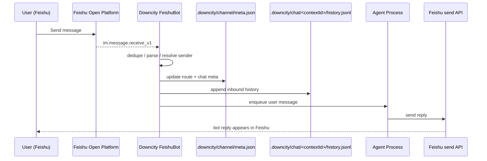

# Feishu: end-to-end message -> agent -> reply

This page explains how the current Feishu channel in `downcity` works internally.

> User-facing setup guide: [/en/docs/services/chat/feishu](/en/docs/services/chat/feishu)

## Overview



## Startup

When chat service starts the Feishu channel, it:

1. loads `appId`, `appSecret`, and `domain` from the bound channel account
2. creates:
   - `Lark.Client`
   - `Lark.WSClient`
3. registers:
   - `im.message.receive_v1`
4. starts the long connection

Code:

- [Index.ts](/Users/wangenius/Documents/github/shipmyagent/packages/downcity/src/services/chat/Index.ts:298)
- [Feishu.ts](/Users/wangenius/Documents/github/shipmyagent/packages/downcity/src/services/chat/channels/feishu/Feishu.ts:733)

## Inbound parsing

The channel reads these core event fields:

- `message.chat_id`
- `message.chat_type`
- `message.message_id`
- `message.message_type`
- `sender.sender_id.open_id / user_id / union_id`

### Deduplication

Feishu may redeliver messages, so the runtime uses:

- in-process dedupe
- file-backed dedupe under `.cache/feishu/dedupe`

This prevents the same message from being executed more than once.

### Current execution input: text plus common attachments

The current Feishu adapter normalizes inbound input by message type:

- `message_type === text`: execute the text body directly
- `message_type === post`: downgrade rich text into plain text plus downloadable attachments
- `message_type === image | file | audio | media`: download to local cache first, then inject as `<file ...>`
- any other type: send an error message back

So Feishu `post`, images, videos, files, and audio now follow the same normalized execution flow:

- text / links / mentions inside `post` are converted into plain execution text
- images / media inside `post` are converted into downloadable attachments
- all downloadable assets are finally injected as `<file ...>`
- images and PDFs are also best-effort injected as model `file parts`

### Automatic ack reaction

In the current release, once an inbound Feishu message:

- passes authorization checks
- and before it enters command handling or agent execution

the bot first adds a lightweight reaction to the triggering user message to signal "received, processing".

The current implementation uses Feishu message reaction type `OK`.

This reaction is **best-effort**:

- if it succeeds, the user sees an immediate acknowledgment
- if it fails, command handling and agent execution continue normally

Code:

- [Feishu.ts](/Users/wangenius/Documents/github/shipmyagent/packages/downcity/src/services/chat/channels/feishu/Feishu.ts:816)

## Sender name and chat title resolution

This is the most important part of the Feishu integration.

### The current runtime uses `tenant_access_token`

The adapter exchanges:

- `appId + appSecret`

for:

- `tenant_access_token`

Then it calls:

- `contact/v3/users/...`
- `im/v1/chats/...`
- `im/v1/chats/:chat_id/members`

This means:

- runtime display-name resolution depends on **tenant scopes**
- a successful manual `user_access_token` test does not prove the bot path will work

### Resolution order

Current order:

1. extract sender identity from the event
   - prefer `open_id`
   - then `user_id`
   - then `union_id`
2. call `contact/v3/users/:id`
3. if no name is returned, try:
   - `im/v1/chats/:chat_id/members`
4. if still unresolved, fall back to raw ids

Code:

- [Feishu.ts](/Users/wangenius/Documents/github/shipmyagent/packages/downcity/src/services/chat/channels/feishu/Feishu.ts:195)
- [Feishu.ts](/Users/wangenius/Documents/github/shipmyagent/packages/downcity/src/services/chat/channels/feishu/Feishu.ts:245)
- [Feishu.ts](/Users/wangenius/Documents/github/shipmyagent/packages/downcity/src/services/chat/channels/feishu/Feishu.ts:349)

## Context routing and persistence

For each inbound message, the runtime creates or updates route metadata such as:

- `contextId`
- `channel`
- `chatId`
- `targetType`
- `messageId`
- `actorId`
- `actorName`
- `chatTitle`

These are stored in:

- `.downcity/channel/meta.json`

The internal target key is shaped like:

```text
feishu|<chatId>|<chatType>|<threadId>
```

Code:

- [ChannelContextStore.ts](/Users/wangenius/Documents/github/shipmyagent/packages/downcity/src/services/chat/runtime/ChannelContextStore.ts:118)
- [BaseChatChannel.ts](/Users/wangenius/Documents/github/shipmyagent/packages/downcity/src/services/chat/channels/BaseChatChannel.ts:365)

## How inbound messages enter the agent

The adapter wraps the inbound platform message into a normalized user message:

```text
<info>
channel: feishu
context_id: ...
chat_id: ...
chat_type: p2p
message_id: ...
user_id: ...
username: ...
</info>

user text
```

So the model sees:

- which channel this came from
- which `contextId` it belongs to
- who sent it
- whether this is a private or group chat

Code:

- [QueuedUserMessage.ts](/Users/wangenius/Documents/github/shipmyagent/packages/downcity/src/services/chat/runtime/QueuedUserMessage.ts:32)

Audit history is also written to:

- `.downcity/chat/<contextId>/history.jsonl`

## Reply delivery

There are two outbound paths:

### Private chat (`p2p`)

Uses:

- `client.im.v1.message.create`

and sends directly by `chat_id`.

### Group chat

Uses:

- `client.im.v1.message.reply`

to reply against the original `message_id`.

Code:

- [Feishu.ts](/Users/wangenius/Documents/github/shipmyagent/packages/downcity/src/services/chat/channels/feishu/Feishu.ts:885)

The current version also supports `<file>` conversion in outbound replies:

```text
<file type="document">reports/downcity-office-hours.md</file>
```

Delivery now follows the actual message structure:

1. parse the message into ordered `segments[]`
2. send text segments in source order
3. upload/send attachment segments in source order

So if the source message is:

```text
Part one

<file type="document" caption="Reference">reports/a.pdf</file>

Part two
```

Feishu receives it in the same order:

1. text: `Part one`
2. attachment: `reports/a.pdf`
3. text: `Part two`

## Why manual `user_access_token` tests can pass while runtime still fails

These are different token modes.

### Manual test

Often uses:

- `user_access_token`
- user-authorized view

### Running channel

Uses:

- `tenant_access_token`
- app identity view

So this is possible:

1. manual `user_access_token` test returns the real name
2. the running Feishu bot still only sees `open_id`

There is no contradiction there.

## Current limitations

The current Feishu channel still has these limitations:

- complex `post` styling (bold/italic/layout) is currently downgraded to plain text instead of preserving visual style
- sender/chat display names depend on tenant scopes and contact visibility
- `user_access_token` is not currently used for inbound metadata enrichment

## Troubleshooting order

If you see:

- `chatTitle = null`
- `chatDisplayNameSource = chat_id`
- `username = unknown`

check in this order:

1. tenant scopes are actually effective
2. `im.message.receive_v1` is enabled
3. `im:chat.members:read` is effective for the app
4. `contact:user.employee_id:readonly` is effective for the app
5. contact visibility includes the current user
6. send a **new** Feishu message so route metadata refreshes
