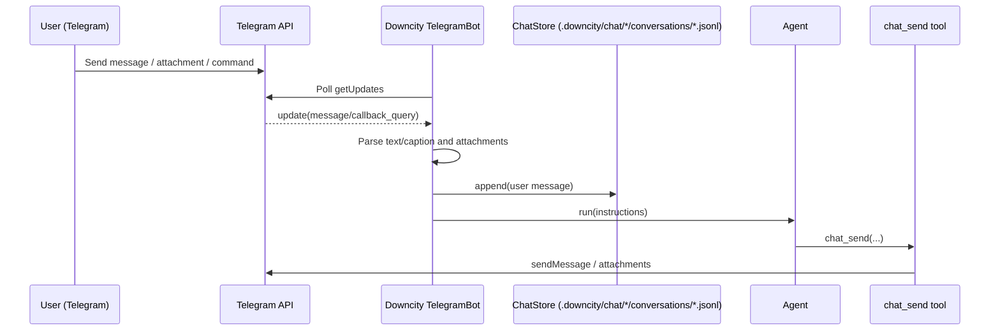

# Telegram: end-to-end message → agent → replies

> ⚠️ **Simplified mode (2026-02-03)**: the current `downcity` package disables approvals (full-permission execution). Approval-related parts of this flow are outdated.

This page explains how a Telegram message is translated into Downcity instructions, how the agent executes them, and how replies are delivered via the `chat_send` tool.

> Code references: `packages/downcity/src/services/chat/channels/telegram/Bot.ts`, `packages/downcity/src/services/chat/channels/BaseChatChannel.ts`, `packages/downcity/src/services/chat/runtime/*`, `packages/downcity/src/sessions/SessionCore.ts`

## Overview



## Input: Telegram update → executable instructions

### Chat keys (per chat / thread)

Downcity uses a `chatKey` to isolate context:

- DM / regular group: `telegram-chat-<chatId>`
- Group topics (forum threads): `telegram-chat-<chatId>-topic-<messageThreadId>`

#### What is a Telegram “topic”?

Telegram **supergroups** can enable *Topics* (also called “Forum” mode). In that mode, a single group chat is split into multiple thread-like topics. Telegram marks messages in a topic with a `message_thread_id`.

Downcity treats each topic as an independent conversation context, so the bot’s memory/history is separated per topic:

- A message in the group “main chat” goes to `telegram-chat-<chatId>`
- A message in topic `#139` goes to `telegram-chat-<chatId>-topic-139`

### Group behavior: trigger

In groups, non-empty messages can be considered for execution.

- No `@mention` or reply is required.
- No initiator/admin gate is applied; group messages are accepted uniformly.

### Automatic ack reaction

In the current release, once an inbound Telegram message:

- passes authorization checks
- and before it enters command handling or agent execution

the bot first adds a `👀` reaction to that exact user message to indicate "received, processing".

This reaction is **best-effort**:

- if it succeeds, the user gets an immediate lightweight acknowledgment
- if it fails, command handling and agent execution continue normally

### Attachments: local cache + `<file>` tags

Incoming files (document/photo/voice/audio/video) are downloaded and stored under:

- `.downcity/.cache/telegram/`

Then the final `instructions` passed to the agent are prefixed with `<file ...>` tags, e.g.:

```text
<file type="document" caption="report.pdf">.downcity/.cache/telegram/1738...-report.pdf</file>

Summarize this PDF and list action items.
```

For images and PDFs, runtime also best-effort injects model `file parts`, while keeping the original `<file>` text protocol as fallback.

## Persistence: ChatStore

Every incoming message is appended to a per-chat JSONL file:

- `.downcity/chat/<encode(chatKey)>/conversations/messages.jsonl`

Before execution, recent entries are loaded and collapsed into a compact “assistant context” that is injected back into the in-memory chat runtime for that `chatKey`.
Before execution, the runtime uses an in-memory session history for the same `chatKey`. If the model needs more details from disk history, it can call `chat_load_history` to load and inject earlier messages from `.downcity/chat/<chatKey>/conversations/messages.jsonl`.

### “All messages are stored” and used as context

In group chats, Downcity stores all incoming messages in `messages.jsonl`, and the recent history may be injected back into the model context for the current `chatKey`.

## Execution

### Tool-strict (agent-controlled sending)

Downcity services use a tool-strict pattern:

- The agent uses the `chat_send` tool to deliver replies (multiple messages, staged updates, etc.)
- The service does not automatically forward the agent’s plain text output as chat messages

### Run + delivery

Telegram dispatches execution for the current `chatKey`.

- Primary delivery path: the model calls `chat_send` to send replies (tool-strict).
- Fallback: if the model forgets to call `chat_send`, the adapter sends the final plain-text output.
- Messages are chunked for Telegram size limits; Markdown is attempted first, then it falls back to plain text.
- Long replies are not pre-truncated before delivery; they are sent in full across multiple chunks.
- Mixed text + attachment replies are first parsed into ordered segments, then sent in the actual order they appeared in the source message.

### Reply targeting and reactions (`reply_to_message` + `chat react`)

#### Outbound reply targeting (`reply_to_message_id`)

For `chat send`, default behavior is non-reply delivery.
The agent only tries `reply_to_message_id` when reply mode is explicitly enabled (for example `city chat send --reply`).

Priority:
1. explicit `messageId` provided by the caller
2. latest inbound `messageId` from chat meta for the same `chatKey`

Result:
- valid numeric id exists: send as a reply-to message
- no valid id: send normally (no reply link), `chat send` still succeeds

#### Reactions (`city chat react`)

`chat react` uses Telegram `setMessageReaction`:
- default emoji is `👍`
- `--emoji` overrides emoji
- `--big` sets Telegram `is_big`
- a valid target `messageId` is required (explicit or backfilled), otherwise the command fails

So in practice:
- `chat send` can degrade gracefully without `messageId`
- `chat react` cannot, because Telegram reactions must point to an existing message

### On-demand history loading (optional)

If the model decides it needs more context than the in-memory session provides, it can call `chat_load_history` to fetch earlier messages from `.downcity/chat/<chatKey>/conversations/messages.jsonl` and inject them into the current in-flight context (before the current user message).

## Approvals (human-in-the-loop)

Approvals are disabled in the current simplified runtime (tools execute directly).
