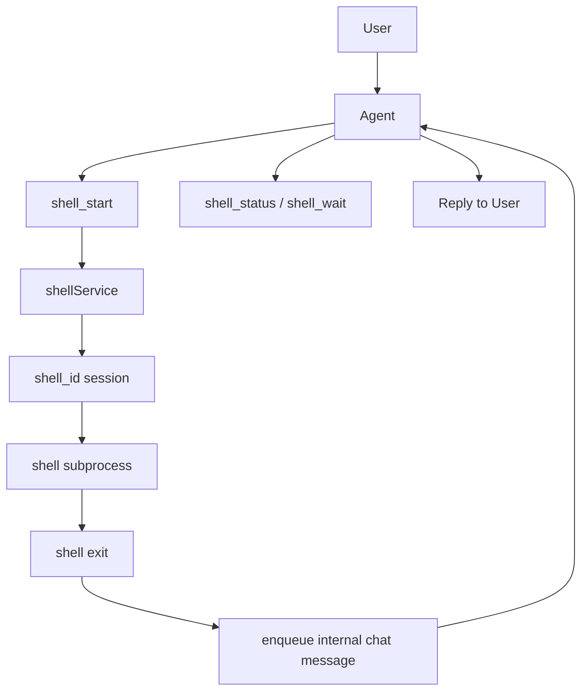

# Shell Service

`shellService` is the runtime service that owns shell execution sessions.

Its job is not only "run a command". Its job is to define:

- who owns shell state
- how long-running work stays queryable
- how shell sessions stay separate from chat `contextId`
- how output is persisted and audited

## What it owns

- starting shell sessions
- tracking shell state
- buffering and persisting stdout/stderr
- reading status and incremental output by `shell_id`
- returning shell completion back to the original chat so the main agent can reply

## What it does not own

- it does not message users directly
- it does not replace agent reasoning
- it does not define third-party business semantics

For example, an external `thread_id` from a video-generation site is only an attached external reference, not a runtime primary key.

## Three IDs to keep separate

### 1. `contextId`

This is the chat / agent conversation context ID.

It represents:

- which conversation this belongs to
- which chat lane is serialized
- where agent message history lives

### 2. `shell_id`

This is a shell session ID.

It represents:

- one command execution instance
- one shell session that can be queried, read, or closed

### 3. external `thread_id`

This is a third-party task ID.

Examples:

- a Jianying task ID
- a workflow ID from an external website

It can be attached to a shell session, but it is not a runtime primary key.

## Relationship between agent and shell

The relationship is now explicit:

- the agent is the orchestrator
- shell is an execution resource
- shell does not talk to the user directly
- shell still returns to the main agent when it finishes

The user is always interacting with the agent, not with a raw background shell.

## Available shell tools

### `shell_exec`

Execute once and wait until completion.

Use it when:

- the command is short
- no mid-run status is needed
- no stdin interaction is needed

The agent does not need to manage `shell_id` after the call.

If the command may run for a while, use `shell_start` instead.

### `shell_start`

Starts a shell session and returns:

- `shell_id`
- current status
- the first output chunk

If the command is short, it may finish immediately during this call.

If the command is long, it returns `running`, and the agent can check later.

### `shell_status`

Reads current shell session status.

This is the right tool when a user asks:

- how is it going?
- is it still running?
- what is the latest output?

### `shell_read`

Reads incremental output starting from `from_cursor`.

This should only be used when the agent really needs raw incremental output.

### `shell_write`

Writes to shell stdin.

### `shell_wait`

Waits for state change or new output.

The important point:

- the agent does not need to write its own high-frequency empty polling loop
- the shell service owns the wait/state mechanism

### `shell_close`

Closes the shell session and releases resources.

## What the shell logic is now

### Short commands

Short commands should prefer `shell_exec`.

Its behavior is:

- execute once
- wait for completion
- return final output directly
- require no follow-up `shell_id` management

Implementation-wise it still reuses the same shell session engine, but the stateful interaction is not exposed to the model.

### Long-running jobs

The long-job flow is:

1. the agent calls `shell_start`
2. runtime creates a `shell_id`
3. `shellService` owns process, state, output, and waiters
4. the agent tells the user the job has started
5. when the user asks for progress, the agent calls `shell_status` or `shell_wait`
6. when the shell exits, the service enqueues an internal chat message
7. the main agent replies with the final result

## Why the agent no longer polls the shell itself

The old model had several problems:

- shell and chat IDs were easy to confuse
- the agent became the shell poller
- user experience during long jobs was poor

The new model changes that:

- `shellService` owns shell state
- the agent queries shell state instead of managing it
- when shell exits, the result returns to the original chat through the agent

## Persisted shell session structure

Each shell session writes to:

```text
.ship/shell/<shell_id>/
├─ snapshot.json
└─ output.log
```

Where:

- `snapshot.json` stores current shell state
- `output.log` stores full output

This gives shell its own auditable surface instead of living only inside a transient tool call.

## Chat relationship diagram



## When shell sessions are the right fit

Use a shell session when:

- the command may run for a while
- progress may need to be queried
- incremental output matters
- stdin interaction may be needed

If the command is very short, `shell_start` is still fine. It will often complete during inline wait and return immediately.

## What is not provided right now

One-shot execution is now available through `shell_exec`.

It should still be kept for short and self-contained commands.

If a command may:

- run for a long time
- need progress checks
- need stdin interaction

then it should not use `shell_exec`; it should use stateful `shell_start` instead.
