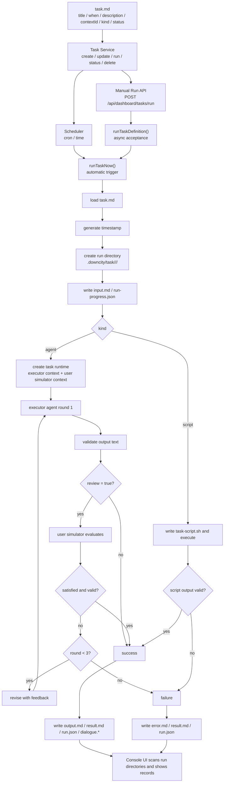

# Agent Task Mode

`kind=agent` executes task body through the agent. It is single-round by default; only `review: true` enables the executor plus user-simulator multi-round review flow.

## What It Fits

- tasks that require reasoning and iteration
- research / analysis / summarization
- human-readable reusable deliverables

## What It Is Not

- not a normal chat turn
- not a database-backed task queue
- not a mode that requires external channel delivery by default

## Use cases

- tasks requiring reasoning and iteration
- research / analysis / summarization
- human-readable deliverables

## Execution characteristics

- single-round execution by default
- automatic multi-round review only when `review: true` (default max: 3)
- live progress events visible in Console UI
- final output written to `output.md`, with summary in `result.md`
- executor query / reply also written into run-directory `messages.jsonl` for debugging

## Current Execution Logic

1. Load `task.md` and parse frontmatter plus body.
2. Create a new run directory: `./.downcity/task/<taskId>/<timestamp>/`.
3. Write `input.md` and `run-progress.json`.
4. Create a task-specific runtime instead of reusing normal chat history.
5. Let the executor agent produce a result.
6. If `review: true`, let the user-simulator agent evaluate whether the result satisfies the task goal.
7. If `review: true` and the result is not good enough, feed the previous output plus simulator feedback back into the executor, up to 3 rounds.
8. If review is disabled, finish after the first valid output.
9. Write `output.md`, `result.md`, `dialogue.*`, `run.json`, and `error.md` when needed.

## Success Rules

- an `agent` task now only requires valid single-round output text by default
- successful `chat_send` delivery is no longer required by default
- if `review: true`, the output also goes through simulator review and up to 3 rounds of revision
- if the task body explicitly asks for external delivery, that requirement belongs to the task itself

## Context Model

- `contextId` is stored in task definition as the task semantic context
- execution uses a separate task run context
- task execution therefore does not directly reuse normal chat message history

## Diagram



## Best practices

- write explicit goals, boundaries, and acceptance criteria
- keep review off by default; only set `review: true` when you really need review-and-revise behavior
- require auditable outputs when possible
- do not put raw shell scripts in agent tasks

## Example

```yaml
---
title: daily-market-research
description: daily market research summary
contextId: research
when: 0 8 * * *
status: enabled
kind: agent
review: true
---

Generate today's market research summary including:
1. major events
2. key risks
3. next-step recommendations
```
