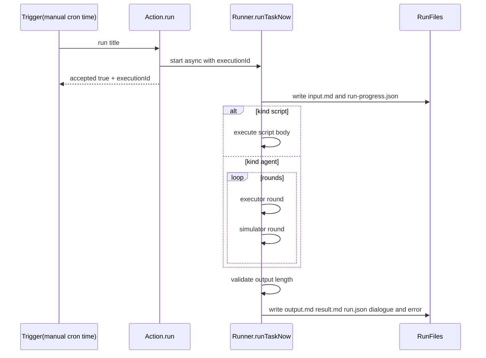

# Execution and Validation Flow

## End-to-end flow

1. load task definition and create run directory
2. write `input.md` and `run-progress.json` (running)
3. execute by `kind`:
   - `script`: execute script body directly
   - `agent`: executor + user-simulator multi-round flow
4. validate result (current rule: output must be at least 1 char; `agent` tasks require successful `chat_send` delivery)
5. write `output.md` / `result.md` / `run.json` / `dialogue.*` / `error.md`

## Result fields

- `status`: final status (success/failure)
- `executionStatus`: execution-stage status
- `resultStatus`: validation status (valid/invalid/not_checked)
- `executionId`: unique execution id

## Mermaid

