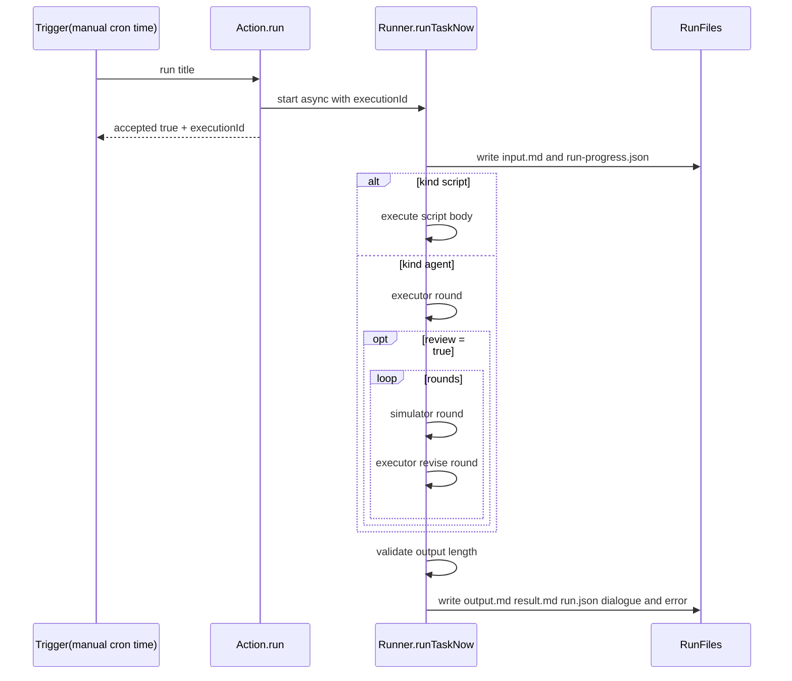

# Execution and Validation Flow

## End-to-end flow

1. load task definition and create run directory
2. write `input.md` and `run-progress.json` (running)
3. execute by `kind`:
   - `script`: execute script body directly
   - `agent`: single-round by default; executor + user-simulator multi-round flow only when `review: true`
4. validate result (current rule: output must be at least 1 char)
5. write `output.md` / `result.md` / `run.json` / `dialogue.*` / `error.md`

## Manual vs Scheduled Trigger

- manual trigger: Console UI calls `/api/dashboard/tasks/run`
- manual trigger is currently async acceptance: the API returns `accepted=true`, a guidance `message`, and `executionId` first, then the run continues in background
- scheduled trigger: task scheduler starts runs from cron or one-shot time rules
- scheduler has same-`taskId` serialization; manual trigger currently does not have the same anti-reentry protection

## Why Multiple Run Records Appear

- every execution creates a new timestamp directory
- Console UI lists runs by scanning these timestamp directories
- so one accepted run request becomes one run record; two accepted requests become two records

## Artifacts and Responsibilities

- `input.md`: execution input snapshot
- `run-progress.json`: in-progress status and phase updates
- `output.md`: final task output body
- `result.md`: human-readable summary
- `dialogue.md` / `dialogue.json`: multi-round agent revision trail
- `run.json`: final metadata and status
- `error.md`: failure summary when execution fails

## Result fields

- `status`: final status (success/failure)
- `executionStatus`: execution-stage status
- `resultStatus`: validation status (valid/invalid/not_checked)
- `executionId`: unique execution id

## Mermaid

