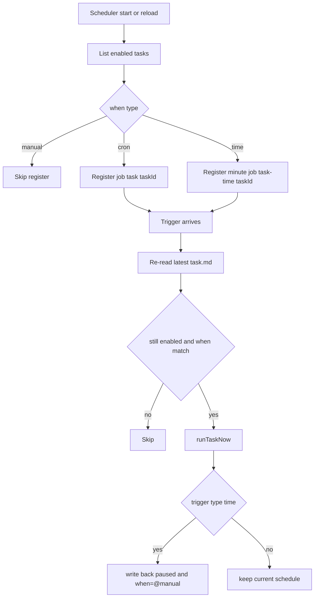

# Scheduler Registration and Trigger Flow

## Registration rules

On scheduler start/reload, for each `enabled` task:

1. `when=@manual`: no job registration
2. `when=cron`: register `task:<taskId>`
3. `when=time:...`: register `task-time:<taskId>` minute poller

## Re-check before execute

At trigger time, runtime re-reads latest `task.md` and verifies:

- status is still `enabled`
- `when` still matches current trigger mode

## One-shot behavior

After successful `when=time:...` execution:

- `status -> paused`
- `when -> @manual`

## Serial guard

Only one in-flight run per `taskId`:

- overlap trigger is skipped
- log: `Task skipped (already running)`

## Mermaid

