# Building a Chatbot

This comprehensive guide will walk you through building intelligent chatbots using downcity, from simple conversational bots to sophisticated agents with memory, knowledge bases, and advanced features.

## Chatbot Architecture Overview

```mermaid
graph TB
    subgraph "User Interfaces"
        Web[Web Chat]
        Mobile[Mobile App]
        Slack[Slack Bot]
        Discord[Discord Bot]
    end
    
    subgraph "Chatbot Engine"
        Router[Message Router]
        Hero[🤖 Hero Agent]
        Middleware[Processing Pipeline]
    end
    
    subgraph "Memory & Knowledge"
        Room[🏠 Room<br/>User Memory]
        Codex[📖 Codex<br/>Knowledge Base]
        Cache[Response Cache]
    end
    
    subgraph "External Services"
        LLM[Language Model]
        DB[(Database)]
        Vector[(Vector Store)]
    end
    
    Web --> Router
    Mobile --> Router
    Slack --> Router
    Discord --> Router
    
    Router --> Middleware
    Middleware --> Hero
    
    Hero <--> Room
    Hero <--> Codex
    Hero --> Cache
    
    Room --> DB
    Codex --> Vector
    Hero --> LLM
    
    style Hero fill:#e1f5fe
    style Room fill:#e8f5e8
    style Codex fill:#fff3e0
```



## Overview

We'll build three different types of chatbots:

1. **Basic Chatbot** - Simple conversational agent
2. **Memory-Enhanced Chatbot** - Persistent conversation memory
3. **Intelligent Chatbot** - Full-featured with knowledge base and advanced capabilities

## Prerequisites

Before starting, ensure you have:
- [downcity installed](/docs/getting-started/installation)
- OpenAI API key configured
- Basic understanding of [core concepts](/docs/core-concepts)

## Part 1: Basic Chatbot

Let's start with a simple conversational chatbot.

### Project Setup

Create a new project directory:

```bash
mkdir downcity-chatbot
cd downcity-chatbot
npm init -y
npm install downcity dotenv
npm install -D typescript tsx @types/node
```

Create the basic structure:

```typescript title="src/basic-chatbot.ts"
import 'dotenv/config';
import { Hero } from 'downcity';
import * as readline from 'readline';

class BasicChatbot {
  private hero: Hero;
  private rl: readline.Interface;

  constructor() {
    // Create the AI agent
    this.hero = Hero.create()
      .avatar(`You are a friendly and helpful chatbot named ChatBot. 
               You enjoy having conversations and helping users with their questions.
               Keep your responses conversational and engaging.`);

    // Set up readline for user input
    this.rl = readline.createInterface({
      input: process.stdin,
      output: process.stdout
    });
  }

  async start() {
    console.log("🤖 ChatBot: Hello! I'm your friendly chatbot. Type 'quit' to exit.\n");

    while (true) {
      const userInput = await this.getUserInput("You: ");
      
      if (userInput.toLowerCase() === 'quit') {
        console.log("🤖 ChatBot: Goodbye! Have a great day!");
        break;
      }

      try {
        const response = await this.hero.chat(userInput);
        console.log(`🤖 ChatBot: ${response}\n`);
      } catch (error) {
        console.error("❌ Error:", error);
        console.log("🤖 ChatBot: Sorry, I encountered an error. Please try again.\n");
      }
    }

    this.rl.close();
  }

  private getUserInput(prompt: string): Promise<string> {
    return new Promise((resolve) => {
      this.rl.question(prompt, (answer) => {
        resolve(answer);
      });
    });
  }
}

// Start the chatbot
async function main() {
  const chatbot = new BasicChatbot();
  await chatbot.start();
}

main().catch(console.error);
```

### Running the Basic Chatbot

```bash
# Create .env file with your OpenAI API key
echo "OPENAI_API_KEY=your_api_key_here" > .env

# Run the chatbot
npx tsx src/basic-chatbot.ts
```

**Expected Interaction:**
```
🤖 ChatBot: Hello! I'm your friendly chatbot. Type 'quit' to exit.

You: Hi there!
🤖 ChatBot: Hello! It's great to meet you! How are you doing today?

You: I'm working on a programming project
🤖 ChatBot: That sounds exciting! What kind of programming project are you working on? I'd love to hear more about it.

You: quit
🤖 ChatBot: Goodbye! Have a great day!
```

## Part 2: Memory-Enhanced Chatbot

Now let's add persistent memory so the chatbot remembers conversations across sessions.

### Enhanced Chatbot Implementation

```typescript title="src/memory-chatbot.ts"
import 'dotenv/config';
import { Hero, SQLitePersistor } from 'downcity';
import * as readline from 'readline';
import * as path from 'path';

class MemoryChatbot {
  private hero: Hero;
  private rl: readline.Interface;
  private sessionId: string;

  constructor() {
    // Create persistent memory
    const persistor = new SQLitePersistor('./chatbot-memory.db');
    
    // Create the AI agent with memory
    this.hero = Hero.create()
      .avatar(`You are ChatBot, a friendly AI assistant with memory.
               You remember previous conversations and can reference them.
               Always acknowledge when you remember something from past conversations.
               Be helpful, engaging, and personable.`)
      .memory(persistor);

    this.rl = readline.createInterface({
      input: process.stdin,
      output: process.stdout
    });

    this.sessionId = this.hero.getCurrentShotId();
  }

  async start() {
    console.log("🤖 ChatBot: Hello! I'm your memory-enhanced chatbot.");
    console.log(`📝 Session ID: ${this.sessionId}`);
    console.log("💡 I can remember our conversations! Type 'quit' to exit, 'new' for new session, 'sessions' to list all sessions.\n");

    // Check if this is a returning user
    const sessions = this.hero.getAllShots();
    if (sessions.length > 1) {
      console.log(`🧠 I see we've talked before! I have ${sessions.length - 1} previous conversations in my memory.`);
      const greeting = await this.hero.chat("Hello again! Do you remember me?");
      console.log(`🤖 ChatBot: ${greeting}\n`);
    }

    while (true) {
      const userInput = await this.getUserInput("You: ");
      
      if (userInput.toLowerCase() === 'quit') {
        console.log("🤖 ChatBot: Goodbye! I'll remember our conversation for next time!");
        break;
      }

      if (userInput.toLowerCase() === 'new') {
        await this.startNewSession();
        continue;
      }

      if (userInput.toLowerCase() === 'sessions') {
        this.listSessions();
        continue;
      }

      try {
        const response = await this.hero.chat(userInput);
        console.log(`🤖 ChatBot: ${response}\n`);
      } catch (error) {
        console.error("❌ Error:", error);
        console.log("🤖 ChatBot: Sorry, I encountered an error. Please try again.\n");
      }
    }

    this.rl.close();
  }

  private async startNewSession() {
    this.hero.newShot();
    this.sessionId = this.hero.getCurrentShotId();
    console.log(`📝 Started new session: ${this.sessionId}`);
    
    const greeting = await this.hero.chat("Starting a fresh conversation, but I still remember our previous talks!");
    console.log(`🤖 ChatBot: ${greeting}\n`);
  }

  private listSessions() {
    const sessions = this.hero.getAllShots();
    console.log(`📋 Available sessions (${sessions.length}):`);
    
    sessions.forEach((session, index) => {
      const isCurrent = session.id === this.sessionId;
      const marker = isCurrent ? "👉" : "  ";
      console.log(`${marker} ${index + 1}. ${session.id} ${isCurrent ? "(current)" : ""}`);
    });
    console.log();
  }

  private getUserInput(prompt: string): Promise<string> {
    return new Promise((resolve) => {
      this.rl.question(prompt, (answer) => {
        resolve(answer);
      });
    });
  }
}

async function main() {
  const chatbot = new MemoryChatbot();
  await chatbot.start();
}

main().catch(console.error);
```

### Testing Memory Features

Run the chatbot and test memory functionality:

```bash
npx tsx src/memory-chatbot.ts
```

**First Session:**
```
🤖 ChatBot: Hello! I'm your memory-enhanced chatbot.
📝 Session ID: shot_abc123

You: Hi, my name is Sarah and I'm a software developer
🤖 ChatBot: Nice to meet you, Sarah! It's great to connect with a fellow software developer...

You: I'm working on a React project
🤖 ChatBot: That sounds exciting, Sarah! React is such a powerful library...

You: quit
🤖 ChatBot: Goodbye! I'll remember our conversation for next time!
```

**Second Session (restart the application):**
```
🤖 ChatBot: Hello! I'm your memory-enhanced chatbot.
🧠 I see we've talked before! I have 1 previous conversations in my memory.
🤖 ChatBot: Hello again, Sarah! Yes, I remember you! You're the software developer working on a React project...
```

## Part 3: Intelligent Chatbot

Now let's create a full-featured chatbot with knowledge base integration and advanced capabilities.

### Knowledge-Enhanced Chatbot

```typescript title="src/intelligent-chatbot.ts"
import 'dotenv/config';
import { Hero, Codex, SQLitePersistor } from 'downcity';
import * as readline from 'readline';
import * as fs from 'fs/promises';

class IntelligentChatbot {
  private hero: Hero;
  private codex: Codex;
  private rl: readline.Interface;
  private sessionId: string;

  constructor() {
    this.rl = readline.createInterface({
      input: process.stdin,
      output: process.stdout
    });
  }

  async initialize() {
    console.log("🚀 Initializing Intelligent ChatBot...");

    // Create knowledge base
    this.codex = Codex.create({ tableName: "chatbot_knowledge" });
    await this.loadKnowledgeBase();

    // Create persistent memory
    const persistor = new SQLitePersistor('./intelligent-chatbot.db');

    // Create the AI agent
    this.hero = Hero.create()
      .avatar(`You are an intelligent AI assistant named ChatBot with the following capabilities:
               
               🧠 Memory: You remember all our previous conversations
               📚 Knowledge: You have access to a comprehensive knowledge base
               🎯 Expertise: You can help with programming, general questions, and learning
               
               Guidelines:
               - Always be helpful, friendly, and engaging
               - When using knowledge from your knowledge base, mention it naturally
               - Remember and reference previous conversations when relevant
               - If you're not sure about something, search your knowledge base
               - Provide practical, actionable advice when possible`)
      .memory(persistor)
      .study(this.codex);

    this.sessionId = this.hero.getCurrentShotId();
    console.log("✅ Initialization complete!\n");
  }

  private async loadKnowledgeBase() {
    console.log("📚 Loading knowledge base...");

    const knowledge = [
      // Programming Knowledge
      {
        content: "React is a JavaScript library for building user interfaces, especially web applications. It uses a component-based architecture and virtual DOM for efficient rendering.",
        metadata: { category: "programming", topic: "react", difficulty: "beginner" }
      },
      {
        content: "TypeScript is a strongly typed programming language that builds on JavaScript, giving you better tooling at any scale. It adds static type definitions to JavaScript.",
        metadata: { category: "programming", topic: "typescript", difficulty: "beginner" }
      },
      {
        content: "Node.js is a JavaScript runtime built on Chrome's V8 JavaScript engine. It allows you to run JavaScript on the server side.",
        metadata: { category: "programming", topic: "nodejs", difficulty: "beginner" }
      },
      {
        content: "REST APIs use HTTP methods (GET, POST, PUT, DELETE) to perform CRUD operations. They follow stateless communication principles.",
        metadata: { category: "programming", topic: "api", difficulty: "intermediate" }
      },
      {
        content: "Git is a distributed version control system that tracks changes in source code during software development. It enables collaboration among developers.",
        metadata: { category: "tools", topic: "git", difficulty: "beginner" }
      },

      // General Knowledge
      {
        content: "Machine learning is a subset of artificial intelligence that enables computers to learn and improve from experience without being explicitly programmed.",
        metadata: { category: "ai", topic: "machine_learning", difficulty: "intermediate" }
      },
      {
        content: "Agile methodology is an iterative approach to software development that emphasizes flexibility, collaboration, and customer feedback.",
        metadata: { category: "methodology", topic: "agile", difficulty: "beginner" }
      },
      {
        content: "Database indexing improves query performance by creating efficient data structures that allow faster data retrieval.",
        metadata: { category: "database", topic: "optimization", difficulty: "intermediate" }
      }
    ];

    for (const item of knowledge) {
      await this.codex.add(item.content, item.metadata);
    }

    console.log(`📖 Loaded ${knowledge.length} knowledge entries`);
  }

  async start() {
    console.log("🤖 Intelligent ChatBot: Hello! I'm your intelligent AI assistant.");
    console.log(`📝 Session: ${this.sessionId}`);
    console.log("💡 Commands: 'quit' to exit, 'new' for new session, 'sessions' to list sessions, 'learn' to teach me something");
    console.log("🧠 I have memory and access to a knowledge base to help you better!\n");

    // Welcome message with memory check
    const sessions = this.hero.getAllShots();
    if (sessions.length > 1) {
      console.log(`🔄 Welcome back! I have ${sessions.length - 1} previous conversations in memory.`);
      const greeting = await this.hero.chat("Hello again! I remember our previous conversations. How can I help you today?");
      console.log(`🤖 ChatBot: ${greeting}\n`);
    }

    while (true) {
      const userInput = await this.getUserInput("You: ");
      
      if (userInput.toLowerCase() === 'quit') {
        await this.handleQuit();
        break;
      }

      if (userInput.toLowerCase() === 'new') {
        await this.startNewSession();
        continue;
      }

      if (userInput.toLowerCase() === 'sessions') {
        this.listSessions();
        continue;
      }

      if (userInput.toLowerCase() === 'learn') {
        await this.teachChatbot();
        continue;
      }

      try {
        const response = await this.hero.chat(userInput);
        console.log(`🤖 ChatBot: ${response}\n`);
      } catch (error) {
        console.error("❌ Error:", error);
        console.log("🤖 ChatBot: I encountered an error. Let me try to help you differently.\n");
      }
    }

    this.cleanup();
  }

  private async startNewSession() {
    this.hero.newShot();
    this.sessionId = this.hero.getCurrentShotId();
    console.log(`📝 Started new session: ${this.sessionId}`);
    
    const greeting = await this.hero.chat("Starting a fresh conversation! I still have access to all my knowledge and remember our previous talks. What would you like to discuss?");
    console.log(`🤖 ChatBot: ${greeting}\n`);
  }

  private listSessions() {
    const sessions = this.hero.getAllShots();
    console.log(`📋 Conversation Sessions (${sessions.length}):`);
    
    sessions.forEach((session, index) => {
      const isCurrent = session.id === this.sessionId;
      const marker = isCurrent ? "👉" : "  ";
      console.log(`${marker} ${index + 1}. ${session.id} ${isCurrent ? "(current)" : ""}`);
    });
    console.log();
  }

  private async teachChatbot() {
    console.log("🎓 Teaching Mode: What would you like to teach me?");
    const knowledge = await this.getUserInput("Knowledge: ");
    
    if (!knowledge.trim()) {
      console.log("📝 No knowledge provided. Returning to chat mode.\n");
      return;
    }

    console.log("🏷️  What category does this belong to? (e.g., programming, science, general)");
    const category = await this.getUserInput("Category: ");
    
    console.log("🎯 What's the main topic? (e.g., javascript, physics, cooking)");
    const topic = await this.getUserInput("Topic: ");

    try {
      // Add to knowledge base
      await this.codex.add(knowledge, {
        category: category || 'general',
        topic: topic || 'misc',
        source: 'user_teaching',
        learned_at: new Date().toISOString()
      });

      // Inform the chatbot
      const response = await this.hero.chat(
        `I want to teach you something new: ${knowledge}. ` +
        `This is about ${topic} in the ${category} category. ` +
        `Please acknowledge that you've learned this and can now use it to help others.`
      );

      console.log(`🤖 ChatBot: ${response}\n`);
    } catch (error) {
      console.error("❌ Error adding knowledge:", error);
      console.log("🤖 ChatBot: Sorry, I had trouble learning that. Please try again.\n");
    }
  }

  private async handleQuit() {
    const farewell = await this.hero.chat("The user is saying goodbye. Give a nice farewell message and mention that you'll remember our conversation.");
    console.log(`🤖 ChatBot: ${farewell}`);
  }

  private getUserInput(prompt: string): Promise<string> {
    return new Promise((resolve) => {
      this.rl.question(prompt, (answer) => {
        resolve(answer);
      });
    });
  }

  private cleanup() {
    this.rl.close();
    this.codex.close();
  }
}

async function main() {
  const chatbot = new IntelligentChatbot();
  await chatbot.initialize();
  await chatbot.start();
}

main().catch(console.error);
```

### Testing the Intelligent Chatbot

```bash
npx tsx src/intelligent-chatbot.ts
```

**Example Interaction:**
```
🚀 Initializing Intelligent ChatBot...
📚 Loading knowledge base...
📖 Loaded 8 knowledge entries
✅ Initialization complete!

🤖 Intelligent ChatBot: Hello! I'm your intelligent AI assistant.
💡 Commands: 'quit' to exit, 'new' for new session, 'learn' to teach me something

You: What is React?
🤖 ChatBot: React is a JavaScript library for building user interfaces, especially web applications. It uses a component-based architecture and virtual DOM for efficient rendering, which makes it very efficient for creating interactive UIs...

You: learn
🎓 Teaching Mode: What would you like to teach me?
Knowledge: Vue.js is a progressive JavaScript framework for building user interfaces
Category: programming
Topic: vue
🤖 ChatBot: Thank you for teaching me about Vue.js! I've learned that Vue.js is a progressive JavaScript framework for building user interfaces...

You: Now tell me about Vue.js
🤖 ChatBot: Based on what you just taught me, Vue.js is a progressive JavaScript framework for building user interfaces...
```

## Part 4: Advanced Features

### Web Interface Chatbot

Create a web-based interface for your chatbot:

```typescript title="src/web-chatbot.ts"
import 'dotenv/config';
import express from 'express';
import { Hero, Codex, SQLitePersistor } from 'downcity';
import path from 'path';

class WebChatbot {
  private app: express.Application;
  private hero: Hero;
  private codex: Codex;
  private port: number;

  constructor(port = 3000) {
    this.app = express();
    this.port = port;
    this.setupMiddleware();
  }

  private setupMiddleware() {
    this.app.use(express.json());
    this.app.use(express.static('public'));
    this.app.use(express.urlencoded({ extended: true }));
  }

  async initialize() {
    // Initialize knowledge base
    this.codex = Codex.create({ tableName: "web_chatbot_knowledge" });
    await this.loadKnowledgeBase();

    // Initialize hero with memory and knowledge
    const persistor = new SQLitePersistor('./web-chatbot.db');
    this.hero = Hero.create()
      .avatar(`You are a helpful web-based chatbot assistant.
               Provide clear, helpful responses in a conversational tone.
               You have access to a knowledge base and remember conversations.`)
      .memory(persistor)
      .study(this.codex);

    this.setupRoutes();
  }

  private async loadKnowledgeBase() {
    // Add some basic knowledge
    const knowledge = [
      {
        content: "This is a web-based chatbot built with downcity framework",
        metadata: { category: "about", topic: "chatbot" }
      },
      {
        content: "You can ask me questions about programming, general topics, or just have a conversation",
        metadata: { category: "about", topic: "capabilities" }
      }
    ];

    for (const item of knowledge) {
      await this.codex.add(item.content, item.metadata);
    }
  }

  private setupRoutes() {
    // Serve the main page
    this.app.get('/', (req, res) => {
      res.send(`
        <!DOCTYPE html>
        <html>
        <head>
            <title>Downcity Chatbot</title>
            <style>
                body { font-family: Arial, sans-serif; max-width: 800px; margin: 0 auto; padding: 20px; }
                #chat-container { border: 1px solid #ddd; height: 400px; overflow-y: auto; padding: 10px; margin-bottom: 10px; }
                #message-input { width: 70%; padding: 10px; }
                #send-button { width: 25%; padding: 10px; }
                .message { margin: 10px 0; padding: 10px; border-radius: 5px; }
                .user-message { background-color: #e3f2fd; text-align: right; }
                .bot-message { background-color: #f5f5f5; }
            </style>
        </head>
        <body>
            <h1>🤖 Downcity Chatbot</h1>
            <div id="chat-container"></div>
            <input type="text" id="message-input" placeholder="Type your message here..." />
            <button id="send-button">Send</button>

            <script>
                const chatContainer = document.getElementById('chat-container');
                const messageInput = document.getElementById('message-input');
                const sendButton = document.getElementById('send-button');

                function addMessage(message, isUser) {
                    const messageDiv = document.createElement('div');
                    messageDiv.className = 'message ' + (isUser ? 'user-message' : 'bot-message');
                    messageDiv.textContent = (isUser ? 'You: ' : '🤖 ChatBot: ') + message;
                    chatContainer.appendChild(messageDiv);
                    chatContainer.scrollTop = chatContainer.scrollHeight;
                }

                async function sendMessage() {
                    const message = messageInput.value.trim();
                    if (!message) return;

                    addMessage(message, true);
                    messageInput.value = '';

                    try {
                        const response = await fetch('/chat', {
                            method: 'POST',
                            headers: { 'Content-Type': 'application/json' },
                            body: JSON.stringify({ message })
                        });

                        const data = await response.json();
                        addMessage(data.response, false);
                    } catch (error) {
                        addMessage('Sorry, I encountered an error. Please try again.', false);
                    }
                }

                sendButton.addEventListener('click', sendMessage);
                messageInput.addEventListener('keypress', (e) => {
                    if (e.key === 'Enter') sendMessage();
                });

                // Welcome message
                addMessage('Hello! I\\'m your intelligent chatbot. How can I help you today?', false);
            </script>
        </body>
        </html>
      `);
    });

    // Chat endpoint
    this.app.post('/chat', async (req, res) => {
      try {
        const { message } = req.body;
        
        if (!message) {
          return res.status(400).json({ error: 'Message is required' });
        }

        const response = await this.hero.chat(message);
        res.json({ response });
      } catch (error) {
        console.error('Chat error:', error);
        res.status(500).json({ error: 'Internal server error' });
      }
    });

    // Health check
    this.app.get('/health', (req, res) => {
      res.json({ status: 'ok', timestamp: new Date().toISOString() });
    });
  }

  start() {
    this.app.listen(this.port, () => {
      console.log(`🌐 Web chatbot running at http://localhost:${this.port}`);
      console.log(`💡 Open your browser and start chatting!`);
    });
  }

  cleanup() {
    this.codex.close();
  }
}

async function main() {
  const webChatbot = new WebChatbot(3000);
  await webChatbot.initialize();
  webChatbot.start();

  // Graceful shutdown
  process.on('SIGINT', () => {
    console.log('\n🛑 Shutting down web chatbot...');
    webChatbot.cleanup();
    process.exit(0);
  });
}

main().catch(console.error);
```

### Running the Web Chatbot

```bash
# Install additional dependency
npm install express
npm install -D @types/express

# Run the web chatbot
npx tsx src/web-chatbot.ts
```

Open your browser to `http://localhost:3000` and start chatting!

## Best Practices

### 1. Error Handling
- Always wrap chat operations in try-catch blocks
- Provide meaningful error messages to users
- Implement retry logic for transient failures
- Log errors for debugging and monitoring

### 2. Memory Management
- Use descriptive session metadata
- Implement conversation summarization for long chats
- Regular cleanup of old conversations
- Monitor memory usage and performance

### 3. Knowledge Base Management
- Organize knowledge with consistent metadata
- Implement quality control for knowledge additions
- Regular updates and maintenance
- Monitor knowledge base performance

### 4. User Experience
- Provide clear commands and help text
- Show typing indicators or loading states
- Implement conversation context awareness
- Allow users to start new sessions

### 5. Security and Privacy
- Validate and sanitize user inputs
- Implement rate limiting for API calls
- Secure storage of conversation data
- Follow privacy best practices

## Deployment Considerations

### Environment Variables
```bash
# .env
OPENAI_API_KEY=your_openai_api_key
NODE_ENV=production
PORT=3000
DATABASE_PATH=./production-chatbot.db
```

### Production Setup
```typescript
// Production configuration
const config = {
  port: process.env.PORT || 3000,
  dbPath: process.env.DATABASE_PATH || './chatbot.db',
  logLevel: process.env.LOG_LEVEL || 'info',
  maxSessions: parseInt(process.env.MAX_SESSIONS || '100'),
  sessionTimeout: parseInt(process.env.SESSION_TIMEOUT || '3600000') // 1 hour
};
```

### Docker Deployment
```dockerfile
FROM node:18-alpine

WORKDIR /app
COPY package*.json ./
RUN npm ci --only=production

COPY . .
RUN npm run build

EXPOSE 3000
CMD ["node", "dist/web-chatbot.js"]
```

## Next Steps

Now that you've built various types of chatbots:

1. **Enhance Features**: Add more sophisticated conversation flows
2. **Integrate APIs**: Connect to external services and APIs
3. **Add Analytics**: Track conversation metrics and user satisfaction
4. **Scale Up**: Implement multi-user support and session management
5. **Deploy**: Deploy your chatbot to production environments

### Related Guides
- [Memory Management](/docs/guides/memory-management) - Advanced memory patterns
- [Knowledge Integration](/docs/guides/knowledge-integration) - Sophisticated knowledge base usage
- [API Reference](/docs/api-reference) - Complete API documentation

### Example Projects
- [Basic Agent](/docs/examples/basic-agent) - Simple agent implementation
- [Persistent Memory](/docs/examples/persistent-memory) - Memory management examples
- [Knowledge Base](/docs/examples/knowledge-base) - Knowledge integration examples