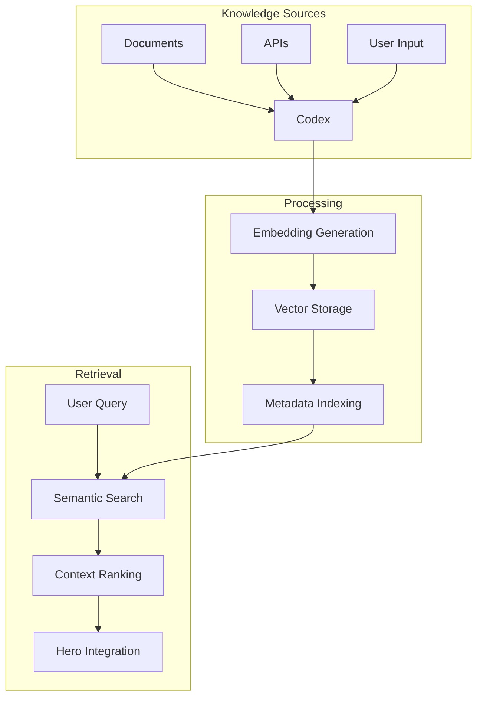

# Knowledge Integration

This comprehensive guide covers advanced patterns for integrating knowledge bases with AI agents using downcity's Codex component. Learn how to build intelligent systems that can ingest, organize, and retrieve knowledge effectively.

## Knowledge Integration Overview

Knowledge integration in downcity involves:



## Document Processing and Ingestion

### Basic Document Processing

Start with simple document ingestion:

```typescript
import { Codex } from 'downcity';
import * as fs from 'fs/promises';

class DocumentProcessor {
  private codex: Codex;
  private chunkSize: number;
  private overlapSize: number;

  constructor(tableName: string, chunkSize = 500, overlapSize = 50) {
    this.codex = Codex.create({ tableName });
    this.chunkSize = chunkSize;
    this.overlapSize = overlapSize;
  }

  async processTextFile(filePath: string, metadata: Record<string, any> = {}) {
    const content = await fs.readFile(filePath, 'utf-8');
    const fileName = filePath.split('/').pop() || 'unknown';
    
    const chunks = this.chunkText(content);
    
    for (let i = 0; i < chunks.length; i++) {
      await this.codex.add(chunks[i], {
        ...metadata,
        source_file: fileName,
        chunk_index: i,
        total_chunks: chunks.length,
        chunk_id: `${fileName}_chunk_${i}`,
        processed_at: new Date().toISOString()
      });
    }

    console.log(`Processed ${fileName}: ${chunks.length} chunks`);
    return chunks.length;
  }

  private chunkText(text: string): string[] {
    const sentences = text.split(/[.!?]+/).filter(s => s.trim().length > 0);
    const chunks: string[] = [];
    let currentChunk = '';

    for (const sentence of sentences) {
      const trimmedSentence = sentence.trim();
      if (currentChunk.length + trimmedSentence.length > this.chunkSize) {
        if (currentChunk) {
          chunks.push(currentChunk.trim());
          
          // Add overlap from previous chunk
          const words = currentChunk.split(' ');
          const overlapWords = words.slice(-Math.floor(this.overlapSize / 5));
          currentChunk = overlapWords.join(' ') + ' ';
        }
      }
      currentChunk += trimmedSentence + '. ';
    }

    if (currentChunk.trim()) {
      chunks.push(currentChunk.trim());
    }

    return chunks;
  }

  async searchDocument(query: string, fileName?: string) {
    const searchOptions: any = { limit: 10 };
    if (fileName) {
      searchOptions.metadata = { source_file: fileName };
    }

    return await this.codex.search(query, searchOptions);
  }

  close() {
    this.codex.close();
  }
}

// Usage
const processor = new DocumentProcessor("documentation_kb");

await processor.processTextFile('./docs/api-reference.md', {
  category: 'documentation',
  type: 'api_reference',
  version: '1.0'
});

const results = await processor.searchDocument("authentication methods");
console.log("Found:", results.length, "relevant chunks");
```

### Advanced Document Processing

Handle multiple document formats and extract structured information:

```typescript
import * as path from 'path';

interface DocumentMetadata {
  title?: string;
  author?: string;
  category: string;
  tags?: string[];
  importance?: number;
  language?: string;
}

class AdvancedDocumentProcessor {
  private codex: Codex;
  private supportedFormats = ['.txt', '.md', '.json'];

  constructor(tableName: string) {
    this.codex = Codex.create({ tableName });
  }

  async processDirectory(dirPath: string, baseMetadata: DocumentMetadata) {
    const files = await fs.readdir(dirPath, { withFileTypes: true });
    const results = [];

    for (const file of files) {
      const filePath = path.join(dirPath, file.name);
      
      if (file.isDirectory()) {
        // Recursively process subdirectories
        const subResults = await this.processDirectory(filePath, {
          ...baseMetadata,
          category: `${baseMetadata.category}/${file.name}`
        });
        results.push(...subResults);
      } else if (this.isSupportedFormat(file.name)) {
        const result = await this.processFile(filePath, baseMetadata);
        results.push(result);
      }
    }

    return results;
  }

  private isSupportedFormat(fileName: string): boolean {
    const ext = path.extname(fileName).toLowerCase();
    return this.supportedFormats.includes(ext);
  }

  async processFile(filePath: string, metadata: DocumentMetadata) {
    const ext = path.extname(filePath).toLowerCase();
    const fileName = path.basename(filePath);

    let content: string;
    let extractedMetadata: any = {};

    switch (ext) {
      case '.md':
        ({ content, metadata: extractedMetadata } = await this.processMarkdown(filePath));
        break;
      case '.json':
        ({ content, metadata: extractedMetadata } = await this.processJSON(filePath));
        break;
      default:
        content = await fs.readFile(filePath, 'utf-8');
    }

    // Merge metadata
    const finalMetadata = {
      ...metadata,
      ...extractedMetadata,
      source_file: fileName,
      file_path: filePath,
      file_extension: ext,
      processed_at: new Date().toISOString()
    };

    // Process content
    const chunks = this.intelligentChunking(content, finalMetadata);
    
    for (let i = 0; i < chunks.length; i++) {
      await this.codex.add(chunks[i].content, {
        ...finalMetadata,
        ...chunks[i].metadata,
        chunk_index: i,
        total_chunks: chunks.length
      });
    }

    return {
      file: fileName,
      chunks: chunks.length,
      metadata: finalMetadata
    };
  }

  private async processMarkdown(filePath: string): Promise<{
    content: string;
    metadata: any;
  }> {
    const rawContent = await fs.readFile(filePath, 'utf-8');
    
    // Extract frontmatter
    const frontmatterMatch = rawContent.match(/^---\n([\s\S]*?)\n---\n([\s\S]*)$/);
    let metadata = {};
    let content = rawContent;

    if (frontmatterMatch) {
      try {
        // Simple YAML parsing (in practice, use a proper YAML parser)
        const frontmatter = frontmatterMatch[1];
        const lines = frontmatter.split('\n');
        
        for (const line of lines) {
          const [key, ...valueParts] = line.split(':');
          if (key && valueParts.length > 0) {
            const value = valueParts.join(':').trim();
            metadata[key.trim()] = value.replace(/^["']|["']$/g, '');
          }
        }
        
        content = frontmatterMatch[2];
      } catch (error) {
        console.warn('Failed to parse frontmatter:', error);
      }
    }

    // Extract headers for structure
    const headers = content.match(/^#+\s+(.+)$/gm) || [];
    metadata.headers = headers.map(h => h.replace(/^#+\s+/, ''));

    return { content, metadata };
  }

  private async processJSON(filePath: string): Promise<{
    content: string;
    metadata: any;
  }> {
    const rawContent = await fs.readFile(filePath, 'utf-8');
    const jsonData = JSON.parse(rawContent);

    // Convert JSON to searchable text
    const content = this.jsonToText(jsonData);
    
    // Extract metadata from JSON structure
    const metadata = {
      json_keys: Object.keys(jsonData),
      data_type: 'json',
      structure_depth: this.getObjectDepth(jsonData)
    };

    return { content, metadata };
  }

  private jsonToText(obj: any, prefix = ''): string {
    let text = '';
    
    for (const [key, value] of Object.entries(obj)) {
      const fullKey = prefix ? `${prefix}.${key}` : key;
      
      if (typeof value === 'object' && value !== null) {
        if (Array.isArray(value)) {
          text += `${fullKey} contains: ${value.join(', ')}\n`;
        } else {
          text += this.jsonToText(value, fullKey);
        }
      } else {
        text += `${fullKey}: ${value}\n`;
      }
    }
    
    return text;
  }

  private getObjectDepth(obj: any): number {
    if (typeof obj !== 'object' || obj === null) return 0;
    
    let maxDepth = 0;
    for (const value of Object.values(obj)) {
      if (typeof value === 'object' && value !== null) {
        maxDepth = Math.max(maxDepth, this.getObjectDepth(value));
      }
    }
    
    return maxDepth + 1;
  }

  private intelligentChunking(content: string, metadata: any): Array<{
    content: string;
    metadata: any;
  }> {
    const chunks = [];
    
    // For markdown, chunk by sections
    if (metadata.file_extension === '.md' && metadata.headers) {
      chunks.push(...this.chunkByHeaders(content, metadata.headers));
    } else {
      // Default semantic chunking
      chunks.push(...this.semanticChunking(content));
    }

    return chunks;
  }

  private chunkByHeaders(content: string, headers: string[]): Array<{
    content: string;
    metadata: any;
  }> {
    const chunks = [];
    const sections = content.split(/^#+\s+/gm);
    
    for (let i = 1; i < sections.length; i++) {
      const headerMatch = sections[i].match(/^(.+?)\n([\s\S]*)$/);
      if (headerMatch) {
        const header = headerMatch[1];
        const sectionContent = headerMatch[2];
        
        chunks.push({
          content: `# ${header}\n${sectionContent}`,
          metadata: {
            section_header: header,
            section_index: i - 1,
            chunk_type: 'section'
          }
        });
      }
    }

    return chunks;
  }

  private semanticChunking(content: string): Array<{
    content: string;
    metadata: any;
  }> {
    const paragraphs = content.split(/\n\s*\n/).filter(p => p.trim().length > 0);
    const chunks = [];
    let currentChunk = '';
    let chunkIndex = 0;

    for (const paragraph of paragraphs) {
      if (currentChunk.length + paragraph.length > 800) {
        if (currentChunk) {
          chunks.push({
            content: currentChunk.trim(),
            metadata: {
              chunk_type: 'semantic',
              paragraph_count: currentChunk.split('\n\n').length
            }
          });
          currentChunk = '';
          chunkIndex++;
        }
      }
      currentChunk += paragraph + '\n\n';
    }

    if (currentChunk.trim()) {
      chunks.push({
        content: currentChunk.trim(),
        metadata: {
          chunk_type: 'semantic',
          paragraph_count: currentChunk.split('\n\n').length
        }
      });
    }

    return chunks;
  }

  async searchByCategory(query: string, category: string) {
    return await this.codex.search(query, {
      metadata: { category },
      limit: 10
    });
  }

  async searchByFileType(query: string, fileExtension: string) {
    return await this.codex.search(query, {
      metadata: { file_extension: fileExtension },
      limit: 10
    });
  }

  close() {
    this.codex.close();
  }
}

// Usage
const advancedProcessor = new AdvancedDocumentProcessor("advanced_kb");

// Process entire documentation directory
const results = await advancedProcessor.processDirectory('./docs', {
  category: 'documentation',
  importance: 0.8,
  language: 'en'
});

console.log(`Processed ${results.length} files`);

// Search specific categories
const apiResults = await advancedProcessor.searchByCategory("authentication", "documentation/api");
console.log("API docs:", apiResults.length);
```

## API Integration

### REST API Knowledge Integration

Integrate knowledge from REST APIs:

```typescript
interface APIEndpoint {
  url: string;
  method: 'GET' | 'POST' | 'PUT' | 'DELETE';
  headers?: Record<string, string>;
  params?: Record<string, any>;
}

class APIKnowledgeIntegrator {
  private codex: Codex;
  private rateLimitDelay: number;

  constructor(tableName: string, rateLimitDelay = 1000) {
    this.codex = Codex.create({ tableName });
    this.rateLimitDelay = rateLimitDelay;
  }

  async integrateAPI(endpoint: APIEndpoint, metadata: Record<string, any>) {
    try {
      const response = await this.makeAPICall(endpoint);
      await this.processAPIResponse(response, endpoint, metadata);
      
      // Rate limiting
      await this.delay(this.rateLimitDelay);
      
      return { success: true, endpoint: endpoint.url };
    } catch (error) {
      console.error(`Failed to integrate API ${endpoint.url}:`, error);
      return { success: false, endpoint: endpoint.url, error: error.message };
    }
  }

  private async makeAPICall(endpoint: APIEndpoint): Promise<any> {
    const { url, method, headers = {}, params = {} } = endpoint;
    
    const fetchOptions: RequestInit = {
      method,
      headers: {
        'Content-Type': 'application/json',
        ...headers
      }
    };

    if (method === 'GET' && Object.keys(params).length > 0) {
      const urlParams = new URLSearchParams(params);
      const fullUrl = `${url}?${urlParams}`;
      const response = await fetch(fullUrl, fetchOptions);
      return await response.json();
    } else if (method !== 'GET') {
      fetchOptions.body = JSON.stringify(params);
      const response = await fetch(url, fetchOptions);
      return await response.json();
    } else {
      const response = await fetch(url, fetchOptions);
      return await response.json();
    }
  }

  private async processAPIResponse(data: any, endpoint: APIEndpoint, metadata: Record<string, any>) {
    if (Array.isArray(data)) {
      // Process array of items
      for (let i = 0; i < data.length; i++) {
        await this.processAPIItem(data[i], {
          ...metadata,
          api_endpoint: endpoint.url,
          item_index: i,
          total_items: data.length
        });
      }
    } else {
      // Process single item
      await this.processAPIItem(data, {
        ...metadata,
        api_endpoint: endpoint.url
      });
    }
  }

  private async processAPIItem(item: any, metadata: Record<string, any>) {
    // Convert API response to searchable text
    const content = this.apiItemToText(item);
    
    // Extract relevant metadata from the item
    const itemMetadata = this.extractItemMetadata(item);
    
    await this.codex.add(content, {
      ...metadata,
      ...itemMetadata,
      data_source: 'api',
      ingested_at: new Date().toISOString()
    });
  }

  private apiItemToText(item: any): string {
    let text = '';
    
    // Handle common API response patterns
    if (item.title || item.name) {
      text += `Title: ${item.title || item.name}\n`;
    }
    
    if (item.description) {
      text += `Description: ${item.description}\n`;
    }
    
    if (item.content || item.body) {
      text += `Content: ${item.content || item.body}\n`;
    }
    
    // Add other fields as key-value pairs
    for (const [key, value] of Object.entries(item)) {
      if (!['title', 'name', 'description', 'content', 'body'].includes(key)) {
        if (typeof value === 'string' || typeof value === 'number') {
          text += `${key}: ${value}\n`;
        }
      }
    }
    
    return text;
  }

  private extractItemMetadata(item: any): Record<string, any> {
    const metadata: Record<string, any> = {};
    
    // Extract common metadata fields
    if (item.id) metadata.item_id = item.id;
    if (item.category) metadata.category = item.category;
    if (item.tags) metadata.tags = Array.isArray(item.tags) ? item.tags : [item.tags];
    if (item.created_at || item.createdAt) metadata.created_at = item.created_at || item.createdAt;
    if (item.updated_at || item.updatedAt) metadata.updated_at = item.updated_at || item.updatedAt;
    if (item.author) metadata.author = item.author;
    if (item.status) metadata.status = item.status;
    
    return metadata;
  }

  async integrateMultipleAPIs(endpoints: Array<{
    endpoint: APIEndpoint;
    metadata: Record<string, any>;
  }>) {
    const results = [];
    
    for (const { endpoint, metadata } of endpoints) {
      const result = await this.integrateAPI(endpoint, metadata);
      results.push(result);
      
      console.log(`Processed ${endpoint.url}: ${result.success ? 'Success' : 'Failed'}`);
    }
    
    return results;
  }

  async searchAPIData(query: string, apiEndpoint?: string) {
    const searchOptions: any = { limit: 10 };
    
    if (apiEndpoint) {
      searchOptions.metadata = { api_endpoint: apiEndpoint };
    }
    
    return await this.codex.search(query, searchOptions);
  }

  private delay(ms: number): Promise<void> {
    return new Promise(resolve => setTimeout(resolve, ms));
  }

  close() {
    this.codex.close();
  }
}

// Usage
const apiIntegrator = new APIKnowledgeIntegrator("api_knowledge");

// Integrate multiple APIs
const apiEndpoints = [
  {
    endpoint: {
      url: 'https://api.github.com/repos/microsoft/typescript/issues',
      method: 'GET' as const,
      params: { state: 'open', per_page: 50 }
    },
    metadata: {
      category: 'github_issues',
      repository: 'typescript',
      source: 'github_api'
    }
  },
  {
    endpoint: {
      url: 'https://jsonplaceholder.typicode.com/posts',
      method: 'GET' as const
    },
    metadata: {
      category: 'blog_posts',
      source: 'jsonplaceholder'
    }
  }
];

const results = await apiIntegrator.integrateMultipleAPIs(apiEndpoints);
console.log("API Integration Results:", results);

// Search integrated data
const searchResults = await apiIntegrator.searchAPIData("typescript issues");
console.log("Found issues:", searchResults.length);
```

### Database Integration

Integrate knowledge from databases:

```typescript
interface DatabaseConfig {
  type: 'sqlite' | 'postgresql' | 'mysql';
  connection: string;
}

interface QueryConfig {
  table: string;
  columns: string[];
  where?: string;
  orderBy?: string;
  limit?: number;
}

class DatabaseKnowledgeIntegrator {
  private codex: Codex;
  private dbConfig: DatabaseConfig;

  constructor(tableName: string, dbConfig: DatabaseConfig) {
    this.codex = Codex.create({ tableName });
    this.dbConfig = dbConfig;
  }

  async integrateTable(queryConfig: QueryConfig, metadata: Record<string, any>) {
    try {
      const rows = await this.executeQuery(queryConfig);
      
      for (let i = 0; i < rows.length; i++) {
        await this.processRow(rows[i], {
          ...metadata,
          source_table: queryConfig.table,
          row_index: i,
          total_rows: rows.length
        });
      }
      
      return { success: true, rowsProcessed: rows.length };
    } catch (error) {
      console.error(`Failed to integrate table ${queryConfig.table}:`, error);
      return { success: false, error: error.message };
    }
  }

  private async executeQuery(config: QueryConfig): Promise<any[]> {
    // This is a simplified example - in practice, use proper database drivers
    const { table, columns, where, orderBy, limit } = config;
    
    let query = `SELECT ${columns.join(', ')} FROM ${table}`;
    
    if (where) {
      query += ` WHERE ${where}`;
    }
    
    if (orderBy) {
      query += ` ORDER BY ${orderBy}`;
    }
    
    if (limit) {
      query += ` LIMIT ${limit}`;
    }
    
    // Simulate database query execution
    console.log(`Executing query: ${query}`);
    
    // In practice, execute the actual query here
    return []; // Placeholder
  }

  private async processRow(row: any, metadata: Record<string, any>) {
    const content = this.rowToText(row);
    const rowMetadata = this.extractRowMetadata(row);
    
    await this.codex.add(content, {
      ...metadata,
      ...rowMetadata,
      data_source: 'database',
      ingested_at: new Date().toISOString()
    });
  }

  private rowToText(row: any): string {
    let text = '';
    
    for (const [column, value] of Object.entries(row)) {
      if (value !== null && value !== undefined) {
        text += `${column}: ${value}\n`;
      }
    }
    
    return text;
  }

  private extractRowMetadata(row: any): Record<string, any> {
    const metadata: Record<string, any> = {};
    
    // Extract common database metadata
    if (row.id) metadata.record_id = row.id;
    if (row.created_at) metadata.created_at = row.created_at;
    if (row.updated_at) metadata.updated_at = row.updated_at;
    if (row.category) metadata.category = row.category;
    if (row.status) metadata.status = row.status;
    
    return metadata;
  }

  close() {
    this.codex.close();
  }
}
```

## Real-time Knowledge Updates

### Live Knowledge Synchronization

Keep knowledge base synchronized with external sources:

```typescript
class LiveKnowledgeSync {
  private codex: Codex;
  private syncInterval: number;
  private syncJobs: Map<string, NodeJS.Timeout> = new Map();

  constructor(tableName: string, syncInterval = 300000) { // 5 minutes default
    this.codex = Codex.create({ tableName });
    this.syncInterval = syncInterval;
  }

  async startSync(sourceId: string, syncFunction: () => Promise<any[]>) {
    // Stop existing sync if running
    this.stopSync(sourceId);
    
    // Initial sync
    await this.performSync(sourceId, syncFunction);
    
    // Schedule recurring sync
    const intervalId = setInterval(async () => {
      await this.performSync(sourceId, syncFunction);
    }, this.syncInterval);
    
    this.syncJobs.set(sourceId, intervalId);
    console.log(`Started live sync for ${sourceId}`);
  }

  private async performSync(sourceId: string, syncFunction: () => Promise<any[]>) {
    try {
      console.log(`Syncing ${sourceId}...`);
      const data = await syncFunction();
      
      // Process new/updated data
      for (const item of data) {
        await this.processLiveUpdate(item, sourceId);
      }
      
      console.log(`Sync completed for ${sourceId}: ${data.length} items processed`);
    } catch (error) {
      console.error(`Sync failed for ${sourceId}:`, error);
    }
  }

  private async processLiveUpdate(item: any, sourceId: string) {
    // Check if item already exists
    const existingItems = await this.codex.search(item.id || item.title, {
      metadata: { source_id: sourceId },
      limit: 1
    });

    const content = this.itemToContent(item);
    const metadata = {
      source_id: sourceId,
      item_id: item.id,
      last_updated: new Date().toISOString(),
      sync_version: Date.now()
    };

    if (existingItems.length > 0) {
      // Update existing item (in practice, implement update functionality)
      console.log(`Updated item: ${item.id || item.title}`);
    } else {
      // Add new item
      await this.codex.add(content, metadata);
      console.log(`Added new item: ${item.id || item.title}`);
    }
  }

  private itemToContent(item: any): string {
    // Convert item to searchable content
    let content = '';
    
    if (item.title) content += `Title: ${item.title}\n`;
    if (item.description) content += `Description: ${item.description}\n`;
    if (item.content) content += `Content: ${item.content}\n`;
    
    return content;
  }

  stopSync(sourceId: string) {
    const intervalId = this.syncJobs.get(sourceId);
    if (intervalId) {
      clearInterval(intervalId);
      this.syncJobs.delete(sourceId);
      console.log(`Stopped sync for ${sourceId}`);
    }
  }

  stopAllSyncs() {
    for (const [sourceId] of this.syncJobs) {
      this.stopSync(sourceId);
    }
  }

  close() {
    this.stopAllSyncs();
    this.codex.close();
  }
}

// Usage
const liveSync = new LiveKnowledgeSync("live_knowledge");

// Sync GitHub issues
await liveSync.startSync('github_issues', async () => {
  const response = await fetch('https://api.github.com/repos/microsoft/typescript/issues?state=open&per_page=10');
  return await response.json();
});

// Sync RSS feed
await liveSync.startSync('tech_news', async () => {
  // In practice, parse RSS feed
  return [
    { id: '1', title: 'Tech News 1', description: 'Latest tech news...' },
    { id: '2', title: 'Tech News 2', description: 'More tech news...' }
  ];
});
```

## Knowledge Quality and Validation

### Quality Control System

Implement quality control for knowledge ingestion:

```typescript
interface QualityMetrics {
  relevance: number;
  accuracy: number;
  completeness: number;
  freshness: number;
  overall: number;
}

class KnowledgeQualityController {
  private codex: Codex;
  private qualityThreshold: number;

  constructor(tableName: string, qualityThreshold = 0.7) {
    this.codex = Codex.create({ tableName });
    this.qualityThreshold = qualityThreshold;
  }

  async addWithQualityCheck(content: string, metadata: Record<string, any>): Promise<{
    added: boolean;
    quality: QualityMetrics;
    issues: string[];
  }> {
    const quality = await this.assessQuality(content, metadata);
    const issues = this.identifyQualityIssues(quality, content, metadata);
    
    if (quality.overall >= this.qualityThreshold) {
      await this.codex.add(content, {
        ...metadata,
        quality_score: quality.overall,
        quality_metrics: quality,
        validated: true,
        validated_at: new Date().toISOString()
      });
      
      return { added: true, quality, issues };
    } else {
      console.warn(`Content rejected due to low quality: ${quality.overall}`);
      return { added: false, quality, issues };
    }
  }

  private async assessQuality(content: string, metadata: Record<string, any>): Promise<QualityMetrics> {
    const relevance = this.assessRelevance(content, metadata);
    const accuracy = this.assessAccuracy(content, metadata);
    const completeness = this.assessCompleteness(content, metadata);
    const freshness = this.assessFreshness(metadata);
    
    const overall = (relevance + accuracy + completeness + freshness) / 4;
    
    return { relevance, accuracy, completeness, freshness, overall };
  }

  private assessRelevance(content: string, metadata: Record<string, any>): number {
    let score = 0.5; // Base score
    
    // Check if content matches category
    if (metadata.category) {
      const categoryKeywords = this.getCategoryKeywords(metadata.category);
      const contentLower = content.toLowerCase();
      
      const matchingKeywords = categoryKeywords.filter(keyword => 
        contentLower.includes(keyword.toLowerCase())
      );
      
      score += (matchingKeywords.length / categoryKeywords.length) * 0.3;
    }
    
    // Check content length (too short or too long reduces relevance)
    if (content.length > 50 && content.length < 2000) {
      score += 0.2;
    }
    
    return Math.min(1.0, score);
  }

  private assessAccuracy(content: string, metadata: Record<string, any>): number {
    let score = 0.7; // Default assumption of accuracy
    
    // Check for source attribution
    if (metadata.source || metadata.author) {
      score += 0.2;
    }
    
    // Check for factual indicators
    const factualIndicators = ['according to', 'research shows', 'study found', 'data indicates'];
    const hasFactualIndicators = factualIndicators.some(indicator => 
      content.toLowerCase().includes(indicator)
    );
    
    if (hasFactualIndicators) {
      score += 0.1;
    }
    
    return Math.min(1.0, score);
  }

  private assessCompleteness(content: string, metadata: Record<string, any>): number {
    let score = 0.5;
    
    // Check for key information elements
    const hasTitle = metadata.title || content.includes('Title:');
    const hasDescription = metadata.description || content.length > 100;
    const hasDetails = content.length > 200;
    
    if (hasTitle) score += 0.2;
    if (hasDescription) score += 0.2;
    if (hasDetails) score += 0.1;
    
    // Check for structured information
    const structureIndicators = [':', '\n', '•', '-', '1.', '2.'];
    const hasStructure = structureIndicators.some(indicator => 
      content.includes(indicator)
    );
    
    if (hasStructure) score += 0.1;
    
    return Math.min(1.0, score);
  }

  private assessFreshness(metadata: Record<string, any>): number {
    if (!metadata.created_at && !metadata.updated_at) {
      return 0.5; // Unknown freshness
    }
    
    const dateStr = metadata.updated_at || metadata.created_at;
    const date = new Date(dateStr);
    const now = new Date();
    const ageInDays = (now.getTime() - date.getTime()) / (1000 * 60 * 60 * 24);
    
    // Fresher content gets higher scores
    if (ageInDays < 7) return 1.0;
    if (ageInDays < 30) return 0.8;
    if (ageInDays < 90) return 0.6;
    if (ageInDays < 365) return 0.4;
    return 0.2;
  }

  private getCategoryKeywords(category: string): string[] {
    const keywordMap: Record<string, string[]> = {
      'programming': ['code', 'function', 'variable', 'class', 'method', 'algorithm'],
      'documentation': ['guide', 'tutorial', 'reference', 'example', 'usage'],
      'api': ['endpoint', 'request', 'response', 'parameter', 'authentication'],
      'business': ['strategy', 'process', 'workflow', 'policy', 'procedure']
    };
    
    return keywordMap[category.toLowerCase()] || [];
  }

  private identifyQualityIssues(quality: QualityMetrics, content: string, metadata: Record<string, any>): string[] {
    const issues = [];
    
    if (quality.relevance < 0.5) {
      issues.push('Low relevance to specified category');
    }
    
    if (quality.accuracy < 0.6) {
      issues.push('Questionable accuracy - missing source attribution');
    }
    
    if (quality.completeness < 0.5) {
      issues.push('Incomplete information - missing key details');
    }
    
    if (quality.freshness < 0.3) {
      issues.push('Outdated information - consider updating');
    }
    
    if (content.length < 20) {
      issues.push('Content too short to be meaningful');
    }
    
    if (content.length > 5000) {
      issues.push('Content too long - consider chunking');
    }
    
    return issues;
  }

  async getQualityReport(): Promise<any> {
    // In practice, implement quality reporting by querying stored quality metrics
    return {
      totalItems: 0, // Query count from codex
      averageQuality: 0, // Calculate from stored quality scores
      qualityDistribution: {
        high: 0, // quality > 0.8
        medium: 0, // quality 0.5-0.8
        low: 0 // quality < 0.5
      },
      commonIssues: [] // Aggregate common quality issues
    };
  }

  close() {
    this.codex.close();
  }
}

// Usage
const qualityController = new KnowledgeQualityController("quality_kb", 0.7);

const result = await qualityController.addWithQualityCheck(
  "TypeScript is a programming language that adds static typing to JavaScript",
  {
    category: 'programming',
    source: 'official_docs',
    created_at: new Date().toISOString()
  }
);

console.log("Quality Assessment:", result);
```

## Integration with Hero Agents

### Smart Knowledge Retrieval

Create agents that intelligently use knowledge:

```typescript
class KnowledgeAwareAgent {
  private hero: Hero;
  private codex: Codex;
  private room: Room;
  private knowledgeCache: Map<string, any[]> = new Map();

  constructor() {
    this.codex = Codex.create({ tableName: "agent_knowledge" });
    this.room = new Room(new SQLitePersistor('./knowledge-agent.db'));
    
    this.hero = Hero.create()
      .avatar(`You are an intelligent assistant with access to a comprehensive knowledge base.
               When answering questions:
               1. First search your knowledge base for relevant information
               2. Cite sources when using knowledge base information
               3. Combine knowledge base info with your general knowledge
               4. If knowledge base doesn't have info, say so clearly
               5. Always provide accurate, helpful responses`)
      .memory(this.room)
      .study(this.codex);
  }

  async chat(message: string): Promise<{
    response: string;
    knowledgeUsed: any[];
    sources: string[];
  }> {
    // Extract key topics from the message
    const topics = this.extractTopics(message);
    
    // Search knowledge base for relevant information
    const knowledgeResults = await this.searchRelevantKnowledge(topics, message);
    
    // Cache results for potential follow-up questions
    const cacheKey = this.generateCacheKey(topics);
    this.knowledgeCache.set(cacheKey, knowledgeResults);
    
    // Create enhanced prompt with knowledge context
    const enhancedMessage = this.createKnowledgeEnhancedPrompt(message, knowledgeResults);
    
    // Get response from hero
    const response = await this.hero.chat(enhancedMessage);
    
    // Extract sources used
    const sources = knowledgeResults.map(result => 
      result.metadata.source || result.metadata.source_file || 'Unknown'
    );
    
    return {
      response,
      knowledgeUsed: knowledgeResults,
      sources: [...new Set(sources)] // Remove duplicates
    };
  }

  private extractTopics(message: string): string[] {
    // Simple topic extraction - in practice, use NLP libraries
    const words = message.toLowerCase().split(/\W+/);
    const stopWords = ['the', 'is', 'at', 'which', 'on', 'and', 'a', 'to', 'are', 'as', 'was', 'with', 'for'];
    
    return words
      .filter(word => word.length > 3 && !stopWords.includes(word))
      .slice(0, 5); // Top 5 topics
  }

  private async searchRelevantKnowledge(topics: string[], originalMessage: string): Promise<any[]> {
    const allResults = [];
    
    // Search for each topic
    for (const topic of topics) {
      const results = await this.codex.search(topic, { limit: 3 });
      allResults.push(...results);
    }
    
    // Also search with the full message
    const fullMessageResults = await this.codex.search(originalMessage, { limit: 5 });
    allResults.push(...fullMessageResults);
    
    // Remove duplicates and sort by relevance
    const uniqueResults = this.deduplicateResults(allResults);
    return uniqueResults.slice(0, 8); // Limit to top 8 results
  }

  private deduplicateResults(results: any[]): any[] {
    const seen = new Set();
    return results.filter(result => {
      const key = result.content.substring(0, 100); // Use first 100 chars as key
      if (seen.has(key)) {
        return false;
      }
      seen.add(key);
      return true;
    });
  }

  private createKnowledgeEnhancedPrompt(originalMessage: string, knowledgeResults: any[]): string {
    if (knowledgeResults.length === 0) {
      return originalMessage;
    }
    
    let enhancedPrompt = 'Relevant knowledge from knowledge base:\n\n';
    
    knowledgeResults.forEach((result, index) => {
      const source = result.metadata.source || result.metadata.source_file || 'Unknown';
      enhancedPrompt += `[${index + 1}] ${result.content}\n`;
      enhancedPrompt += `Source: ${source}\n\n`;
    });
    
    enhancedPrompt += `User question: ${originalMessage}\n\n`;
    enhancedPrompt += 'Please answer the user\'s question using the relevant knowledge above. ';
    enhancedPrompt += 'Cite the knowledge sources when appropriate using [1], [2], etc.';
    
    return enhancedPrompt;
  }

  private generateCacheKey(topics: string[]): string {
    return topics.sort().join('_');
  }

  async addKnowledge(content: string, metadata: Record<string, any>) {
    await this.codex.add(content, {
      ...metadata,
      added_by_agent: true,
      added_at: new Date().toISOString()
    });
  }

  async getKnowledgeStats(): Promise<any> {
    // In practice, implement knowledge statistics
    return {
      totalKnowledge: 0, // Count from codex
      recentlyUsed: Array.from(this.knowledgeCache.keys()),
      cacheSize: this.knowledgeCache.size
    };
  }

  cleanup() {
    this.codex.close();
  }
}

// Usage
const knowledgeAgent = new KnowledgeAwareAgent();

// Add some knowledge
await knowledgeAgent.addKnowledge(
  "React hooks allow you to use state and lifecycle features in functional components",
  { category: 'programming', topic: 'react', source: 'official_docs' }
);

// Chat with knowledge integration
const result = await knowledgeAgent.chat("How do React hooks work?");
console.log("Response:", result.response);
console.log("Knowledge used:", result.knowledgeUsed.length);
console.log("Sources:", result.sources);
```

## Best Practices Summary

### 1. Knowledge Organization
- **Consistent Metadata**: Use standardized metadata schemas
- **Hierarchical Categories**: Implement clear categorization systems
- **Source Attribution**: Always track knowledge sources
- **Version Control**: Track knowledge updates and versions

### 2. Quality Control
- **Validation Pipeline**: Implement quality checks before ingestion
- **Relevance Scoring**: Score content relevance to categories
- **Freshness Tracking**: Monitor and update outdated knowledge
- **Duplicate Detection**: Prevent redundant knowledge storage

### 3. Performance Optimization
- **Intelligent Chunking**: Use semantic chunking strategies
- **Efficient Indexing**: Implement proper metadata indexing
- **Caching**: Cache frequently accessed knowledge
- **Rate Limiting**: Respect API rate limits during ingestion

### 4. Integration Patterns
- **Gradual Enhancement**: Start simple, add complexity gradually
- **Source Diversity**: Integrate multiple knowledge sources
- **Real-time Updates**: Keep knowledge current with live sync
- **Context Awareness**: Use knowledge contextually in responses

## Next Steps

- [Advanced Patterns Guide](/docs/guides/advanced-patterns) - Complex implementation strategies
- [API Reference](/docs/api-reference/codex-api) - Complete Codex API documentation
- [Examples](/docs/examples/knowledge-base) - Practical knowledge integration examples
- [Memory Management](/docs/guides/memory-management) - Advanced memory strategies